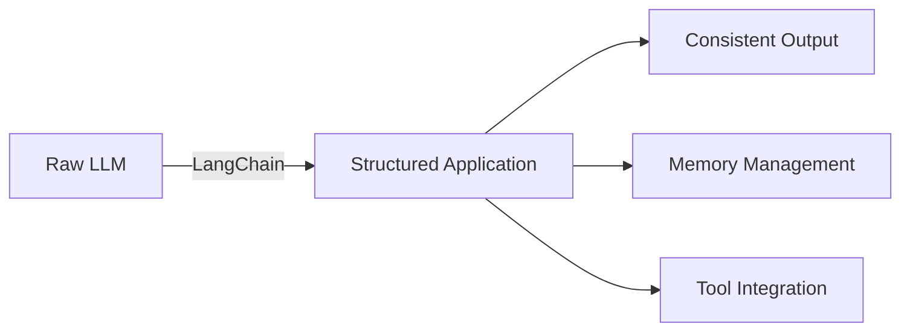
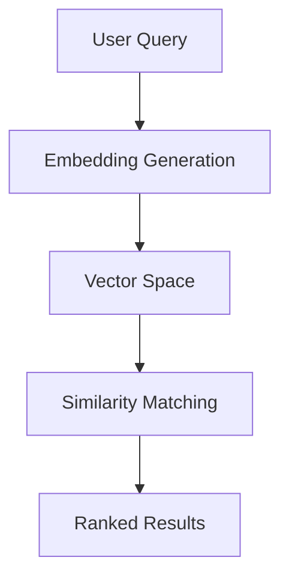
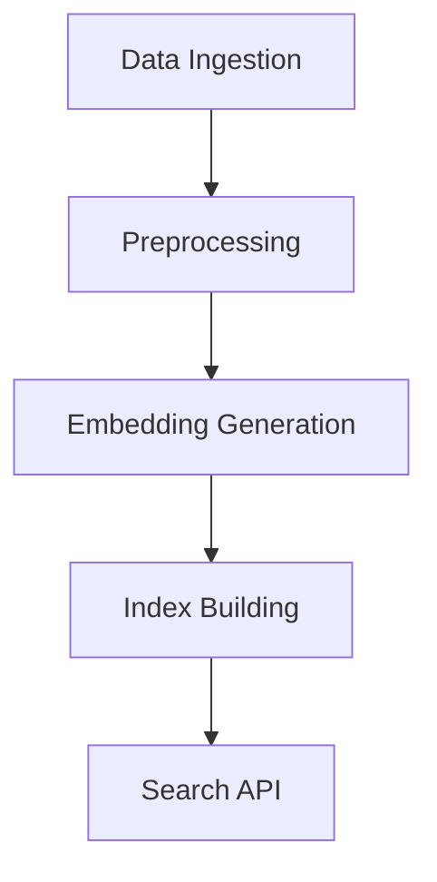
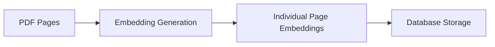

#  Introduction to LangChain | LangChain for Beginners

## Table of Contents
- [Overview](#overview-)
- [Core Components](#core-components-)
  - [Chains](#1-chains)
  - [Agents](#2-agents-)
  - [Memory Systems](#3-memory-systems-)
- [Key Features](#key-features-)
- [Use Cases](#use-cases-)
- [Community and Ecosystem](#community-and-ecosystem-)
- [Benefits](#benefits-)
- [What is Semantic Search?](#what-is-semantic-search)
- [Mathematical Explanation of Semantic Search](#mathematical-explanation-of-semantic-search)
- [Why We Need LangChain: Understanding the Evolution](#why-we-need-langchain-understanding-the-evolution-)
- [Natural Language Query System Architecture](#natural-language-query-system-architecture-)
- [Semantic Search: A Comprehensive Deep Dive](#semantic-search-a-comprehensive-deep-dive-)
- [LangChain Deep Dive: Core Components & Architecture](#langchain-deep-dive-core-components--architecture-)

## LangChain: A Comprehensive Framework for LLM Applications 🔗

## Overview 🌟
LangChain is an open-source framework designed to simplify the development of applications powered by Large Language Models (LLMs). It provides a structured approach for building complex LLM-based applications through modular components and chains.

### **Why Do We Need LangChain?**  

LangChain is essential for **building advanced applications using Large Language Models (LLMs)** by providing structured tools for handling prompts, memory, chains, agents, and data retrieval. It simplifies the integration of LLMs with external sources, databases, APIs, and various machine learning components, making it useful for **Retrieval-Augmented Generation (RAG)** and **multi-step reasoning**.

Key benefits of LangChain:  
✅ **Chaining multiple prompts together** to build complex workflows.  
✅ **Memory management** for context-aware conversations.  
✅ **Integration with vector databases** like Pinecone, FAISS, and ChromaDB.  
✅ **Building AI-powered agents** that interact with APIs and databases.  
✅ **Simplifies deployment** by handling input/output flows effectively.  


### **Ebook Example: AI-Powered Ebook Search & Summarization System**  

Imagine you want to build an **AI-powered Ebook Search and Summarization System** using LangChain. This system allows users to:  
🔍 **Search for information inside multiple ebooks** using natural language queries.  
📖 **Summarize chapters or sections** using LLMs.  
💾 **Store and retrieve book embeddings** for fast access.  

#### **How LangChain Helps**  

1️⃣ **Loading & Processing Ebooks**  
   - LangChain provides document loaders to ingest PDFs, EPUB, or text files.  

2️⃣ **Embedding and Storing Data**  
   - Convert ebook text into embeddings using OpenAI or Hugging Face models.  
   - Store embeddings in vector databases like FAISS or Pinecone.  

3️⃣ **Retrieval-Augmented Generation (RAG)**  
   - When a user queries, LangChain retrieves the most relevant content using similarity search.  
   - It then feeds this context into an LLM to generate an accurate response.  

4️⃣ **Summarization Feature**  
   - LangChain enables text summarization pipelines with LLMs (e.g., GPT-4 or Claude).  


### **Code Example** (Using LangChain to Search an Ebook)  

```python
from langchain.document_loaders import PyPDFLoader
from langchain.embeddings import OpenAIEmbeddings
from langchain.vectorstores import FAISS
from langchain.llms import OpenAI
from langchain.chains import RetrievalQA

# Load Ebook
loader = PyPDFLoader("ebook.pdf")
documents = loader.load()

# Convert text into embeddings
embeddings = OpenAIEmbeddings()
vector_db = FAISS.from_documents(documents, embeddings)

# Initialize LLM & Retrieval Chain
llm = OpenAI(model_name="gpt-4")
qa_chain = RetrievalQA.from_chain_type(llm, retriever=vector_db.as_retriever())

# User Query
query = "What are the key takeaways from Chapter 3?"
response = qa_chain.run(query)
print(response)
```

### **Conclusion**  
LangChain is a game-changer for **LLM-powered applications** like Ebook search, RAG systems, and chatbot integration. It simplifies workflows by combining **document processing, embeddings, retrieval, and LLM-based generation**, making it **a must-have for AI engineers** building advanced applications. 🚀

## Core Components 🛠️

### 1. Chains
- **Concept**: Sequential operations that combine multiple components for complex tasks
- **Purpose**: Enable structured workflow creation for document processing, question-answering, and data analysis

### 2. Agents 🤖
- **Definition**: Autonomous components that can make decisions about which tools to use
- **Capability**: Can execute multiple steps, choosing appropriate actions based on the task at hand

### 3. Memory Systems 🧠
- **Function**: Store and manage conversation history and context
- **Types**: Various memory implementations for different use cases (buffer, summary, conversation)

## Key Features ⭐

### Prompting Layer
- **Template Management**: Structured approach to creating and managing prompts
- **Dynamic Insertion**: Variables and context integration into prompts

### Document Interaction
- **Loaders**: Support for multiple document formats
- **Splitting**: Intelligent document chunking
- **Storage**: Vector store integration for efficient retrieval

### Integration Capabilities 🔌
- **Model Support**: Works with various LLM providers
- **Tool Connection**: Easy integration with external tools and APIs
- **Database Compatibility**: Connects with various vector and traditional databases

## Use Cases 📋

### 1. Question Answering
- Document-based Q&A systems
- Chat interfaces with memory

### 2. Data Analysis
- Automated analysis pipelines
- Data extraction and summarization

### 3. Automation
- Task automation workflows
- Content generation pipelines

## Community and Ecosystem 🌐
- **Active Development**: Regular updates and improvements
- **Community Support**: Large developer community
- **Documentation**: Extensive guides and examples

## Benefits 📈
- **Rapid Development**: Accelerates application building
- **Flexibility**: Modular design for custom solutions
- **Scalability**: Enterprise-ready architecture

*Note: As of January 2025, LangChain continues to evolve with new features and capabilities being added regularly. For the most current information, consulting the official documentation is recommended.*

## **What is Semantic Search?**  

### **Definition**  
Semantic Search is an advanced search technique that understands the **meaning and context** of a query rather than just matching keywords. Unlike traditional keyword-based search, **semantic search leverages AI, NLP, and embeddings to retrieve more relevant results** by considering **synonyms, relationships, and intent** behind a query.  

### **Key Components of Semantic Search**  

1. **Word Embeddings**  
   - Words are represented as numerical vectors in high-dimensional space using models like **Word2Vec, BERT, OpenAI Embeddings, or Sentence Transformers**.  
   - Similar words have similar vector representations.  

2. **Vectorization & Similarity Search**  
   - Text queries and documents are converted into embeddings.  
   - A **vector database (FAISS, Pinecone, Weaviate, ChromaDB)** is used for **fast similarity search**.  
   - Common similarity metrics: **Cosine Similarity, Euclidean Distance, Dot Product**.  

3. **Retrieval-Augmented Generation (RAG) Integration**  
   - In AI chatbots and LLM-powered search systems, **semantic search retrieves relevant data** and provides it as context to LLMs like **GPT-4, Claude, or Gemini** for better responses.  

## **Example 1: Traditional vs. Semantic Search**  

### **Traditional Search (Keyword-Based)**  
🔍 **Query:** "Best laptop for programming"  
❌ **Result (Keyword Match):** "Gaming laptop deals 2024" (Irrelevant because it matches "laptop" but doesn't consider "programming").  

### **Semantic Search (Meaning-Based)**  
🔍 **Query:** "Best laptop for programming"  
✅ **Result (Semantic Match):** "Top laptops for developers with long battery life and Linux support."  

Here, **semantic search understands "programming" means developer-focused features** and provides better results.


## **Example 2: Implementing Semantic Search with FAISS and OpenAI**  

Let’s implement a simple **semantic search system** using OpenAI’s embedding model and FAISS (Facebook AI Similarity Search).  

### **Steps Involved:**  
1. Convert documents into embeddings using OpenAI.  
2. Store embeddings in a FAISS vector database.  
3. Convert user queries into embeddings.  
4. Retrieve the most relevant document using **Cosine Similarity**.  

```python
from langchain.embeddings import OpenAIEmbeddings
from langchain.vectorstores import FAISS
from langchain.document_loaders import TextLoader

# Step 1: Load documents and create embeddings
documents = [
    "Python is a great programming language for data science.",
    "Laptops with high RAM and GPU are good for machine learning.",
    "JavaScript is popular for web development.",
    "MacBooks are preferred by many software engineers."
]

# Convert text to vector embeddings
embedding_model = OpenAIEmbeddings()
doc_vectors = embedding_model.embed_documents(documents)

# Step 2: Store embeddings in FAISS vector store
vector_db = FAISS.from_embeddings(doc_vectors, documents)

# Step 3: User query
query = "Which laptop is best for AI projects?"
query_vector = embedding_model.embed_query(query)

# Step 4: Search for the most relevant document
search_result = vector_db.similarity_search(query_vector, k=1)
print("Top result:", search_result[0])
```

✅ **Output:** `"Laptops with high RAM and GPU are good for machine learning."`  


## **Example 3: Semantic Search in Chatbots (RAG)**  
- **Scenario:** A banking chatbot uses **semantic search + RAG** to answer customer queries.  
- **Query:** *"How do I apply for a credit card?"*  
- **Traditional Search Result:** Finds an FAQ page mentioning "credit card" but irrelevant to applying.  
- **Semantic Search Result:** Retrieves a section explaining **"steps to apply for a credit card online."**  

## **Use Cases of Semantic Search**  

✅ **Enterprise Search:** Find documents based on meaning, not just keywords.  
✅ **Chatbots & Virtual Assistants:** Retrieve context-aware responses.  
✅ **E-commerce Search:** Show relevant products based on user intent.  
✅ **Healthcare:** Retrieve medical literature based on symptoms.  
✅ **Finance:** Find relevant stock reports or investment insights.  


## **Conclusion**  
**Semantic Search revolutionizes information retrieval** by leveraging AI to understand user intent and context. It powers **intelligent chatbots, AI assistants, and advanced search engines**, making it an essential tool in modern AI applications. 🚀


## **Mathematical Explanation of Semantic Search**  

### **1. Vector Representation of Words (Embeddings)**  
Instead of treating words as discrete entities, semantic search represents them as points in an **N-dimensional space**.

For example:  
🔹 "Car" → \( v_{car} = [0.21, 0.34, 0.12, 0.85] \)  
🔹 "Vehicle" → \( v_{vehicle} = [0.20, 0.32, 0.15, 0.88] \)  

Since the vectors for "Car" and "Vehicle" are close in vector space, they are **semantically similar**.

---

### **2. Similarity Calculation Using Cosine Similarity**  
The similarity between two word vectors \( v_1 \) and \( v_2 \) is computed using **cosine similarity**:

\[
\cos(\theta) = \frac{v_1 \cdot v_2}{\| v_1 \| \| v_2 \|}
\]

where:
- \( v_1 \cdot v_2 \) is the **dot product** of the vectors.
- \( \| v_1 \| \) and \( \| v_2 \| \) are the **magnitudes (norms)** of the vectors.

#### **Example Calculation**  
Let’s take two document vectors:

\[
v_1 = [0.1, 0.2, 0.9], \quad v_2 = [0.1, 0.3, 0.8]
\]

1️⃣ **Compute Dot Product**  
\[
v_1 \cdot v_2 = (0.1 \times 0.1) + (0.2 \times 0.3) + (0.9 \times 0.8) = 0.01 + 0.06 + 0.72 = 0.79
\]

2️⃣ **Compute Magnitude**  
\[
\| v_1 \| = \sqrt{(0.1)^2 + (0.2)^2 + (0.9)^2} = \sqrt{0.01 + 0.04 + 0.81} = \sqrt{0.86} = 0.927
\]

\[
\| v_2 \| = \sqrt{(0.1)^2 + (0.3)^2 + (0.8)^2} = \sqrt{0.01 + 0.09 + 0.64} = \sqrt{0.74} = 0.86
\]

3️⃣ **Compute Cosine Similarity**  
\[
\cos(\theta) = \frac{0.79}{(0.927 \times 0.86)} = \frac{0.79}{0.797} = 0.99
\]

Since **cosine similarity ≈ 0.99**, these vectors are **highly similar**, meaning the documents are semantically related.

---

### **3. Finding the Most Relevant Document**  
When a user searches for "best electric car", the query is embedded as a vector \( v_q \). The system retrieves the top **k nearest neighbors (KNN)** based on similarity scores.

If the database has stored document embeddings:
\[
D_1 = [0.21, 0.34, 0.12, 0.85], \quad D_2 = [0.50, 0.10, 0.80, 0.60], \quad D_3 = [0.23, 0.32, 0.15, 0.88]
\]
and the query vector is:
\[
Q = [0.20, 0.33, 0.14, 0.87]
\]

Then, by computing cosine similarity, we find that **D1 and D3** are the most relevant documents, meaning the search result returns them first.


# Why We Need LangChain: Understanding the Evolution 🔄

## Context from Image Analysis 📋
The image shows a 2019 interface evolution of "Ebook Mafia" integrating ML (Machine Learning) capabilities, with example queries focusing on:
1. Age-appropriate explanations
2. Educational exercise generation
3. Technical note creation

## The Need for LangChain: A Deep Dive 🔍

### 1. Streamlined LLM Integration 🔌


### 2. Solving Key Challenges

| Challenge | LangChain Solution |
|-----------|-------------------|
| Context Management | Built-in memory systems |
| Tool Integration | Unified agent framework |
| Output Consistency | Structured chains |
| Document Handling | Automated loaders & processors |

### 3. Development Efficiency 🚀

#### Without LangChain
- Manual prompt engineering
- Custom context management
- Individual API integrations
- Separate memory implementations

#### With LangChain
- **Structured Prompting**: Template management
- **Unified Interface**: Single API for multiple LLMs
- **Built-in Tools**: Ready-to-use components
- **Memory Patterns**: Pre-built conversation handlers

## Practical Benefits 💡

### 1. Application Development
- **Faster Prototyping**: Ready-made components
- **Scalable Architecture**: Production-ready patterns
- **Consistent Patterns**: Standardized approaches

### 2. Integration Capabilities
```python
# Example LangChain Pattern
from langchain import PromptTemplate, LLMChain

template = "Explain {concept} to a {age} year old"
chain = LLMChain(
    prompt=PromptTemplate(template),
    llm=chosen_llm
)
```

### 3. Resource Optimization
- **Cost Efficiency**: Optimized token usage
- **Performance**: Intelligent caching
- **Maintenance**: Reduced technical debt

## Future-Proofing Applications 🎯

### Adaptability Features
- Model-agnostic design
- Pluggable architecture
- Extensible components

### Community Benefits
- Active development
- Shared best practices
- Collaborative improvements

---

*🔑 Key Takeaway: LangChain transforms complex LLM integration challenges into manageable, structured development patterns, essential for modern AI application development.*

# Natural Language Query System Architecture 🔍

## System Flow Analysis 📊

### 1. Input Processing Layer
- **User Query** (Green Hexagon)
  - Captures initial user intent
  - Processes incoming assumptions/parameters
  - Routes to semantic processing

### 2. Search & Retrieval Layer 🗃️

#### Document Management


#### Database Integration
- **PDF Storage**
  - Structured document repository
  - Indexed for quick retrieval
  - Stores approximately 1000 documents

### 3. Query Processing Pipeline 🔄

| Component | Function | Output |
|-----------|----------|---------|
| Semantic Search | Context understanding | Relevant documents |
| System Query | Document processing | Page selection |
| NLU | Natural language understanding | Query interpretation |
| Brain | Information synthesis | Final response |

### 4. Advanced Processing Components 🧠

#### Natural Language Understanding (NLU)
- Processes refined user queries
- Integrates with system query results
- Enhances context understanding

#### Brain Module (Purple)
- **Core Functions**
  - Information synthesis
  - Context aggregation
  - Response generation
- **Output Control**
  - Generates final text
  - Ensures response quality
  - Maintains context awareness

## System Integration Points 🔌

### Data Flow
```python
# Conceptual flow representation
class QueryProcessor:
    def process(self, user_query):
        semantic_results = semantic_search(user_query)
        doc_results = pdf_database.query(semantic_results)
        processed_data = system_query.combine(doc_results, user_query)
        return brain.generate_response(processed_data)
```

### Key Features 💡

#### 1. Multi-Stage Processing
- Semantic understanding
- Document retrieval
- Query refinement
- Response synthesis

#### 2. Optimization Points
- Keyword search efficiency
- Document indexing
- Query processing
- Response generation

## Performance Metrics 📈

### Document Processing
- Database capacity: 1000 documents
- Reference IDs: 392, 467
- Real-time query processing

### System Efficiency
- Integrated semantic search
- Optimized document retrieval
- Streamlined response generation

---

*🔑 Note: This architecture demonstrates a sophisticated approach to natural language processing, combining multiple layers of analysis and processing for accurate and contextual responses.*

# Semantic Search: A Comprehensive Deep Dive 🔍

## Core Concepts & Architecture 🏗️

### What is Semantic Search? 
Semantic search is an advanced information retrieval method that understands the *intent* and *contextual meaning* behind search queries, rather than just matching keywords.



## Key Components 🔧

### 1. Text Embeddings Engine
```python
# Example of embedding generation
from sentence_transformers import SentenceTransformer

model = SentenceTransformer('all-MiniLM-L6-v2')
def generate_embedding(text):
    return model.encode(text, convert_to_tensor=True)
```

### 2. Vector Database Integration 

| Database Type | Use Case | Example |
|--------------|----------|----------|
| FAISS | High-performance similarity search | Large-scale document retrieval |
| Pinecone | Managed vector search | Real-time search applications |
| Milvus | Distributed vector search | Enterprise-scale deployments |

## Search Process Breakdown 📊

### 1. Query Processing 
- **Text Normalization**
- **Language Detection**
- **Entity Recognition**

### 2. Embedding Generation 🧬


### 3. Similarity Computation 📐

#### Common Metrics
```python
def cosine_similarity(vec1, vec2):
    return np.dot(vec1, vec2) / (np.linalg.norm(vec1) * np.linalg.norm(vec2))
```

## Advanced Features 🚀

### 1. Hybrid Search
```python
class HybridSearcher:
    def search(self, query):
        semantic_results = self.semantic_search(query)
        keyword_results = self.keyword_search(query)
        return self.merge_results(semantic_results, keyword_results)
```

### 2. Context-Aware Ranking 📈

| Feature | Description | Impact |
|---------|-------------|---------|
| User Context | Historical interactions | Personalized results |
| Time Awareness | Temporal relevance | Recent content priority |
| Domain Knowledge | Field-specific understanding | Targeted results |

## Optimization Techniques 🎯

### 1. Performance Optimization
- **Approximate Nearest Neighbors (ANN)**
- **Clustering-based search**
- **Index optimization**

### 2. Quality Improvements
```python
# Example of result diversification
def diversify_results(results, threshold=0.3):
    diverse_results = []
    for result in results:
        if not any(is_similar(result, dr, threshold) 
                  for dr in diverse_results):
            diverse_results.append(result)
    return diverse_results
```

## Implementation Best Practices 📚

### 1. Data Preparation
- Clean and normalize text
- Handle multiple languages
- Maintain data freshness

### 2. System Architecture


## Monitoring & Maintenance 🔧

### Key Metrics
- **Query Latency**
- **Relevance Scores**
- **User Satisfaction**

### Health Checks
```python
def system_health_check():
    metrics = {
        'index_size': get_index_size(),
        'query_latency': measure_latency(),
        'embedding_quality': evaluate_embeddings()
    }
    return metrics
```

---

## Future Developments 🔮

### Emerging Trends
- Multi-modal semantic search
- Zero-shot learning capabilities
- Improved contextual understanding

### Research Directions
- Cross-lingual semantic search
- Dynamic embedding updates
- Efficient vector compression

---

*🔑 Remember: Semantic search is continuously evolving. Regular updates and monitoring are crucial for maintaining optimal performance.*

Let me help explain semantic search using cricket examples and then break down the math behind it.


Let's understand semantic search through cricket examples:

Traditional (Keyword) Search vs Semantic Search:

Query: "How many runs has Virat scored?"

1. Keyword Search would look for exact matches:
- Only finds documents containing "Virat", "runs", "scored"
- Might miss relevant content using different words like "centuries" or "batting statistics"

2. Semantic Search understands meaning:
- "Virat Kohli has amassed 25,000 international runs across formats"
- "King Kohli recently scored his 50th ODI century"
- "India's batting maestro reached another milestone"

All three sentences are semantically relevant even though they use different words!

Example Paragraphs:

1. "Virat Kohli, often called the modern master of cricket, has revolutionized batting with his aggressive style and fitness standards. His cover drives and ability to chase targets have made him a legend."

2. "Jasprit Bumrah is India's premier fast bowler known for his unique action and yorkers. His ability to take wickets in all conditions makes him special."

3. "Rohit Sharma, nicknamed Hitman, is known for his elegant batting style and ability to hit sixes effortlessly. As captain, he's led India to multiple successes."

How Semantic Search Works (Math Behind It):

1. Text Embedding:
- Convert text into high-dimensional vectors (usually 768 or 1024 dimensions)
- Each word/sentence gets a unique numerical representation
- Example: "Virat" might become [0.2, -0.5, 0.8, ...] in vector space

2. Cosine Similarity:
```
similarity = cos(θ) = (A·B)/(||A||·||B||)
```
where:
- A·B is dot product of vectors
- ||A|| and ||B|| are vector magnitudes
- Result ranges from -1 to 1 (1 being most similar)

3. Vector Space:
- Query: "How many runs has Virat scored?"
- Vector: [0.1, 0.3, -0.2, ...]
- Compares with document vectors
- Finds closest matches based on semantic meaning

4. Transformer Architecture:
- Uses attention mechanisms
- Processes words in context
- BERT, RoBERTa, or similar models encode meaning

Example Calculation:
Let's say we have simplified 3D vectors:
- Query: [0.2, 0.3, 0.1]
- Document 1: [0.25, 0.28, 0.12]
- Document 2: [-0.5, -0.1, 0.8]

Cosine similarity with Document 1 would be higher (≈0.99) than Document 2 (≈0.12), indicating Document 1 is more semantically relevant.

Key Benefits:
1. Understands context and meaning
2. Handles synonyms and related concepts
3. Language-agnostic (works across languages)
4. Better handles natural language queries

This is why semantic search can understand that "Kohli's batting achievements" is relevant to "Virat's runs" even without exact word matches.

# PDF Document Processing & Semantic Search System 📑

## System Architecture Overview

This diagram illustrates a sophisticated document processing and semantic search pipeline. Let's break down each component and its functionality.

### 1. Document Ingestion Pipeline 📤

#### Initial Processing
- **Upload Stage**: PDF documents are initially uploaded to AWS S3 storage
- **Doc Loader**: Documents are retrieved and processed through a specialized PDF loader
- **Text Splitter**: Content is systematically divided into manageable page segments

#### Document Embedding Process


### 2. Query Processing System 🔍

The system handles user queries through multiple stages:
- **Query Embedding**: Converts user input into vector representations
- **Semantic Search**: Performs similarity matching against document embeddings
- **Database Integration**: Retrieves relevant page contents

### 3. Search & Retrieval Architecture

#### Components
| Component | Function | Output |
|-----------|----------|---------|
| Semantic Search | Vector similarity matching | Relevant page matches |
| System Query | Combines pages & user query | Contextualized search |
| Brain | Final processing & analysis | Refined output |

### 4. Technical Implementation Details ⚙️

```python
# Conceptual representation of the search flow
def process_query(user_query, document_embeddings):
    query_embedding = generate_embedding(user_query)
    relevant_pages = semantic_search(query_embedding, document_embeddings)
    return combine_results(relevant_pages, user_query)
```

### 5. Key Features 🎯

- **Scalability**: Handles large documents (up to 1000+ pages)
- **Parallel Processing**: Simultaneous embedding generation
- **Semantic Understanding**: Advanced query comprehension
- **Efficient Retrieval**: Optimized search algorithms

## System Benefits 💫

1. **Enhanced Accuracy**: Semantic search enables contextual understanding
2. **Scalable Architecture**: AWS S3 integration provides robust storage
3. **Efficient Processing**: Parallel embedding generation reduces processing time
4. **Flexible Integration**: Modular design allows for system expansion

# PDF Document Processing & Semantic Search System 📑

## System Architecture Overview

This diagram illustrates a sophisticated document processing and semantic search pipeline. Let's break down each component and its functionality.

### 1. Document Ingestion Pipeline 📤

#### Initial Processing
- **Upload Stage**: PDF documents are initially uploaded to AWS S3 storage
- **Doc Loader**: Documents are retrieved and processed through a specialized PDF loader
- **Text Splitter**: Content is systematically divided into manageable page segments

#### Document Embedding Process


### 2. Query Processing System 🔍

The system handles user queries through multiple stages:
- **Query Embedding**: Converts user input into vector representations
- **Semantic Search**: Performs similarity matching against document embeddings
- **Database Integration**: Retrieves relevant page contents

### 3. Search & Retrieval Architecture

#### Components
| Component | Function | Output |
|-----------|----------|---------|
| Semantic Search | Vector similarity matching | Relevant page matches |
| System Query | Combines pages & user query | Contextualized search |
| Brain | Final processing & analysis | Refined output |

### 4. Technical Implementation Details ⚙️

```python
# Conceptual representation of the search flow
def process_query(user_query, document_embeddings):
    query_embedding = generate_embedding(user_query)
    relevant_pages = semantic_search(query_embedding, document_embeddings)
    return combine_results(relevant_pages, user_query)
```

### 5. Key Features 🎯

- **Scalability**: Handles large documents (up to 1000+ pages)
- **Parallel Processing**: Simultaneous embedding generation
- **Semantic Understanding**: Advanced query comprehension
- **Efficient Retrieval**: Optimized search algorithms

## System Benefits 💫

1. **Enhanced Accuracy**: Semantic search enables contextual understanding
2. **Scalable Architecture**: AWS S3 integration provides robust storage
3. **Efficient Processing**: Parallel embedding generation reduces processing time
4. **Flexible Integration**: Modular design allows for system expansion
# Semantic Search: A Comprehensive Deep Dive 🔍

## Core Concepts & Architecture 🏗️

### What is Semantic Search? 
Semantic search is an advanced information retrieval method that understands the *intent* and *contextual meaning* behind search queries, rather than just matching keywords.


## Key Components 🔧

### 1. Text Embeddings Engine
```python
# Example of embedding generation
from sentence_transformers import SentenceTransformer

model = SentenceTransformer('all-MiniLM-L6-v2')
def generate_embedding(text):
    return model.encode(text, convert_to_tensor=True)
```

### 2. Vector Database Integration 

| Database Type | Use Case | Example |
|--------------|----------|----------|
| FAISS | High-performance similarity search | Large-scale document retrieval |
| Pinecone | Managed vector search | Real-time search applications |
| Milvus | Distributed vector search | Enterprise-scale deployments |

## Search Process Breakdown 📊

### 1. Query Processing 
- **Text Normalization**
- **Language Detection**
- **Entity Recognition**

### 2. Embedding Generation 🧬


### 3. Similarity Computation 📐

#### Common Metrics
```python
def cosine_similarity(vec1, vec2):
    return np.dot(vec1, vec2) / (np.linalg.norm(vec1) * np.linalg.norm(vec2))
```

## Advanced Features 🚀

### 1. Hybrid Search
```python
class HybridSearcher:
    def search(self, query):
        semantic_results = self.semantic_search(query)
        keyword_results = self.keyword_search(query)
        return self.merge_results(semantic_results, keyword_results)
```

### 2. Context-Aware Ranking 📈

| Feature | Description | Impact |
|---------|-------------|---------|
| User Context | Historical interactions | Personalized results |
| Time Awareness | Temporal relevance | Recent content priority |
| Domain Knowledge | Field-specific understanding | Targeted results |

## Optimization Techniques 🎯

### 1. Performance Optimization
- **Approximate Nearest Neighbors (ANN)**
- **Clustering-based search**
- **Index optimization**

### 2. Quality Improvements
```python
# Example of result diversification
def diversify_results(results, threshold=0.3):
    diverse_results = []
    for result in results:
        if not any(is_similar(result, dr, threshold) 
                  for dr in diverse_results):
            diverse_results.append(result)
    return diverse_results
```

## Implementation Best Practices 📚

### 1. Data Preparation
- Clean and normalize text
- Handle multiple languages
- Maintain data freshness

### 2. System Architecture


## Monitoring & Maintenance 🔧

### Key Metrics
- **Query Latency**
- **Relevance Scores**
- **User Satisfaction**

### Health Checks
```python
def system_health_check():
    metrics = {
        'index_size': get_index_size(),
        'query_latency': measure_latency(),
        'embedding_quality': evaluate_embeddings()
    }
    return metrics
```

---

## Future Developments 🔮

### Emerging Trends
- Multi-modal semantic search
- Zero-shot learning capabilities
- Improved contextual understanding

### Research Directions
- Cross-lingual semantic search
- Dynamic embedding updates
- Efficient vector compression

---

*🔑 Remember: Semantic search is continuously evolving. Regular updates and monitoring are crucial for maintaining optimal performance.*


# LangChain Deep Dive: Core Components & Architecture 🔗

## 1. Concept of Chains 🔄

### What Are Chains?
Chains in LangChain represent a sequence of operations that combine multiple components to perform complex tasks. Think of them as an assembly line for language model operations.

### Advantages
- **Modularity**: Easy to build complex applications from simple components
- **Reusability**: Chain components can be reused across different applications
- **Maintainability**: Each component can be tested and debugged independently
- **Flexibility**: Chains can be modified or extended without rebuilding

### Disadvantages
- **Learning Curve**: Understanding chain composition requires initial investment
- **Overhead**: Simple tasks might not need chain complexity
- **Debugging Complexity**: Issues can be harder to trace in long chains
- **Performance Impact**: Multiple chain steps can increase latency

## 2. Model Agnostic Development 🎯

### Core Concept
Model agnostic development allows applications to work with different language models without requiring significant code changes.

### Advantages
- **Vendor Independence**: Not locked into specific LLM providers
- **Easy Experimentation**: Test different models without major refactoring
- **Future-Proofing**: New models can be integrated easily
- **Cost Optimization**: Switch between models based on requirements

### Disadvantages
- **Feature Limitations**: Some model-specific features might be unavailable
- **Performance Variances**: Different models may produce inconsistent results
- **Integration Complexity**: Each model might require specific handling
- **Testing Burden**: Applications need testing with multiple models

## 3. Complete Ecosystem 🌐

### Overview
LangChain provides a comprehensive set of tools, integrations, and components for building LLM applications.

### Advantages
- **One-Stop Solution**: Most components available within ecosystem
- **Standardized Patterns**: Consistent development approaches
- **Community Support**: Large community for troubleshooting
- **Regular Updates**: Frequent feature additions and improvements

### Disadvantages
- **Dependency Management**: Multiple components to keep updated
- **Feature Bloat**: Many unused features in simple applications
- **Version Compatibility**: Updates might break existing functionality
- **Learning Overhead**: Large ecosystem requires significant learning

## 4. Memory and State Handling 🧠

### Core Concept
Memory components manage conversation history and maintain context across interactions.

### Memory Types
1. **Buffer Memory**
   - Stores recent conversations
   - Simple and efficient
   - Limited by size

2. **Summary Memory**
   - Maintains condensed conversation history
   - Efficient for long conversations
   - May lose detail in summarization

3. **Conversational Memory**
   - Tracks full conversation flow
   - Rich context maintenance
   - Higher resource usage

4. **Vector Memory**
   - Stores embeddings for semantic search
   - Efficient retrieval
   - Complex setup required

### Advantages
- **Context Retention**: Maintains conversation coherence
- **Scalability**: Different memory types for different needs
- **Persistence**: Can save and load conversation states
- **Flexibility**: Multiple memory types can be combined

### Disadvantages
- **Resource Usage**: Memory storage can be resource-intensive
- **Complexity**: Choosing right memory type can be challenging
- **State Management**: Managing state across sessions can be tricky
- **Token Limitations**: Memory content limited by model context windows

## Key Implementation Considerations 🔑

### 1. Architecture Planning
- Consider application scale
- Plan memory requirements
- Design chain structures
- Choose appropriate models

### 2. Resource Management
- Monitor memory usage
- Optimize chain operations
- Handle state persistence
- Manage model tokens

### 3. Error Handling
- Plan for model failures
- Handle memory overflow
- Manage chain breaks
- Implement fallbacks

### 4. Performance Optimization
- Cache frequently used results
- Implement parallel processing
- Optimize memory usage
- Reduce chain complexity

## Best Practices 📋

1. **Chain Design**
   - Keep chains focused and simple
   - Document chain purposes
   - Test chain components independently
   - Plan for error recovery

2. **Memory Management**
   - Clear unnecessary memory
   - Implement memory pruning
   - Use appropriate memory types
   - Plan for persistence

3. **Model Integration**
   - Test with multiple models
   - Implement model fallbacks
   - Monitor model performance
   - Handle model-specific features

4. **State Management**
   - Plan for session handling
   - Implement state recovery
   - Manage concurrent access
   - Handle state conflicts


*🔑 Note: Success with LangChain requires careful planning of chains, memory, and model integration while considering application-specific requirements and constraints.*

LangChain is a powerful, open‐source framework that enables developers to rapidly build applications powered by large language models (LLMs). Its modular design lets you “chain” together various components—such as prompt templates, memory management, external tool integrations, and API calls—to create systems that can reason, interact, and automate tasks. Here’s how you can leverage LangChain to build a variety of intelligent applications:

---

## 1. Conversational Chatbots

**What They Are:**  
Conversational chatbots built with LangChain go far beyond scripted, rule-based responses. They combine natural language understanding with context retention and external data retrieval to engage users in dynamic, multi-turn dialogues.

**How It Works:**  
- **Prompt Chaining and Templates:** Developers design prompt templates that guide the LLM’s responses based on the conversation’s flow.  
- **Memory Integration:** Chatbots maintain context over multiple turns using memory modules, ensuring continuity and personalized interactions.  
- **Tool & API Integrations:** They can pull in external data—like user account details or FAQs—via integrated APIs to provide real-time, accurate responses.

**Example Use Case:**  
A customer support bot that not only answers questions but also retrieves customer data from a CRM, processes transactions, and escalates complex issues to a human agent when necessary.

citeturn0search2  
citeturn0search10

---

## 2. AI Knowledge Assistants

**What They Are:**  
AI knowledge assistants are designed to function as research aides, data aggregators, or intelligent search tools that can understand and synthesize large amounts of information.

**How It Works:**  
- **Retrieval-Augmented Generation (RAG):** These assistants can connect to databases, knowledge bases, or even live search engines to fetch relevant documents or data.  
- **Summarization & Synthesis:** Once the information is gathered, LangChain enables summarization tools that condense lengthy texts into concise, digestible insights.  
- **Contextual Memory:** By retaining context over time, the assistant can recall previous queries or user preferences to refine subsequent searches.

**Example Use Case:**  
A research assistant that can scan multiple scientific articles or company reports, summarize the key findings, and answer follow-up questions with context-aware responses.

citeturn0search10

---

## 3. AI Agents

**What They Are:**  
AI agents built using LangChain are autonomous systems that can plan, decide, and execute multi-step tasks with minimal human intervention. They’re sometimes described as “agentic” because they dynamically choose actions based on the task at hand.

**How It Works:**  
- **Decision-Making Loops:** Using LangChain’s agent frameworks, developers can create loops where the LLM evaluates the current state, selects an appropriate tool or action, and iterates until the goal is achieved.  
- **Tool and Workflow Integration:** These agents can be connected to external services (e.g., code execution environments, scheduling APIs) so they can perform tasks like data analysis, code generation, or even self-improvement.  
- **Multi-Agent Collaboration:** In more advanced setups, several AI agents can communicate and collaborate on complex problems, each handling different aspects of a larger workflow.

**Example Use Case:**  
An autonomous project manager that aggregates emails, analyzes task priorities, schedules meetings, and even triggers notifications to keep teams aligned—all without direct human input.

citeturn0search2

---

## 4. Workflow Automation

**What It Is:**  
Workflow automation with LangChain involves constructing chains that link together various operations—data extraction, processing, decision-making, and action execution—into an end-to-end automated process.

**How It Works:**  
- **Chaining Operations:** Developers can sequence tasks, such as reading a document, summarizing its content, and then sending the summary via email, all as part of a single automated workflow.  
- **Error Handling & Conditional Logic:** LangChain supports the integration of error-handling routines and conditional branches so that the workflow can adapt to unexpected inputs or failures.  
- **Integration with External Systems:** Through APIs and webhooks, these workflows can interact with existing enterprise systems, databases, and third-party applications.

**Example Use Case:**  
A business automation system that pulls data from multiple sources (like sales data, customer feedback, and inventory levels), analyzes it for trends, and then automatically generates and distributes performance reports.

citeturn0search2

---

## 5. Summarization / Research Helpers

**What They Are:**  
Summarization and research helper applications are designed to distill complex, lengthy texts into manageable summaries, extract key insights, and even generate follow-up questions for deeper analysis.

**How It Works:**  
- **Document Loaders and Parsing:** LangChain can ingest various document types (PDFs, web pages, databases) and parse them into analyzable text.  
- **Summarization Chains:** By employing LLMs with specialized summarization prompts, the system can condense the content while preserving critical details.  
- **Interactive Q&A:** These helpers can also answer questions about the content, leveraging memory to refer back to the original documents for accuracy.

**Example Use Case:**  
A research assistant for journalists or academics that quickly reads through lengthy reports, generates bullet-point summaries, and highlights areas for further investigation or fact-checking.

citeturn0search10

---

## Conclusion

Using LangChain, you can build a diverse array of AI-powered applications—from sophisticated conversational chatbots and context-aware knowledge assistants to autonomous AI agents, workflow automation systems, and summarization/research helpers. Its flexible, modular architecture not only accelerates development but also allows for deep customization and seamless integration with external tools, making it a versatile choice for both startups and large enterprises looking to harness the power of LLMs.

By choosing LangChain, you’re equipped to innovate rapidly, streamline operations, and create intelligent systems that adapt to complex real-world scenarios.

Feel free to dive into the [LangChain documentation](https://python.langchain.com/docs/introduction/) and explore community projects to see these concepts in action!

Below is a detailed comparison in table format of LangChain and similar frameworks—specifically LlamaIndex and Haystack—with a focus on key criteria such as purpose, features, ease of use, integration, and typical use cases.

| **Criteria**             | **LangChain**                                                                                  | **LlamaIndex**                                                                                           | **Haystack**                                                                                      |
|--------------------------|------------------------------------------------------------------------------------------------|----------------------------------------------------------------------------------------------------------|---------------------------------------------------------------------------------------------------|
| **Primary Focus**        | Building LLM-powered applications using chains, agents, and memory management for complex workflows. | Creating indexes from unstructured data to enable efficient retrieval-augmented generation (RAG).         | Constructing end-to-end pipelines for document retrieval and question-answering (QA) systems.       |
| **Key Features**         | - Prompt chaining & customizable templates<br>- Built-in memory management<br>- Agent creation for multi-step decision-making<br>- Integrates with multiple APIs and LLMs | - Flexible document indexing<br>- Multiple data connectors and support for various vector DBs (e.g., FAISS, Pinecone, Milvus)<br>- Retrieval-augmented generation to query large document corpora | - Modular pipeline design for search and QA<br>- Integration with search backends (Elasticsearch, FAISS, Milvus)<br>- Transformer-based answer generation and retrieval modules |
| **Ease of Use**          | Requires a good level of coding expertise; very flexible but may involve a steeper learning curve for beginners. | Designed to simplify connecting your documents to LLMs, making retrieval tasks relatively straightforward; less complex than building full workflows. | Can require significant configuration to set up custom pipelines; focused more on QA and search so may be less “plug-and-play” for conversational agents. |
| **Customization & Flexibility** | Highly customizable for complex, multi-turn interactions and diverse workflows (chatbots, automation, agents). | Focuses mainly on the indexing/retrieval aspect; excellent for document querying but less for orchestrating multi-step logic. | Offers robust customization for search/QA pipelines; ideal if your primary need is accurate information retrieval and answer generation. |
| **Integration & Ecosystem** | Integrates broadly with many external APIs, data sources, and LLM providers (OpenAI, Hugging Face, etc.); supports multi-agent setups. | Integrates with popular vector databases and data connectors to easily bring in your documents and data sources. | Connects with well-known search infrastructures and vector databases; optimized for enterprise-scale retrieval and QA scenarios. |
| **Typical Use Cases**    | • Conversational chatbots and AI agents<br>• Workflow automation<br>• Research assistants and dynamic dialogue systems | • Document-based Q&A systems<br>• Retrieval-augmented generation for private data or knowledge bases<br>• Personalized search over large document collections | • Enterprise search engines<br>• Question answering systems<br>• Knowledge management platforms and customer support systems |
| **Pros**                 | • Extremely flexible and powerful<br>• Active and growing community<br>• Supports complex logic and multi-turn interactions | • Streamlines the connection between unstructured data and LLMs<br>• Simplifies retrieval tasks<br>• Often easier to set up for document querying | • Provides robust, scalable pipelines for QA and search<br>• Open source with many pre-built modules<br>• Well-suited for enterprise search applications |
| **Cons**                 | • Can be complex to set up and maintain, especially for beginners<br>• Dependency management may be challenging as projects grow | • Primarily focused on retrieval/indexing—less suited for orchestrating multi-step workflows or conversations | • More specialized toward retrieval and QA, so additional work may be needed for full conversational or agent-based applications |

---

### Summary

- **LangChain** is best when you need an end-to-end solution for building flexible, multi-turn conversational agents or complex automation workflows that require chaining multiple steps and integrating diverse data sources.
- **LlamaIndex** shines in scenarios where your primary goal is to turn large document collections into searchable knowledge bases for retrieval-augmented generation.
- **Haystack** is ideal if you are focused on building robust, scalable search and QA systems with advanced retrieval pipelines.

Each framework has its strengths and trade-offs, so the right choice depends on your specific application needs and technical resources.
