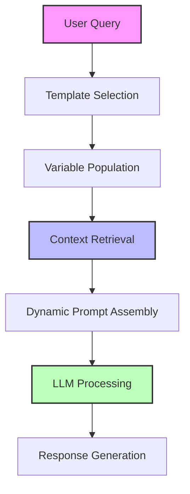

# Prompts in LangChain

# Understanding Prompts in LangChain 🔗🧠

## What Are Prompts? 🤔

Prompts are input instructions or queries given to language models to guide their responses. They serve as the primary interface between users and AI models, directing the model on what to generate and how to format its output.

In the context of LangChain, prompts are structured inputs that can range from simple strings to complex templates with variables.

## Code Breakdown 🧩

Let's analyze the code snippet you provided:

```python
from langchain_openai import ChatOpenAI
from dotenv import load_dotenv

load_dotenv()  # Loads environment variables from .env file

model = ChatOpenAI(
    model='gpt-4',             # Specifies which OpenAI model to use
    temperature=1.5,           # Controls randomness (higher = more creative)
    max_completion_tokens=10   # Limits response length to 10 tokens
)

result = model.invoke("Write a 5 line poem on cricket")  # The prompt
print(result.content)  # Prints the generated content
```

## LangChain Prompt Types 📋

LangChain offers several ways to work with prompts:

| Prompt Type | Description | Use Case |
|-------------|-------------|----------|
| **Simple String** | Basic text input | Quick, straightforward queries |
| **PromptTemplate** | Templates with variables | Dynamically generated prompts |
| **ChatPromptTemplate** | Templates for chat models | Multi-turn conversations |
| **FewShotPromptTemplate** | Templates with examples | Learning from demonstrations |

## Using PromptTemplates ✨

The simple string approach works, but LangChain's power comes from its templating system:

```python
from langchain.prompts import PromptTemplate

# Create a template with variables
template = PromptTemplate.from_template(
    "Write a {line_count} line poem about {topic} in the style of {author}"
)

# Format the template with specific values
formatted_prompt = template.format(
    line_count="5",
    topic="cricket",
    author="Shakespeare"
)

result = model.invoke(formatted_prompt)
```

## Chat-Specific Prompts 💬

For chat models, LangChain provides specialized templates:

```python
from langchain.prompts import ChatPromptTemplate
from langchain.prompts.chat import SystemMessagePromptTemplate, HumanMessagePromptTemplate

system_template = "You are a poet specializing in {style} poetry."
human_template = "Write a poem about {topic} with {line_count} lines."

chat_prompt = ChatPromptTemplate.from_messages([
    SystemMessagePromptTemplate.from_template(system_template),
    HumanMessagePromptTemplate.from_template(human_template)
])

messages = chat_prompt.format_messages(
    style="lyrical",
    topic="cricket",
    line_count="5"
)

result = model.invoke(messages)
```

## Best Practices for Effective Prompts 🌟

1. **Be Specific**: Clearly state what you want the model to do
2. **Provide Context**: Give relevant background information
3. **Use Examples**: Demonstrate the desired output format
4. **Control Parameters**: Adjust temperature based on creativity needs
5. **Iterate**: Refine prompts based on the outputs you receive

## Common Issues 🚫

- **Temperature Too High**: Your code uses `temperature=1.5`, which is quite high and may lead to very random outputs
- **Token Limit**: `max_completion_tokens=10` is very restrictive for a 5-line poem

## Improved Example ✅

```python
from langchain_openai import ChatOpenAI
from langchain.prompts import ChatPromptTemplate

model = ChatOpenAI(
    model='gpt-4',
    temperature=0.7,  # More balanced creativity
    max_tokens=150    # Reasonable space for a short poem
)

prompt = ChatPromptTemplate.from_messages([
    ("system", "You are a poet who specializes in concise, vivid imagery."),
    ("human", "Write a 5-line poem about cricket that captures both the sport and the insect. Each line should be exactly 7 words long.")
])

messages = prompt.format_messages()
result = model.invoke(messages)
print(result.content)
```

# Multimodal Prompts in LangChain 🌐🔊🎥🖼️

## What Are Multimodal Prompts? 🤔

Multimodal prompts allow you to interact with AI models using **multiple types of media** simultaneously, including:

- 📝 **Text**: Traditional text prompts
- 🔊 **Audio**: Sound files and speech
- 🎥 **Video**: Motion picture content
- 🖼️ **Images**: Visual content and graphics

This capability extends LangChain's functionality beyond text-only interactions, enabling more complex and rich applications.

---

## LangChain's Multimodal Architecture 🏗️

```
┌─────────────────────────────────────┐
│          LangChain Pipeline         │
├─────────┬─────────┬────────┬────────┤
│  Text   │  Audio  │  Video │ Image  │
│ Handling│ Handling│Handling│Handling│
└────┬────┴────┬────┴───┬────┴────┬───┘
     │         │        │         │
     ▼         ▼        ▼         ▼
┌─────────────────────────────────────┐
│        Multimodal LLM Models        │
└─────────────────────────────────────┘
```

LangChain supports multimodal processing through:
1. **Specialized chains** for each media type
2. **Media handlers** that process different inputs
3. **Integration** with multimodal foundation models

---

## Working with Text + Images 🖼️📝

```python
from langchain_openai import ChatOpenAI
from langchain_core.messages import HumanMessage
from langchain_core.messages.image import ImageContent

# Initialize a multimodal model
model = ChatOpenAI(model="gpt-4-vision-preview")

# Create a message with both text and image
message = HumanMessage(
    content=[
        {"type": "text", "text": "What's in this image?"},
        {
            "type": "image_url",
            "image_url": {
                "url": "https://example.com/image.jpg"
            }
        }
    ]
)

# Get the response
response = model.invoke([message])
print(response.content)
```

### Image Input Types Supported ✅

| Input Method | Description | Example |
|--------------|-------------|---------|
| `image_url` | URL pointing to an image | External web URL or data URI |
| `base64` | Base64 encoded image | Encoded image data |
| `file_path` | Local file path reference | Path to image on disk |

---

## Working with Audio 🔊

LangChain supports audio processing through specialized chains and tools:

```python
from langchain.chains import TranscriptionChain
from langchain_community.models import OpenAIWhisper
from langchain_core.prompts import PromptTemplate

# Initialize audio transcription model
transcriber = OpenAIWhisper()

# Create a transcription chain
transcription_prompt = PromptTemplate.from_template(
    "Transcribe the following audio file and capture all details: {audio_content}"
)
transcription_chain = TranscriptionChain(
    llm=transcriber,
    prompt=transcription_prompt
)

# Process audio
result = transcription_chain.run("path/to/audio.mp3")
```

### Audio Processing Pipeline 🔄

1. **Load audio** → 2. **Transcribe** → 3. **Process text** → 4. **Generate response**

---

## Video Processing Capabilities 🎥

Video processing in LangChain typically involves:

1. **Frame extraction** - Breaking video into key frames
2. **Audio extraction** - Isolating audio tracks
3. **Multimodal analysis** - Processing both visual and audio components

```python
from langchain_community.document_loaders import VideoLoader
from langchain_openai import ChatOpenAI
from langchain.chains import LLMChain

# Load video and extract frames and audio
loader = VideoLoader("path/to/video.mp4")
documents = loader.load()

# Process frames as images
frames = [doc for doc in documents if doc.metadata["type"] == "frame"]

# Process audio
audio = [doc for doc in documents if doc.metadata["type"] == "audio"]

# Initialize model and create chain
model = ChatOpenAI(model="gpt-4-vision-preview")
chain = LLMChain(
    llm=model,
    prompt=PromptTemplate.from_template(
        "Analyze this video content: Visual: {frames_content}, Audio: {audio_content}"
    )
)

# Process the content
result = chain.run(frames_content=frames, audio_content=audio)
```

---

## Integrating All Modalities 🔄

For fully integrated multimodal processing, LangChain can connect to specialized models:

```python
from langchain_openai import ChatOpenAI
from langchain_core.messages import HumanMessage
from langchain_community.tools import BaseTool
from langchain.chains import LLMChain

# Initialize a model that supports multiple modalities
model = ChatOpenAI(model="gpt-4-vision-preview")

# Create a complex multimodal message
message = HumanMessage(
    content=[
        {"type": "text", "text": "Analyze all this content:"},
        {"type": "image_url", "image_url": {"url": "https://example.com/scene.jpg"}},
        {"type": "audio", "audio": "base64_encoded_audio_content"},
        {"type": "video_url", "video_url": {"url": "https://example.com/clip.mp4"}}
    ]
)

# Process with appropriate handlers
response = model.invoke([message])
```

## Models with Multimodal Support 🤖

| Model | Text | Image | Audio | Video | Notes |
|-------|------|-------|-------|-------|-------|
| GPT-4V | ✓ | ✓ | ✗ | ✗ | Strong text+image capabilities |
| Claude 3 | ✓ | ✓ | ✗ | ✗ | Good image understanding |
| Gemini | ✓ | ✓ | ✓ | ✓ | Most complete multimodal support |
| Whisper | ✗ | ✗ | ✓ | ✗ | Audio transcription specialist |

---

## Best Practices for Multimodal Prompts 🌟

### 1. Media Preparation 📋

- **Images**: Resize to appropriate dimensions (1024x1024 recommended)
- **Audio**: Convert to compatible formats (MP3, WAV)
- **Video**: Extract key frames for better processing

### 2. Prompt Engineering Tips 💡

- **Be specific** about what to analyze in each media type
- **Provide context** linking different media elements
- **Ask targeted questions** that leverage multimodal understanding

### 3. Error Handling 🛑

```python
try:
    response = model.invoke([multimodal_message])
except Exception as e:
    if "file size" in str(e).lower():
        # Handle media too large
        print("Media file too large, resizing...")
    elif "unsupported format" in str(e).lower():
        # Handle format issues
        print("Unsupported media format...")
    else:
        # General error
        print(f"Error: {e}")
```

---

## Complete Example: Building a Multimodal Assistant 🤖

## Future Developments in Multimodal LangChain 🔮

- **Improved video understanding**: Better frame-by-frame analysis
- **Real-time processing**: Lower latency for audio/video streams
- **Cross-modal reasoning**: Understanding relationships between different media types
- **Specialized tools**: Purpose-built components for specific media analysis tasks

---

## Limitations to Consider ⚠️

- **Resource intensive**: Processing multiple media types requires significant compute
- **Size constraints**: Most models have limits on media file sizes
- **Quality dependence**: Poor quality media yields poor analysis
- **Integration complexity**: Handling multiple media types increases code complexity

---

## Conclusion 🏁

Multimodal prompts in LangChain open up powerful new avenues for AI applications by combining text, audio, video, and image processing capabilities. While implementation can be complex, the ability to process and reason across different media types enables more sophisticated and natural interactions.

The code sample provided demonstrates a comprehensive approach to building a multimodal assistant that can handle all four media types in a unified framework.

# Static vs. Dynamic Prompts in LangChain 🔄🔒

## Fundamental Differences 🧩

| Feature | Static Prompts | Dynamic Prompts |
|---------|---------------|-----------------|
| **Definition** | Fixed text strings defined before runtime | Templates populated with variables at runtime |
| **Flexibility** | Limited to predefined text | Adapts based on context, user input, or retrieved data |
| **Complexity** | Simple implementation | More complex, but more powerful |
| **Use Cases** | Consistent, predictable outputs | Personalized, context-aware responses |
| **Data Flow** | One-directional | Bi-directional with feedback loops |

## Static Prompts: The Foundation 🪨

Static prompts are hardcoded instructions that remain unchanged throughout the interaction lifecycle.

```python
from langchain_openai import ChatOpenAI
from langchain.schema import HumanMessage

model = ChatOpenAI()

# Static prompt example
static_prompt = "Summarize the 'Attention is All You Need' paper in simple terms."

response = model.invoke([HumanMessage(content=static_prompt)])
print(response.content)
```

### Characteristics of Static Prompts ✅

- **Consistency**: Same prompt produces similar outputs
- **Simplicity**: Easy to implement and test
- **Predictability**: Behavior is more deterministic
- **Efficiency**: No runtime computation needed

---

## Dynamic Prompts: The Evolution 🧬

Dynamic prompts utilize templates with variables that get populated based on context, user inputs, or retrieved information.

```python
from langchain.prompts import ChatPromptTemplate
from langchain_openai import ChatOpenAI
from datetime import datetime

# Dynamic prompt template
template = ChatPromptTemplate.from_template("""
You are a {role} on {date}.
{action} the paper titled '{paper_title}' in {style} fashion.
""")

# Variables filled at runtime
formatted_prompt = template.format(
    role="Research Assistant",
    date="14 February 2025 00:01",
    action="Summarize",
    paper_title="Attention is All You Need",
    style="simple"
)

model = ChatOpenAI()
response = model.invoke(formatted_prompt.to_messages())
print(response.content)
```

### Dynamic Prompt Evolution 📈

```
Static  →  Template  →  Context-Aware  →  Retrieval-Augmented  →  Adaptive
```

---

## The "Summarize → Fetch → ILM" Workflow 🔄

![Workflow Visualization](data:image/svg+xml;base64,PHN2ZyB3aWR0aD0iNTAwIiBoZWlnaHQ9IjEwMCIgeG1sbnM9Imh0dHA6Ly93d3cudzMub3JnLzIwMDAvc3ZnIj48ZGVmcz48bWFya2VyIGlkPSJhcnJvdyIgdmlld0JveD0iMCAwIDEwIDEwIiByZWZYPSI1IiByZWZZPSI1IiBtYXJrZXJXaWR0aD0iNiIgbWFya2VySGVpZ2h0PSI2IiBvcmllbnQ9ImF1dG8iPjxwYXRoIGQ9Ik0wLDAgTDEwLDUgTDAsMTAgWiIgZmlsbD0iIzAwN2JmZiIvPjwvbWFya2VyPjwvZGVmcz48cmVjdCB4PSIyMCIgeT0iMzAiIHdpZHRoPSIxMDAiIGhlaWdodD0iNDAiIHJ4PSI1IiByeT0iNSIgZmlsbD0iI2YwZjhmZiIgc3Ryb2tlPSIjMDA3YmZmIiBzdHJva2Utd2lkdGg9IjIiLz48dGV4dCB4PSI3MCIgeT0iNTAiIHRleHQtYW5jaG9yPSJtaWRkbGUiIGFsaWdubWVudC1iYXNlbGluZT0ibWlkZGxlIiBmb250LWZhbWlseT0iQXJpYWwiIGZvbnQtc2l6ZT0iMTQiIGZvbnQtd2VpZ2h0PSJib2xkIj5TdW1tYXJpemU8L3RleHQ+PGxpbmUgeDE9IjEyMCIgeTE9IjUwIiB4Mj0iMTkwIiB5Mj0iNTAiIHN0cm9rZT0iIzAwN2JmZiIgc3Ryb2tlLXdpZHRoPSIyIiBtYXJrZXItZW5kPSJ1cmwoI2Fycm93KSIvPjxyZWN0IHg9IjE5MCIgeT0iMzAiIHdpZHRoPSIxMDAiIGhlaWdodD0iNDAiIHJ4PSI1IiByeT0iNSIgZmlsbD0iI2YwZjhmZiIgc3Ryb2tlPSIjMDA3YmZmIiBzdHJva2Utd2lkdGg9IjIiLz48dGV4dCB4PSIyNDAiIHk9IjUwIiB0ZXh0LWFuY2hvcj0ibWlkZGxlIiBhbGlnbm1lbnQtYmFzZWxpbmU9Im1pZGRsZSIgZm9udC1mYW1pbHk9IkFyaWFsIiBmb250LXNpemU9IjE0IiBmb250LXdlaWdodD0iYm9sZCI+RmV0Y2g8L3RleHQ+PGxpbmUgeDE9IjI5MCIgeTE9IjUwIiB4Mj0iMzYwIiB5Mj0iNTAiIHN0cm9rZT0iIzAwN2JmZiIgc3Ryb2tlLXdpZHRoPSIyIiBtYXJrZXItZW5kPSJ1cmwoI2Fycm93KSIvPjxyZWN0IHg9IjM2MCIgeT0iMzAiIHdpZHRoPSIxMDAiIGhlaWdodD0iNDAiIHJ4PSI1IiByeT0iNSIgZmlsbD0iI2YwZjhmZiIgc3Ryb2tlPSIjMDA3YmZmIiBzdHJva2Utd2lkdGg9IjIiLz48dGV4dCB4PSI0MTAiIHk9IjUwIiB0ZXh0LWFuY2hvcj0ibWlkZGxlIiBhbGlnbm1lbnQtYmFzZWxpbmU9Im1pZGRsZSIgZm9udC1mYW1pbHk9IkFyaWFsIiBmb250LXNpemU9IjE0IiBmb250LXdlaWdodD0iYm9sZCI+SUxNPC90ZXh0Pjwvc3ZnPg==)

The workflow represents a dynamic prompt pipeline:

1. **Summarize** 📝
   - Initial request for summarization
   - Example: "Summarize the 'Attention is All You Need' paper"

2. **Fetch** 🔍
   - Retrieval of relevant information
   - Example: Fetching details from the transformer paper

3. **ILM (Interactive Language Model)** 🧠
   - Processing information using a language model
   - Generating the final output based on retrieved context

## Research Assistant Example (Feb 14, 2025) 👩‍🔬

## Dynamic Prompt Flow Analysis 🔄



---

## Static vs. Dynamic: "Attention is All You Need" Paper Example 📑

### Static Approach 🔒

```python
# Fixed instruction regardless of context
prompt = """
Summarize the 'Attention is All You Need' paper in simple terms.
Focus on the key contributions and explain the transformer architecture.
"""
```

**Output Quality**:
- ✅ Consistent but generic summary
- ❌ Limited to model's training knowledge
- ❌ May contain outdated or incomplete information
- ❌ Cannot adapt to user's expertise level

### Dynamic Approach 🔄

```python
# Template with variables filled at runtime
template = """
You are a {role} helping on {date}.

TASK: {action} the '{paper_title}' paper at a {expertise_level} level.

CONTEXT:
{retrieved_content}

FORMAT:
- Key Innovation: [Focus on attention mechanism]
- Main Components: [List the architectural elements]
- Impact: [Explain how it transformed NLP]
- Simple Analogy: [Provide an intuitive explanation]
"""

# Variables populated based on context and retrieval
dynamic_prompt = template.format(
    role="Research Assistant",
    date="14 February 2025 00:01",
    action="Summarize",
    paper_title="Attention is All You Need",
    expertise_level="beginner",
    retrieved_content=fetch_paper_details("Attention is All You Need")
)
```

**Output Quality**:
- ✅ Up-to-date information from retrieval
- ✅ Tailored to specified expertise level
- ✅ Formatted according to specific requirements
- ✅ Can include recent developments and citations

---

## ILM: Interactive Language Model Approach 🤖

ILM represents an advanced dynamic prompting approach where the model:

1. **Interacts** with external sources
2. **Learns** from context during the conversation
3. **Modifies** its responses based on feedback

```python
from langchain.chains import ConversationalRetrievalChain
from langchain.memory import ConversationBufferMemory

# Setup memory to track conversation
memory = ConversationBufferMemory(
    memory_key="chat_history",
    return_messages=True
)

# Create retriever for the paper
retriever = create_paper_retriever("Attention is All You Need")

# Create interactive chain
chain = ConversationalRetrievalChain.from_llm(
    llm=ChatOpenAI(),
    retriever=retriever,
    memory=memory
)

# First interaction
response = chain.run(
    "Summarize the Attention is All You Need paper"
)

# Follow-up with more specific questions
response = chain.run(
    "Explain the multi-head attention mechanism in simpler terms"
)
```

---

## Real-World Applications 🌐

| Scenario | Static Prompt | Dynamic Prompt |
|----------|---------------|----------------|
| **Academic Research** | "Summarize this paper" | "Summarize {paper_title} focusing on {specific_aspect} for a {audience_type}" |
| **Medical Diagnosis** | "What does this symptom mean?" | "Analyze these {symptoms} in light of {patient_history} and {recent_test_results}" |
| **Code Generation** | "Write a function to sort a list" | "Write a {language} function to implement {algorithm} optimized for {constraints}" |
| **Legal Document Analysis** | "Summarize this contract" | "Identify potential {risk_type} in this {document_type} relating to {jurisdiction}" |

---

## Which Approach Should You Choose? 🤔

### Choose Static Prompts When:
- 🎯 Consistent, predictable responses are needed
- 🛠 Simple tasks with minimal variation
- ⏱ Performance and speed are priorities
- 🔐 Strict control over outputs is required

### Choose Dynamic Prompts When:
- 🧩 Tasks require contextual awareness
- 📊 Handling variable inputs or data sources
- 🔍 Information retrieval is part of the workflow
- 🎛 Personalization is important

---

## Future Trends (February 2025) 🔮

- **Adaptive Prompting**: Self-adjusting prompts based on feedback
- **Multi-modal Prompts**: Combining text, image, and code inputs
- **Prompt Optimization Algorithms**: Automatic refinement of prompts
- **Chain-of-Thought Integration**: Structured reasoning within dynamic templates

---

## Conclusion 🏁

Static and dynamic prompts represent two fundamental approaches to LLM interaction, each with distinct advantages. While static prompts offer simplicity and consistency, dynamic prompts provide adaptability and context-awareness that's crucial for advanced applications like the research assistant scenario described.

The "Summarize → Fetch → ILM" workflow demonstrates how dynamic prompting can transform a simple request into a comprehensive, context-aware process that delivers significantly more valuable results.

For sophisticated applications like summarizing research papers, the dynamic approach clearly outperforms static prompting by incorporating up-to-date information and adapting to specific requirements.


