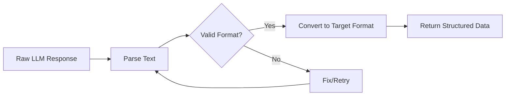
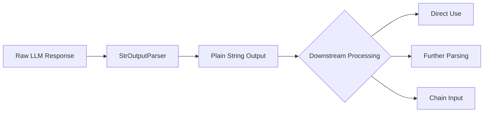
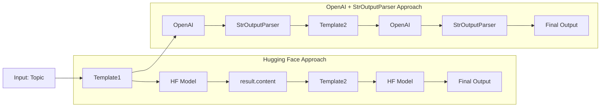
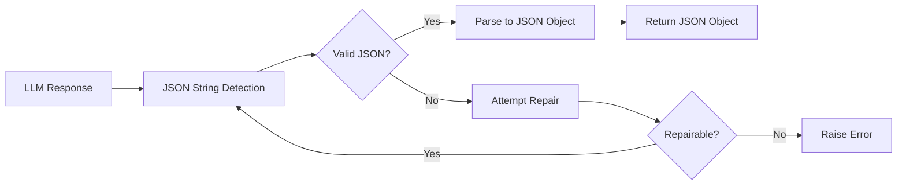
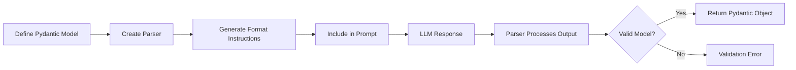

# Output Parsers in LangChain

# 🔄 Output Parsers in LangChain 📊

## What Are Output Parsers? 🧩

Output Parsers in LangChain serve as crucial translators that convert raw, unstructured text responses from Large Language Models (LLMs) into structured, usable data formats for applications.


## Why Output Parsers Matter 🎯

| Benefit | Description | Impact |
|---------|-------------|--------|
| 🔹 **Consistency** | Ensures LLM outputs follow predictable formats | High |
| 🔹 **Validation** | Verifies outputs meet expected schema requirements | High |
| 🔹 **Usability** | Makes LLM outputs directly consumable by downstream processes | High |
| 🔹 **Error Handling** | Provides graceful recovery from malformed responses | Medium |
| 🔹 **Integration** | Simplifies connecting LLMs to other systems | High |

## Types of Output Parsers in LangChain 📋

### 1. Structured Format Parsers 📁

- **JSON Parser** 📄
  - Converts LLM text responses into valid JSON objects
  - Handles nested structures and arrays
  - Provides error recovery for malformed JSON

- **CSV Parser** 📊
  - Transforms text into tabular data format
  - Maintains row/column structure
  - Supports various delimiter options

- **XML Parser** 🏗️
  - Parses hierarchical data structures
  - Preserves tag attributes and relationships
  - Validates against schema definitions

### 2. Model-Based Parsers 🧠

- **Pydantic Parser** 📏
  - Maps outputs to predefined Pydantic models
  - Provides automatic type validation
  - Supports complex nested object structures

- **TypeScript Interface Parser** 📘
  - Generates outputs compatible with TypeScript interfaces
  - Ensures type safety for frontend applications
  - Supports optional and required fields

### 3. Specialized Parsers 🔍

- **List Parser** 📝
  - Extracts itemized lists from text
  - Maintains hierarchical list structure
  - Supports numbered and bulleted formats

- **Router Parser** 🔀
  - Routes outputs to different handlers based on content
  - Implements content-based logic branching
  - Supports complex decision workflows

## How Output Parsers Work 🛠️



### The Parser Workflow:

1. 📥 **Input Preparation**: Format prompts to guide the LLM to produce parse-friendly outputs
2. 📤 **Response Generation**: LLM generates text based on the prompt
3. 🔍 **Parsing Attempt**: Parser tries to convert the text to the target format
4. ✅ **Validation**: Confirm the parsed output meets expected schema/requirements
5. 🔄 **Error Recovery** (if needed): Handle malformed outputs with retry logic or fixers

## Implementation Examples 💻

### JSON Output Parser Example:

```python
from langchain.output_parsers import JsonOutputParser
from langchain.prompts import PromptTemplate
from langchain.llms import OpenAI

# Define the parser
parser = JsonOutputParser(schema={
    "type": "object",
    "properties": {
        "name": {"type": "string"},
        "age": {"type": "number"},
        "interests": {"type": "array", "items": {"type": "string"}}
    },
    "required": ["name", "age"]
})

# Create a prompt template
prompt = PromptTemplate(
    template="Generate details about a person.\n{format_instructions}\n",
    input_variables=[],
    partial_variables={"format_instructions": parser.get_format_instructions()}
)

# Set up the LLM chain
model = OpenAI(temperature=0)
chain = prompt | model | parser

# Run the chain
result = chain.invoke({})
print(result)
```

## Advanced Features (As of March 2025) 🚀

> 💡 **2025 Update**: Recent improvements to Output Parsers include enhanced error recovery, streaming compatibility, and multimodal output parsing capabilities.

### Latest Enhancements:

- **Streaming Parser Support** ⚡
  - Parse outputs incrementally as they stream from the LLM
  - Reduce latency for large structured outputs
  
- **Multi-format Parsing** 🔄
  - Handle multiple potential output formats from a single LLM response
  - Dynamically select the most appropriate parser
  
- **Self-healing Parsers** 🔧
  - Automatically fix common formatting errors
  - Use the LLM itself to correct malformed outputs

## Best Practices 🌟

| Practice | Description | Example |
|----------|-------------|---------|
| **Clear Instructions** | Provide explicit formatting guidance in prompts | "Return your answer as a valid JSON object with fields: name, age, and occupation" |
| **Schema Validation** | Define expected output structure | Use JSON Schema or Pydantic models |
| **Error Handling** | Implement robust recovery mechanisms | Add retry logic with reformatting hints |
| **Type Checking** | Verify data types match expectations | Validate numeric fields contain actual numbers |
| **Simplicity First** | Start with simpler schemas before complex ones | Begin with flat objects before nested structures |

## Integration in LangChain Applications 🔗

Output Parsers can be integrated at various points in your LangChain application:

1. 🔹 As part of a chain
2. 🔹 In agents for structured tool responses
3. 🔹 Within document QA systems
4. 🔹 For chatbot response formatting
5. 🔹 In data extraction workflows

## Conclusion 📝

Output Parsers are essential components that bridge the gap between the creative, natural language capabilities of LLMs and the structured, predictable data formats required by software applications. By implementing appropriate parsers, developers can harness the power of LLMs while maintaining data consistency and application reliability.

> 🔍 **Note**: Always keep your LangChain libraries updated to benefit from the latest parser improvements and bug fixes as the ecosystem continues to evolve.


# 📜 StrOutputParser in LangChain 📜

## What is StrOutputParser? 🔍

The StrOutputParser is the simplest output parser in LangChain's parsing ecosystem. Its primary function is elegantly straightforward:

> 💡 **Core Purpose**: Parse the output of a Language Model (LLM) and return it as a plain string.


## Key Characteristics ✨

| Feature | Description | Complexity |
|---------|-------------|------------|
| 🔹 **Simplicity** | Minimal processing with no complex transformations | Low |
| 🔹 **Universality** | Works with all LLM outputs regardless of content | High |
| 🔹 **Performance** | Minimal overhead with fast processing time | High |
| 🔹 **Integration** | Easily chains with other LangChain components | High |
| 🔹 **Flexibility** | Accepts any text format from the LLM | High |

## How StrOutputParser Works 🛠️



### The Processing Flow:

1. 📥 **Input**: Receives raw text output from an LLM
2. 📤 **Processing**: Minimal or no transformation applied
3. 🔄 **Output**: Returns the text as a standard Python string
4. 🔗 **Usage**: Ready for downstream processing or direct use

## Implementation Examples 💻

### Basic Usage:

```python
from langchain.output_parsers import StrOutputParser
from langchain.prompts import PromptTemplate
from langchain.llms import OpenAI

# Create components
prompt = PromptTemplate(
    template="Write a short explanation about {topic}.",
    input_variables=["topic"]
)
model = OpenAI(temperature=0.7)
parser = StrOutputParser()

# Build and run the chain
chain = prompt | model | parser
result = chain.invoke({"topic": "black holes"})
print(result)  # Prints the string output directly
```

## When to Use StrOutputParser 📊

| Scenario | Suitability | Reason |
|----------|-------------|--------|
| Simple text generation | ⭐⭐⭐⭐⭐ | No structure needed |
| Content creation | ⭐⭐⭐⭐⭐ | Preserves formatting |
| Direct human consumption | ⭐⭐⭐⭐⭐ | No parsing overhead |
| Structured data needs | ⭐ | No validation or schema |
| API responses | ⭐⭐ | May need additional formatting |
| Database storage | ⭐⭐ | May require further processing |

## Comparison with Other Parsers 🔄

| Parser Type | Complexity | Structure | Validation | Use Case |
|-------------|------------|-----------|------------|----------|
| 📜 **StrOutputParser** | Low | None | None | Simple text return |
| 📊 **JsonOutputParser** | Medium | JSON | Schema-based | Structured data |
| 📋 **PydanticOutputParser** | High | Object | Type checking | Application objects |
| 📑 **ListOutputParser** | Medium | List | Format checking | Itemized content |
| 🔀 **RouterOutputParser** | High | Varies | Route-based | Conditional flows |

## Advanced Use Cases 🚀

### 1. Text Preprocessing Pipeline

```python
from langchain.output_parsers import StrOutputParser
from langchain.prompts import PromptTemplate
from langchain.llms import OpenAI
from langchain.schema import StrOutputParser as StringParser

# Create a text processing pipeline
prompt = PromptTemplate(template="Summarize: {text}", input_variables=["text"])
model = OpenAI(temperature=0.2)
parser = StrOutputParser()

# Add custom post-processing
def clean_text(text):
    return text.strip().replace("\n\n", "\n")

chain = prompt | model | parser | clean_text
result = chain.invoke({"text": "Long document content here..."})
```

### 2. Chaining with Other Parsers

```python
from langchain.output_parsers import StrOutputParser, JsonOutputParser
from langchain.prompts import PromptTemplate
from langchain.llms import OpenAI

# Initial text generation
text_prompt = PromptTemplate(
    template="Write about {topic}.",
    input_variables=["topic"]
)
model = OpenAI(temperature=0.7)
str_parser = StrOutputParser()

# Text analysis chain
analysis_prompt = PromptTemplate(
    template="Analyze the sentiment and key topics in this text. Return as JSON: {text}",
    input_variables=["text"]
)
json_parser = JsonOutputParser()

# Chain them together
text_chain = text_prompt | model | str_parser
analysis_chain = analysis_prompt | model | json_parser

# Execute
text = text_chain.invoke({"topic": "renewable energy"})
analysis = analysis_chain.invoke({"text": text})
```

## Token Usage Insights 📈

When using StrOutputParser with LLMs, you'll receive token usage information as seen in the example:

```
content='A black hole is a region in space where gravity is so strong that nothing, not even light, can escape its pull. It is formed when a massive star collapses upon itself.'
additional_kwargs={'usage': {'prompt_tokens': 15, 'total_tokens': 52, 'completion_tokens': 37, 'completion_tokens_details': {'accepted_prediction_tokens': 0, 'audio_tokens': 0, 'reasoning_tokens': 0, 'rejected_prediction_tokens': 0}, 'prompt_tokens_details': {'audio_tokens': 0, 'cached_tokens': 0}}, 'model_name': 'gpt-3.5-turbo-0125', 'system_fingerprint': None, 'finish_reason': 'stop', 'logprobs': None} id='run-a7b90203-58f8-47c5-a01b-01184b6aec14-0' usage_metadata={'input_tokens': 15, 'output_tokens': 37, 'total_tokens': 52, 'input_token_details': {'audio': 0, 'cache_read': 0}, 'output_token_details': {'audio': 0, 'reasoning': 0}}
```

> 💡 **Note**: This metadata is valuable for monitoring costs and optimizing prompts, even when using the simplest parser.

## Best Practices 🌟

1. 🔹 **Direct Text Needs**: Use StrOutputParser when you need the raw text output with no additional processing
2. 🔹 **Preprocessing Step**: Implement it as the first step in a more complex parsing pipeline
3. 🔹 **Human-Readable Content**: Ideal for generating content meant for direct human consumption
4. 🔹 **Template Generation**: Perfect for creating templates or formatted text
5. 🔹 **Simple Integration**: Use when you need quick implementation with minimal overhead

## Conclusion 📝

The StrOutputParser exemplifies the principle of simplicity in design within the LangChain ecosystem. While other parsers offer structured data transformations and schema validation, the StrOutputParser delivers raw, unprocessed text exactly as the LLM generates it—making it perfect for direct text applications and the foundation of more complex parsing pipelines.

> 🔍 **When to Choose StrOutputParser**: Select this parser when your application needs the exact text output from an LLM without any transformation or when you plan to handle any necessary formatting or parsing in subsequent processing steps.
>
> # 🔄 LangChain Output Parsing: Code Comparison 📊

## Overview 📋

The code snippets demonstrate two different approaches to creating a language model workflow:

1. 🤗 **Sequential Approach** - Using Hugging Face models with manual chaining
2. 🔗 **Integrated Chain Approach** - Using OpenAI with StrOutputParser for streamlined pipelines

## 📊 Visual Comparison

| Feature | Hugging Face Approach | OpenAI + StrOutputParser Approach |
|---------|----------------------|-----------------------------------|
| 🔹 **Model** | Gemma 2 2B | ChatOpenAI |
| 🔹 **Chaining Method** | Manual (multiple invocations) | Integrated pipeline (using \| operator) |
| 🔹 **Output Parser** | None (uses raw content) | StrOutputParser |
| 🔹 **Code Complexity** | Higher (more steps) | Lower (streamlined) |
| 🔹 **Readability** | Sequential operations | Declarative pipeline |

## 🔍 Detailed Analysis

### 1️⃣ Hugging Face Approach (Manual Sequential Processing)

```python
# Setting up Hugging Face model
from langchain_huggingface import ChatHuggingFace, HuggingFaceEndpoint
from dotenv import load_dotenv
from langchain_core.prompts import PromptTemplate

load_dotenv()
llm = HuggingFaceEndpoint(
    repo_id="google/gemma-2-2b-it",
    task="text-generation"
)
model = ChatHuggingFace(llm=llm)

# Define templates
template1 = PromptTemplate(
    template='Write a detailed report on {topic}',
    input_variables=['topic']
)
template2 = PromptTemplate(
    template='Write a 5 line summary on the following text. /n {text}',
    input_variables=['text']
)

# Manual execution - step by step
prompt1 = template1.invoke({'topic':'black hole'})
result = model.invoke(prompt1)
prompt2 = template2.invoke({'text':result.content})
result1 = model.invoke(prompt2)
print(result1.content)
```

> 💡 **Key Point**: This approach requires manually invoking each step and managing the intermediate results through explicit variables.

### 2️⃣ OpenAI Approach with StrOutputParser (Integrated Chain)

```python
# Setting up OpenAI model with parser
from langchain_openai import ChatOpenAI
from dotenv import load_dotenv
from langchain_core.prompts import PromptTemplate
from langchain_core.output_parsers import StrOutputParser

load_dotenv()
model = ChatOpenAI()

# Same templates as before
template1 = PromptTemplate(
    template='Write a detailed report on {topic}',
    input_variables=['topic']
)
template2 = PromptTemplate(
    template='Write a 5 line summary on the following text. /n {text}',
    input_variables=['text']
)

# Integrated chain with StrOutputParser
parser = StrOutputParser()
chain = template1 | model | parser | template2 | model | parser
result = chain.invoke({'topic':'black hole'})
print(result)
```

> 🔍 **Key Insight**: The StrOutputParser enables seamless chaining by converting LLM responses into plain strings that can be directly fed into subsequent components.

## 🔄 Flow Visualization



## 🌟 The Role of StrOutputParser

The StrOutputParser serves as a crucial connector in LangChain pipelines by:

1. 🔹 **Extracting Text**: Pulling the raw string content from model responses
2. 🔹 **Format Conversion**: Converting structured responses to simple strings
3. 🔹 **Chain Compatibility**: Enabling seamless piping between components
4. 🔹 **Flow Automation**: Eliminating manual extraction of `.content`

## 💡 Benefits of the Integrated Chain Approach

| Benefit | Description | Impact |
|---------|-------------|--------|
| 🔹 **Code Conciseness** | Fewer lines of code | Reduced development time |
| 🔹 **Readability** | Clearer pipeline structure | Easier maintenance |
| 🔹 **Error Handling** | Unified error propagation | More robust applications |
| 🔹 **Extensibility** | Easier to add components | Flexible architecture |
| 🔹 **Composition** | Mix and match components | Powerful combinations |

## 📝 Implementation Best Practices

1. 🔹 **Use StrOutputParser** when connecting components that expect string inputs
2. 🔹 **Leverage the pipe operator** `|` for cleaner, more readable chains
3. 🔹 **Keep templates separate** from chain definition for better reusability
4. 🔹 **Consider specialized parsers** (JSON, List, etc.) when more structured output is needed
5. 🔹 **Use environment variables** with `.env` files for sensitive credentials

> 🚀 **Pro Tip**: For complex workflows, the integrated chain approach with StrOutputParser can significantly reduce code complexity while improving maintainability.

## 🔍 Conclusion

The StrOutputParser exemplifies how LangChain simplifies working with language models by providing elegant abstractions for common operations. By enabling the pipe operator syntax, it transforms verbose sequential code into streamlined declarative pipelines that are easier to read, write, and maintain.

# 🔄 JsonOutputParser in LangChain: Structured Data Extraction 📊

## 📌 What is JsonOutputParser? 🧩

JsonOutputParser is a specialized output parser in LangChain that transforms language model responses into structured JSON objects. Unlike the simple string conversion of StrOutputParser, JsonOutputParser ensures outputs conform to valid JSON format.


> 💡 **Core Purpose**: Convert LLM text outputs into structured, machine-readable JSON objects for programmatic use.

## 🔍 Key Capabilities & Features ✨

| Feature | Description | Benefit |
|---------|-------------|---------|
| 🔹 **Format Instructions** | Automatically provides JSON formatting guidelines to LLMs | Increases parsing success rate |
| 🔹 **Schema Validation** | Can validate outputs against predefined JSON schemas | Ensures data consistency |
| 🔹 **Error Recovery** | Attempts to fix common JSON formatting errors | Improves reliability |
| 🔹 **Nested Structures** | Handles complex nested JSON objects and arrays | Supports rich data structures |
| 🔹 **Type Conversion** | Converts text representations to appropriate data types | Maintains data integrity |

## 🛠️ How JsonOutputParser Works 



### The Parsing Process:

1. 📝 **Preparation**: Injects format instructions into the prompt
2. 📤 **Response Generation**: LLM generates text with JSON structure
3. 🔍 **Validation**: Checks if output is valid JSON
4. 🔧 **Parsing**: Converts JSON string to Python dictionary/list
5. 🔄 **Error Handling**: Attempts recovery if parsing fails

## 💻 Code Analysis: JsonOutputParser Implementation

Let's examine the code example provided:

```python
from langchain_huggingface import ChatHuggingFace, HuggingFaceEndpoint
from dotenv import load_dotenv
from langchain_core.prompts import PromptTemplate
from langchain_core.output_parsers import JsonOutputParser
load_dotenv()

# Define the model
llm = HuggingFaceEndpoint(
    repo_id="google/gemma-2-2b-it",
    task="text-generation"
)
model = ChatHuggingFace(llm=llm)

# Create JSON parser
parser = JsonOutputParser()

# Create prompt template with format instructions
template = PromptTemplate(
    template='Give me 5 facts about {topic} \n {format_instruction}',
    input_variables=['topic'],
    partial_variables={'format_instruction': parser.get_format_instructions()}
)

# Build and run the chain
chain = template | model | parser
result = chain.invoke({'topic':'black hole'})
print(result)
```

### 🔍 Key Components Explained:

1. 🔹 **Parser Initialization**: `parser = JsonOutputParser()`
   - Creates a parser instance without schema constraints

2. 🔹 **Format Instructions**: `parser.get_format_instructions()`
   - Generates instructions for the LLM on how to format JSON output
   - Typically includes examples and guidance on JSON syntax

3. 🔹 **Prompt Template**: Injects format instructions into template
   - Ensures LLM knows to return properly structured JSON

4. 🔹 **Chain Construction**: `template | model | parser`
   - Connects components for seamless execution
   - Parser automatically processes model output

## ⚙️ Behind the Scenes: Format Instructions

When you call `parser.get_format_instructions()`, the JsonOutputParser generates text similar to:

```
The output should be formatted as a JSON object.
Here's an example of the expected format:
{
  "key1": "value1",
  "key2": "value2",
  ...
}
```

> 📝 **Note**: These instructions help guide the LLM to produce properly formatted JSON, significantly improving parsing success rates.

## 📊 Potential Output Structure

The black hole facts example might return:

```json
{
  "facts": [
    "Black holes have gravitational fields so strong that nothing can escape, not even light",
    "They are formed when massive stars collapse at the end of their life cycle",
    "The boundary of a black hole is called the event horizon",
    "Time appears to slow down near a black hole due to gravitational time dilation",
    "Supermassive black holes exist at the center of most galaxies, including our Milky Way"
  ]
}
```

## 🔄 JsonOutputParser vs. Other Parsers

| Parser Type | Structure | Validation | Complexity | Best For |
|-------------|-----------|------------|------------|----------|
| 📜 **StrOutputParser** | None | None | Low | Simple text extraction |
| 📊 **JsonOutputParser** | JSON | Optional schema | Medium | Structured data, API responses |
| 📋 **PydanticOutputParser** | Object | Type checking | High | Application data models |
| 📑 **ListOutputParser** | Array | Format checking | Low-Medium | Simple lists |
| 🔀 **RouterOutputParser** | Varies | Format-based | Medium-High | Conditional processing |

## 🚀 Advanced Applications

### 1. With Schema Validation

```python
# Using JsonOutputParser with schema validation
from langchain_core.output_parsers import JsonOutputParser
import json

# Define schema for black hole facts
schema = {
    "type": "object",
    "properties": {
        "facts": {
            "type": "array",
            "items": {
                "type": "string"
            }
        }
    },
    "required": ["facts"]
}

# Create parser with schema
schema_parser = JsonOutputParser(schema=schema)

# Update template with schema-aware instructions
template = PromptTemplate(
    template='Give me 5 facts about {topic} \n {format_instruction}',
    input_variables=['topic'],
    partial_variables={'format_instruction': schema_parser.get_format_instructions()}
)

# Build chain with schema validation
validated_chain = template | model | schema_parser
```

### 2. Complex Nested Structures

```python
# Example for extracting structured information about astronomy topics
complex_schema = {
    "type": "object",
    "properties": {
        "name": {"type": "string"},
        "category": {"type": "string"},
        "characteristics": {
            "type": "object",
            "properties": {
                "size": {"type": "string"},
                "composition": {"type": "string"},
                "age": {"type": "string"}
            }
        },
        "keyFacts": {
            "type": "array",
            "items": {"type": "string"}
        },
        "relatedTopics": {
            "type": "array",
            "items": {"type": "string"}
        }
    }
}

# Create parser for complex astronomical data
astro_parser = JsonOutputParser(schema=complex_schema)
```

## 🌟 Best Practices for JsonOutputParser

1. 🔹 **Provide Clear Instructions**: Use format_instructions in your prompt template
2. 🔹 **Use Schema Validation**: When possible, define expected structure
3. 🔹 **Handle Parsing Errors**: Implement fallback strategies for parsing failures
4. 🔹 **Start Simple**: Begin with basic schemas before complex nested structures
5. 🔹 **Test Thoroughly**: Different LLMs may require different prompting strategies

## 🛑 Common Pitfalls & Solutions

| Issue | Cause | Solution |
|-------|-------|----------|
| 🔸 **Invalid JSON** | LLM includes explanatory text or markdown | Improve format instructions |
| 🔸 **Missing Fields** | LLM omits required properties | Use schema validation |
| 🔸 **Type Mismatches** | LLM returns strings for numbers | Set `pydantic_schema=True` for type coercion |
| 🔸 **Nested Complexity** | Too complex schema for LLM capability | Simplify schema or use more capable models |
| 🔸 **Context Length Limits** | Format instructions consume token budget | Optimize prompts for conciseness |

## 📈 Performance Considerations

- 🔹 **Token Usage**: Format instructions consume tokens, impacting costs
- 🔹 **Model Selection**: More capable models (like GPT-4, Claude 3) produce better-structured JSON
- 🔹 **Temperature Setting**: Lower temperatures (0.0-0.3) improve JSON formatting reliability
- 🔹 **Prompt Design**: Clear examples in prompts improve parsing success rates

## 🔍 Conclusion

JsonOutputParser transforms raw LLM text into structured JSON data, bridging the gap between natural language and programmatic data formats. By injecting format instructions and optionally validating against schemas, it creates reliable data pipelines that connect LLMs to downstream applications, databases, and APIs.

> 🚀 **When to Choose JsonOutputParser**: Select this parser when your application needs structured data extraction from LLMs, especially for API responses, database storage, or integration with existing systems that expect JSON.
# 📐 PydanticOutputParser in LangChain: Type-Safe Structured Output 🧩

## 📌 What is PydanticOutputParser? 🔍

PydanticOutputParser is an advanced output parser in LangChain that leverages Pydantic models to enforce schema validation and type safety when processing LLM responses. It transforms unstructured text outputs into validated Python objects.


> 💡 **Core Purpose**: Convert LLM text outputs into type-safe Python objects with strict schema validation using Pydantic models.

## 🔮 Key Capabilities & Features ✨

| Feature | Description | Benefit |
|---------|-------------|---------|
| 🔹 **Schema Enforcement** | Validates output against Pydantic models | Ensures data integrity |
| 🔹 **Type Safety** | Automatic type conversion and validation | Reduces runtime errors |
| 🔹 **Field Validation** | Supports custom validation rules | Maintains data quality |
| 🔹 **Complex Structures** | Handles nested models and relationships | Supports rich data models |
| 🔹 **Default Values** | Provides fallbacks for missing fields | Improves robustness |
| 🔹 **Documentation** | Self-documenting through field descriptions | Clearer LLM guidance |

## 🛠️ How PydanticOutputParser Works 



### 🔄 The Parsing Process:

1. 📋 **Model Definition**: Define a Pydantic model with fields and validation
2. 🔧 **Parser Creation**: Initialize parser with Pydantic model
3. 📝 **Instruction Generation**: Create format instructions for the LLM
4. 📤 **Response Generation**: LLM produces structured output
5. 🔍 **Parsing & Validation**: Convert text to Pydantic object with validation
6. 🔄 **Type Conversion**: Automatically convert data to appropriate types

## 💻 Code Analysis: PydanticOutputParser Implementation

Let's examine the provided example:

```python
from langchain_huggingface import ChatHuggingFace, HuggingFaceEndpoint
from dotenv import load_dotenv
from langchain_core.prompts import PromptTemplate
from langchain_core.output_parsers import PydanticOutputParser
from pydantic import BaseModel, Field
load_dotenv()

# Define the model
llm = HuggingFaceEndpoint(
    repo_id="google/gemma-2-2b-it",
    task="text-generation"
)
model = ChatHuggingFace(llm=llm)

# Define Pydantic model
class Person(BaseModel):
    name: str = Field(description='Name of the person')
    age: int = Field(gt=18, description='Age of the person')
    city: str = Field(description='Name of the city the person belongs to')

# Create parser with Pydantic model
parser = PydanticOutputParser(pydantic_object=Person)

# Create prompt template with format instructions
template = PromptTemplate(
    template='Generate the name, age and city of a fictional {place} person \n {format_instruction}',
    input_variables=['place'],
    partial_variables={'format_instruction':parser.get_format_instructions()}
)

# Build and run the chain
chain = template | model | parser
final_result = chain.invoke({'place':'sri lankan'})
print(final_result)
```

### 🔍 Key Components Explained:

1. 🔹 **Pydantic Model Definition**: Creating a schema with validation rules
   ```python
   class Person(BaseModel):
       name: str = Field(description='Name of the person')
       age: int = Field(gt=18, description='Age of the person')
       city: str = Field(description='Name of the city the person belongs to')
   ```

2. 🔹 **Field Validation**: Note the `gt=18` constraint for age validation
   - Ensures the age is greater than 18
   - Will raise a validation error if the LLM provides an invalid age

3. 🔹 **Parser Initialization**: Creating parser with the Pydantic model
   ```python
   parser = PydanticOutputParser(pydantic_object=Person)
   ```

4. 🔹 **Format Instructions**: Generating and injecting instructions into prompt
   ```python
   template = PromptTemplate(
       template='Generate the name, age and city of a fictional {place} person \n {format_instruction}',
       input_variables=['place'],
       partial_variables={'format_instruction':parser.get_format_instructions()}
   )
   ```

## ⚙️ Behind the Scenes: Format Instructions

When you call `parser.get_format_instructions()`, it generates detailed instructions:

```
The output should be formatted as a JSON instance that conforms to the JSON schema below.

{
    "properties": {
        "name": {
            "description": "Name of the person",
            "type": "string"
        },
        "age": {
            "description": "Age of the person",
            "type": "integer",
            "exclusiveMinimum": 18
        },
        "city": {
            "description": "Name of the city the person belongs to",
            "type": "string"
        }
    },
    "required": ["name", "age", "city"]
}
```

> 📝 **Note**: These instructions include field types, descriptions, and validation rules from the Pydantic model.

## 📊 Example Output

The Sri Lankan person example might return:

```python
Person(name='Rajith Perera', age=34, city='Colombo')
```

Which is a fully validated Pydantic object that can be used directly in your application.

## 🔄 PydanticOutputParser vs. Other Parsers

| Parser Type | Schema Approach | Validation | Type Safety | Object-Oriented | Best For |
|-------------|----------------|------------|------------|-----------------|----------|
| 📜 **StrOutputParser** | None | None | None | No | Simple text extraction |
| 📊 **JsonOutputParser** | JSON Schema | Basic | Limited | No | Flexible structured data |
| 📋 **StructuredOutputParser** | Field list | Basic | Limited | No | Named field extraction |
| 📑 **PydanticOutputParser** | Pydantic models | Advanced | High | Yes | Complex data models with validation |
| 🔀 **CommaSeparatedListOutputParser** | None | Format only | None | No | Simple lists |

## 🧩 Validation Capabilities

| Validation Type | Example | Description |
|-----------------|---------|-------------|
| 🔹 **Type Validation** | `age: int` | Ensures correct data type |
| 🔹 **Range Constraints** | `Field(gt=18)` | Numerical boundaries |
| 🔹 **String Patterns** | `Field(regex='^[A-Z]')` | Text pattern matching |
| 🔹 **Enumerations** | `Field(enum=["A", "B"])` | Limited value options |
| 🔹 **Custom Validators** | `@validator('field')` | Complex custom logic |
| 🔹 **Dependent Fields** | `@root_validator` | Cross-field validation |
| 🔹 **Default Values** | `Field(default="Unknown")` | Fallback for missing data |

## 🚀 Advanced Applications

### 1. Nested Models

```python
from pydantic import BaseModel, Field
from typing import List

class Address(BaseModel):
    street: str = Field(description="Street name and number")
    city: str = Field(description="City name")
    postal_code: str = Field(description="Postal/ZIP code")
    country: str = Field(description="Country name")

class Contact(BaseModel):
    email: str = Field(description="Email address")
    phone: str = Field(description="Phone number")

class Person(BaseModel):
    name: str = Field(description="Full name")
    age: int = Field(gt=0, description="Age in years")
    address: Address = Field(description="Residential address")
    contacts: List[Contact] = Field(description="Contact information")
```

### 2. Complex Validations

```python
from pydantic import BaseModel, Field, validator
from datetime import date

class Employee(BaseModel):
    employee_id: str = Field(description="Employee ID")
    name: str = Field(description="Employee name")
    department: str = Field(description="Department name")
    salary: float = Field(gt=0, description="Annual salary")
    hire_date: date = Field(description="Date of hiring (YYYY-MM-DD)")
    
    @validator('employee_id')
    def validate_employee_id(cls, v):
        if not v.startswith('EMP-'):
            raise ValueError('Employee ID must start with EMP-')
        return v
        
    @validator('hire_date')
    def validate_hire_date(cls, v):
        if v > date.today():
            raise ValueError('Hire date cannot be in the future')
        return v
```

## 🌟 Benefits of Pydantic Integration

| Benefit | Description | Impact |
|---------|-------------|--------|
| 🔹 **IDE Integration** | Type hints work with modern IDEs | Improved developer experience |
| 🔹 **Documentation** | Self-documenting models | Better code maintenance |
| 🔹 **Schema Export** | Generate JSON Schema, OpenAPI | API integration |
| 🔹 **Serialization** | Easy conversion to dict, JSON | Data interoperability |
| 🔹 **Extensibility** | Custom validators, field types | Flexible validation rules |
| 🔹 **Error Handling** | Detailed validation errors | Better debugging |

## 🛑 Common Pitfalls & Solutions

| Issue | Cause | Solution |
|-------|-------|----------|
| 🔸 **Validation Errors** | LLM output doesn't match schema | Improve format instructions with examples |
| 🔸 **Complex Models** | Too many nested fields or validations | Simplify model or use more capable LLMs |
| 🔸 **Type Mismatches** | LLM returns strings for numbers | Add explicit conversion hints in prompt |
| 🔸 **Missing Fields** | LLM omits required fields | Make fields optional or add defaults |
| 🔸 **Token Limitations** | Format instructions too verbose | Simplify model or split into smaller components |

## 📈 Best Practices

1. 🔹 **Start Simple**: Begin with basic models before adding complex validation
2. 🔹 **Clear Descriptions**: Provide helpful field descriptions to guide the LLM
3. 🔹 **Reasonable Constraints**: Use validation rules that LLMs can reasonably satisfy
4. 🔹 **Default Values**: Add defaults for non-critical fields to handle missing data
5. 🔹 **Examples in Prompts**: Include example outputs in your prompts when possible
6. 🔹 **Error Handling**: Implement graceful handling for validation failures

## 🏆 Use Cases: When to Choose PydanticOutputParser

PydanticOutputParser excels in scenarios requiring:

- 🔹 **Type-Safe Applications**: When integrating with strongly-typed systems
- 🔹 **Complex Data Models**: For nested or relational data structures
- 🔹 **Validation Requirements**: When data quality is critical
- 🔹 **API Integration**: For generating outputs that match API schemas
- 🔹 **Object-Oriented Workflows**: When working with class-based architectures

## 🔍 Conclusion

PydanticOutputParser represents the most sophisticated parser in LangChain's arsenal, offering a powerful combination of schema enforcement, type safety, and validation capabilities. By leveraging Pydantic's robust validation ecosystem, it ensures that LLM outputs conform precisely to your application's data models.

While it requires more setup than simpler parsers, it provides unmatched reliability for applications where data integrity and type safety are critical. The combination of descriptive fields, validation rules, and type conversion makes it particularly well-suited for complex enterprise applications or systems with strict data requirements.

> 🚀 **When to Choose PydanticOutputParser**: Select this parser when you need validated, type-safe Python objects with complex structure and validation rules, especially when integrating with strongly-typed systems or APIs.
