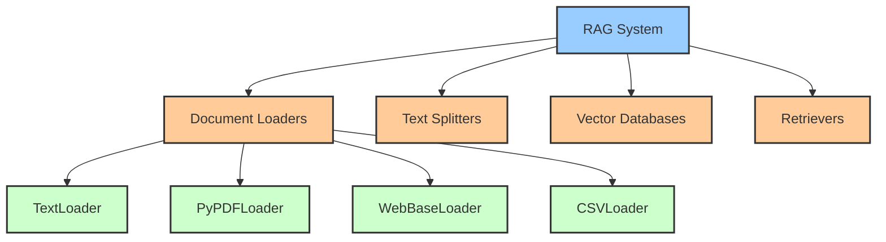
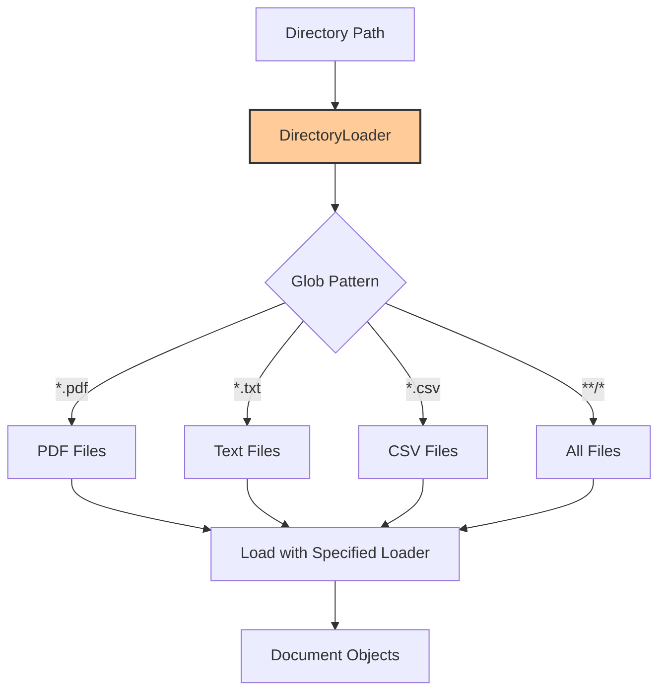
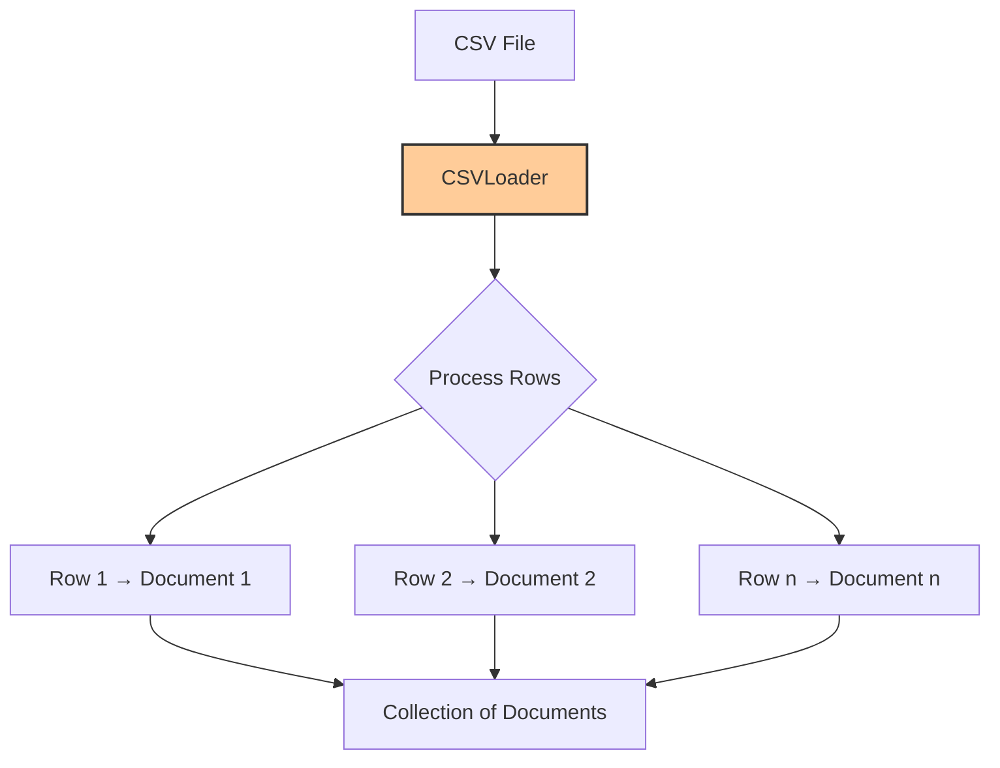
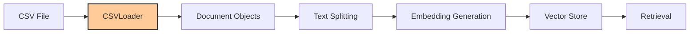

# Document Loaders in LangChain

https://python.langchain.com/docs/concepts/document_loaders/
# 🔍 Retrieval-Augmented Generation (RAG) 📚

## What is RAG? 🤔

Retrieval-Augmented Generation is a powerful technique that enhances AI language models by:

> 💡 Combining information retrieval with language generation to produce responses that are both accurate and contextually relevant.

In this approach, the model first retrieves relevant documents from a knowledge base and then uses them as context to generate well-grounded responses.

## How RAG Works 🛠️


## Key Benefits of RAG ✨

| Benefit | Description | Impact |
|---------|-------------|--------|
| 🔄 **Up-to-date Information** | Models can access the latest information without retraining | Reduces hallucinations and outdated responses |
| 🔒 **Enhanced Privacy** | Sensitive data can remain in secure knowledge bases | Better compliance with data protection regulations |
| 📚 **No Document Size Limitations** | Can work with documents of any length | Overcomes context window constraints of LLMs |

## Use Cases for RAG 🚀

- 📊 **Enterprise Knowledge Management**
- 📝 **Document Q&A Systems**
- 🏥 **Healthcare Information Retrieval**
- 📜 **Legal Document Analysis**
- 🧪 **Scientific Research Assistance**

## Implementation Considerations 🔧

### Components of a RAG System:

1. **Document Processor** 📄
   - Ingests and chunks documents
   - Creates embeddings for efficient retrieval

2. **Vector Database** 🗃️
   - Stores document chunks and their embeddings
   - Enables semantic search functionality

3. **Retriever** 🔍
   - Finds the most relevant context based on queries
   - Uses similarity metrics to match user questions

4. **Generator** ✍️
   - Combines retrieved information with the query
   - Produces coherent, grounded responses

## Conclusion 🎯

RAG represents a significant advancement in making AI systems more reliable, current, and useful across various domains while addressing key limitations of traditional language models.

# 📚 Document Loaders in LangChain 🔄

## What Are Document Loaders? 🤔

> 💡 **Document Loaders** are essential components in the RAG architecture that ingest various file formats from different sources and convert them into a standardized document format that can be processed further in the RAG pipeline.

## Architecture Overview 🏗️



## Common Document Loaders in LangChain 📋

| Loader Type | Supported Formats | Use Case | Example |
|-------------|-------------------|----------|---------|
| 📄 **TextLoader** | .txt, .md, .py, etc. | Plain text documents | Code files, markdown docs |
| 📑 **PyPDFLoader** | .pdf | PDF documents | Research papers, manuals |
| 🌐 **WebBaseLoader** | URLs, HTML | Web content | Articles, websites |
| 📊 **CSVLoader** | .csv | Tabular data | Datasets, spreadsheets |

## How Document Loaders Work 🛠️

1. **Source Connection** 🔌
   - Connect to data source (file system, web, database)
   - Handle authentication if needed

2. **Content Extraction** 📤
   - Read raw content from source
   - Parse content according to format

3. **Transformation** 🔄
   - Convert to LangChain Document objects
   - Preserve metadata (source, timestamps, etc.)

## Code Example: Using Document Loaders 💻

```python
# Import loaders
from langchain.document_loaders import TextLoader, PyPDFLoader, WebBaseLoader, CSVLoader

# Text files
text_loader = TextLoader("path/to/file.txt")
text_docs = text_loader.load()

# PDF documents
pdf_loader = PyPDFLoader("path/to/document.pdf")
pdf_docs = pdf_loader.load()

# Web content
web_loader = WebBaseLoader("https://example.com")
web_docs = web_loader.load()

# CSV data
csv_loader = CSVLoader("path/to/data.csv")
csv_docs = csv_loader.load()
```

## Integration in RAG Pipeline 🚀

Document Loaders represent the first crucial step in a RAG system:

1. 📥 **Document Loading** (Document Loaders)
2. ✂️ **Document Chunking** (Text Splitters)
3. 🧮 **Vector Embedding** (Vector Databases)
4. 🔍 **Retrieval** (Retrievers)
5. 💬 **Response Generation** (LLM)

## Advanced Features 🌟

- **Metadata Extraction**: Automatically pull author, date, source info
- **Batch Processing**: Handle large document collections efficiently
- **Recursive Directory Loading**: Process entire folder structures
- **Custom Loaders**: Create specialized loaders for proprietary formats

## Best Practices 📋

- ✅ Match the loader to your document type
- ✅ Preserve relevant metadata during loading
- ✅ Consider preprocessing steps for noisy data
- ✅ Test loaders with sample documents before scaling

The Document Loader component forms the critical foundation of any effective RAG system by ensuring diverse information sources can be properly ingested and standardized for downstream processing.

# 📁 DirectoryLoader in LangChain 🔄

## Overview 🔍

> 💡 **DirectoryLoader** is a document loader that lets you load multiple documents from a directory (folder) of files, making it easy to process entire collections of documents with a single loader.

## Glob Pattern Support 🌟

| Glob Pattern | What It Loads | Example Use Case |
|--------------|--------------|-----------------|
| `**/*.txt` | All text files in all subfolders | Processing text across a project |
| `*.pdf` | All PDF files in the root directory | Analyzing documents in a single folder |
| `data/*.csv` | All CSV files in the data/ folder | Working with dataset collections |
| `**/*` | All files (any type, all folders) | Comprehensive content processing |

> 📝 **Note**: `**` = recursive search through subfolders

## DirectoryLoader Workflow 🔄



## Implementation Example 💻

```python
from langchain_community.document_loaders import DirectoryLoader, PyPDFLoader

loader = DirectoryLoader(
    path='books',
    glob='*.pdf',
    loader_cls=PyPDFLoader
)

# Lazy loading to handle large directories efficiently
docs = loader.lazy_load()

for document in docs:
    print(document.metadata)
```

## Key Features ✨

- 🔹 **Batch Processing**: Load multiple files at once
- 🔹 **Customizable Patterns**: Use glob patterns to filter files
- 🔹 **Loader Flexibility**: Specify any document loader class
- 🔹 **Memory Efficiency**: Lazy loading option for large directories
- 🔹 **Metadata Preservation**: Maintains source information

## Best Practices 📋

- 🔸 Use specific glob patterns to avoid loading unnecessary files
- 🔸 Combine with appropriate loaders for each file type
- 🔸 Consider `lazy_load()` for directories with many files to manage memory
- 🔸 Monitor processing time when working with large directories
- 🔸 Verify file permissions before attempting to load protected directories

## Common Integration Pattern 🚀


DirectoryLoader is an essential tool for scaling your RAG applications to handle large document collections across multiple file types and directory structures.


# 🔄 Document Loading Methods: `load()` vs `lazy_load()` 📚

## Loading Approaches Compared 🔍

> 💡 LangChain document loaders provide two main methods for loading documents: eager loading (`load()`) and lazy loading (`lazy_load()`), each optimized for different scenarios.

## Comparison Table 📊

| Feature | `load()` ⚡ | `lazy_load()` 🐢 |
|---------|------------|-----------------|
| **Loading Strategy** | Eager Loading (all at once) | Lazy Loading (on demand) |
| **Return Type** | List of Document objects | Generator of Document objects |
| **Memory Usage** | Higher (all in memory) | Lower (streamed processing) |
| **Processing Speed** | Faster upfront, slower to start | Slower overall, faster to start |
| **Best For** | Small document collections | Large files or many documents |

## Visual Explanation 🎯

```mermaid
graph TD
    A[Document Loading] --> B{Choose Method}
    B -->|Small Collection| C[load()]
    B -->|Large Collection| D[lazy_load()]
    C --> E[Load All Documents]
    E --> F[Process All Documents]
    D --> G[Load First Document]
    G --> H[Process First Document]
    H --> I[Load Next Document]
    I --> J[Process Next Document]
    J --> K{More Documents?}
    K -->|Yes| I
    K -->|No| L[Complete]
    F --> L
    style C fill:#ff9900,stroke:#333,stroke-width:2px
    style D fill:#3498db,stroke:#333,stroke-width:2px
```

## Method Details 📝

### `load()` ⚡
- 🔹 **Eager Loading**: Loads everything at once
- 🔹 **Returns**: A list of Document objects
- 🔹 **Memory Impact**: Loads all documents immediately into memory
- 🔹 **Best when**:
  - The number of documents is small
  - You want everything loaded upfront
  - Processing needs random access to documents

### `lazy_load()` 🐢
- 🔹 **Lazy Loading**: Loads on demand
- 🔹 **Returns**: A generator of Document objects
- 🔹 **Memory Impact**: Documents are fetched one at a time as needed
- 🔹 **Best when**:
  - You're dealing with large documents or lots of files
  - You want to stream processing (chunking, embedding)
  - Memory optimization is important

## Implementation Example 💻

```python
from langchain_community.document_loaders import DirectoryLoader

# Eager loading (all at once)
loader = DirectoryLoader("./data", glob="*.pdf")
docs = loader.load()  # Returns a list
print(f"Loaded {len(docs)} documents")

# Lazy loading (on demand)
loader = DirectoryLoader("./data", glob="*.pdf")
docs_generator = loader.lazy_load()  # Returns a generator
for doc in docs_generator:
    # Process one document at a time
    process_document(doc)
```

## Memory Usage Comparison 📉

| Collection Size | `load()` Memory | `lazy_load()` Memory | Recommendation |
|-----------------|-----------------|----------------------|----------------|
| Small (<10 MB) | ✅ Low impact | ✅ Low impact | Either method works |
| Medium (10-100 MB) | ⚠️ Moderate impact | ✅ Low impact | Consider `lazy_load()` |
| Large (>100 MB) | ❌ High impact | ✅ Low impact | Use `lazy_load()` |

## Best Practices ✨

- 🔸 Use `load()` for quick prototyping and small document sets
- 🔸 Use `lazy_load()` for production systems with large document collections
- 🔸 Consider memory constraints of your environment when choosing between methods
- 🔸 Combine `lazy_load()` with streaming processing for optimal memory efficiency

The choice between `load()` and `lazy_load()` significantly impacts your application's memory footprint and performance characteristics, especially when scaling to larger document collections. 

# 📊 CSVLoader in LangChain 📄

## Overview 🔍

> 💡 **CSVLoader** is a document loader in LangChain used to load CSV files into Document objects — one Document per row, by default.

## How It Works 🛠️



## Key Features ✨

| Feature | Description | Impact |
|---------|-------------|--------|
| 🔹 **Row-Based Conversion** | Each CSV row becomes a separate Document | Granular content handling |
| 🔹 **Metadata Integration** | Preserves source file information | Maintains provenance |
| 🔹 **Custom Delimiter Support** | Works with various CSV formats | Flexibility with data formats |
| 🔹 **Header Handling** | Can use column names in document content | Structured data representation |

## Implementation Example 💻

```python
from langchain_community.document_loaders import CSVLoader

loader = CSVLoader(file_path='Social_Network_Ads.csv')
docs = loader.load()

print(len(docs))  # Number of rows in the CSV
print(docs[1])    # Second document (from second row)
```

## Document Structure 📑

Each Document created by CSVLoader contains:

```
Document(
    page_content="column1: value1, column2: value2, ...",
    metadata={"source": "filename.csv", "row": 1}
)
```

## Customization Options 🔧

```python
# Custom CSV configuration
loader = CSVLoader(
    file_path='data.csv',
    csv_args={
        'delimiter': ';',    # For semicolon-separated values
        'quotechar': '"',    # Quote character
        'fieldnames': ['custom_col1', 'custom_col2']  # Custom headers
    }
)

# Custom content formatting
loader = CSVLoader(
    file_path='data.csv',
    source_column='primary_key'  # Use specific column as source in metadata
)
```

## Processing Flow Comparison 📈

| Strategy | Implementation | Use Case |
|----------|---------------|----------|
| 📄 **One document per row** | Default behavior | Independent analysis of each record |
| 📚 **One document per CSV** | Use text concatenation | Holistic analysis of entire dataset |
| 🔍 **Filtered documents** | Custom loading logic | Focus on specific data subsets |

## Integration in RAG Pipeline 🚀



## Best Practices 📋

- 🔸 **Pre-process CSV files** to handle missing values or inconsistent formatting
- 🔸 **Consider column selection** for large CSVs to reduce noise
- 🔸 **Format content appropriately** for better semantic understanding
- 🔸 **Handle encoding issues** with explicit encoding parameters
- 🔸 **Check header consistency** across multiple CSV files

## Common Challenges & Solutions 🛡️

| Challenge | Solution |
|-----------|----------|
| 📉 Large file handling | Use chunking or streaming approaches |
| 🔣 Encoding issues | Specify encoding in CSVLoader constructor |
| 🧩 Complex data types | Pre-process complex fields before loading |
| 📊 Table relationships | Consider custom document creation logic |

CSVLoader provides a straightforward way to incorporate tabular data into your LangChain workflows, making it ideal for working with structured datasets in RAG applications.

