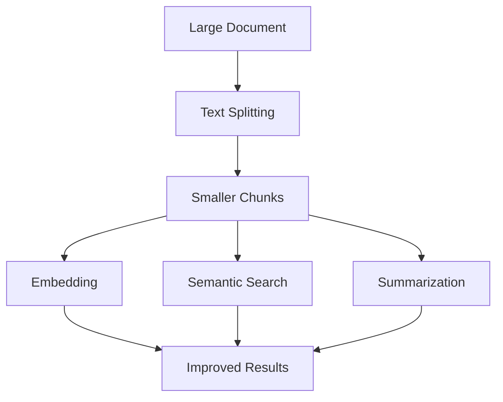
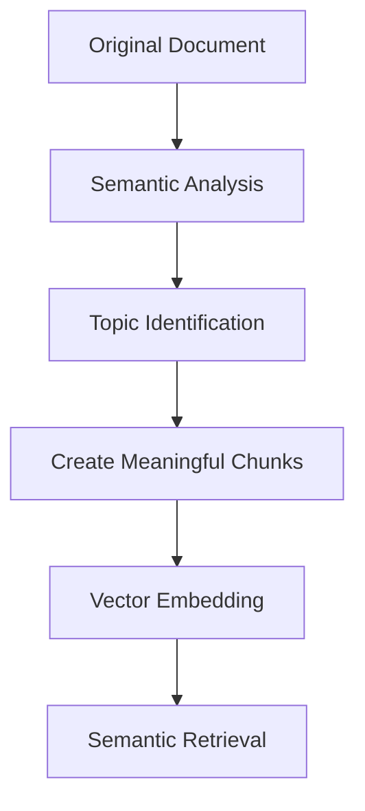

# 11_Text_Splitters_in_LangChain

# 📄 Text Splitting Guide 📊

> **Text Splitting 01 April 2025** 
> 
> Text Splitting is the process of breaking large chunks of text (like articles, PDFs, HTML pages, or books) into smaller, manageable pieces (chunks) that an LLM can handle effectively.

## 🚀 Key Benefits of Text Splitting

### 📏 Overcoming model limitations
Many embedding models and language models have maximum input size constraints. Splitting allows us to process documents that would otherwise exceed these limits.

### 🔄 Downstream tasks improved
Text Splitting improves nearly every LLM powered task:

| Task | Why Splitting Helps |
|------|---------------------|
| 🔤 Embedding | Short chunks yield more accurate vectors |
| 🔍 Semantic Search | Search results point to focused info, not noise |
| 📝 Summarization | Prevents hallucination and topic drift |

### 💻 Optimizing computational resources
Working with smaller chunks of text can be more memory-efficient and allow for better parallelization of processing tasks.



## 📈 Benefits by Implementation

- ⚡ **Faster processing** through parallel computation
- 🧠 **Better memory management** by working with smaller pieces
- 🎯 **More accurate results** from focused context windows
- 🔋 **Resource optimization** across computational tasks

# 📑 Text Splitting Methods Guide

> **01 April 2025**

## 🔍 Overview of Text Splitting Approaches

Text splitting is essential for processing large documents with LLMs. Based on the diagram, there are four main approaches:

![Text Splitters Diagram showing four categories: Length Based, Text Structure Based, Document Structure Based, and Semantic Meaning Based]

## 1️⃣ Length-Based Text Splitting

Length-based splitting divides text into chunks of a specific character or token count.

### ⚠️ Challenges Illustrated:
As shown in Image 2, simple length-based splitting can break text at awkward points:

```
Space exploration has led to incredible scientific discoveries. From landing
on the Moon to explorin
```
```
g Mars, humanity continues to push the boundaries of what's possible beyond our
planet. These missi
```

### 💻 Implementation Example:
```python
from langchain.text_splitter import CharacterTextSplitter
from langchain_community.document_loaders import PyPDFLoader

# Load document
loader = PyPDFLoader('dl-curriculum.pdf')
docs = loader.load()

# Configure splitter
splitter = CharacterTextSplitter(
    chunk_size=200,
    chunk_overlap=0,
    separator=''
)

# Split documents
result = splitter.split_documents(docs)
print(result[1].page_content)
```

### 🔧 Improved Approach:
```python
# Better implementation with meaningful separators
better_splitter = CharacterTextSplitter(
    chunk_size=1000,
    chunk_overlap=200,
    separator="\n\n"  # Split on paragraph breaks
)
```

## 2️⃣ Text Structure-Based Splitting

| Approach | Description | Benefits |
|----------|-------------|----------|
| 📝 Sentence Splitting | Divides text at sentence boundaries | Preserves sentence integrity |
| 📄 Paragraph Splitting | Splits text at paragraph breaks | Maintains contextual grouping |
| 🔤 N-gram Splitting | Creates overlapping sequences of n words | Useful for specific NLP tasks |

```python
# Example: Sentence-based splitting
from langchain.text_splitter import RecursiveCharacterTextSplitter

sentence_splitter = RecursiveCharacterTextSplitter(
    chunk_size=1000,
    chunk_overlap=100,
    separators=["\n\n", "\n", ".", "!", "?", ";"]
)
```

## 3️⃣ Document Structure-Based Splitting

Leverages document structure elements like:
- 📑 Headers and sections
- 📊 Tables and figures
- 📌 Markdown or HTML tags

```python
# Example: HTML-aware splitting
from langchain.text_splitter import HTMLHeaderTextSplitter

header_splitter = HTMLHeaderTextSplitter(
    headers_to_split_on=[
        ("h1", "Header 1"),
        ("h2", "Header 2"),
        ("h3", "Header 3"),
    ]
)
```

## 4️⃣ Semantic Meaning-Based Splitting

Divides text based on topic or meaning changes rather than structural elements.



### 🧠 Key Benefits:
- Maintains semantic coherence between related concepts
- Improves retrieval accuracy for RAG applications
- Reduces context fragmentation issues

## 🚀 Choosing the Right Splitting Method

| Scenario | Recommended Method | Why |
|----------|-------------------|-----|
| 📚 General text processing | Text Structure-Based | Preserves natural language flow |
| 🏗️ Working with structured docs | Document Structure-Based | Leverages existing document organization |
| 🔍 Complex information retrieval | Semantic Meaning-Based | Optimizes for conceptual relevance |
| ⚡ Performance-critical systems | Length-Based with overlaps | Balance between speed and quality |

## 💡 Best Practices

- ✅ Use appropriate chunk overlap to maintain context (typically 10-20% of chunk size)
- ✅ Consider the specific needs of downstream tasks when selecting methods
- ✅ Combine multiple approaches for optimal results
- ✅ Test different splitting strategies on your specific data


