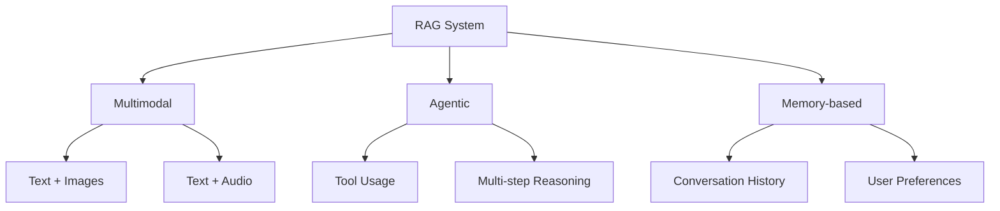

 # Building a RAG system in LangChain | YouTube Chatbot using LangChain 

 https://colab.research.google.com/drive/1pat55z_iiLqzInsLi3sWS2wekFCXprQW?usp=sharing

 # 🚀 RAG System Architecture & Evaluation Guide

## 1. UI-based Enhancements 🖥️
Rich user interfaces that improve end-user experience with RAG systems

## 2. Evaluation Framework 📊

### a. RAGAS Metrics
Comprehensive evaluation suite for RAG systems

### b. LangSmith
Tooling for tracing, evaluating and monitoring LLM applications

## 3. Indexing Pipeline 📚

### a. Document Ingestion
Process of importing and preprocessing documents

### b. Text Splitting
Breaking documents into appropriate chunks for effective retrieval

### c. Vector Store
Database for storing and retrieving vector embeddings

## 4. Retrieval Strategies 🔍

### a. Pre-Retrieval
Techniques applied before primary retrieval

| Strategy | Description |
|----------|-------------|
| Query rewriting using LLM | Reformulating user queries for better results |
| Multi-query generation | Creating multiple query variations |
| Domain-aware routing | Directing queries to appropriate knowledge sources |

### b. During Retrieval
Techniques applied during the primary retrieval process

| Strategy | Description |
|----------|-------------|
| MMR (Maximum Marginal Relevance) | Balancing relevance and diversity |
| Hybrid Retrieval | Combining dense and sparse retrieval methods |
| Reranking | Reordering retrieved documents for relevance |

### c. Post-Retrieval
Techniques applied after primary retrieval

| Strategy | Description |
|----------|-------------|
| Contextual Compression | Reducing context size while preserving information |

## 5. Evaluation Metrics ⚖️

| Metric | What It Measures |
|--------|------------------|
| Faithfulness | Is the answer grounded in the retrieved context? |
| Answer Relevancy | Is the answer relevant to the user's question? |
| Context Precision | How much of the retrieved context is actually useful? |
| Context Recall | Did we retrieve all necessary information? |

## 6. Augmentation Techniques 🔧

### a. Prompt Templating
Structuring prompts for optimal LLM performance

### b. Answer Grounding
Ensuring responses are anchored in retrieved content

### c. Context Window Optimization
Maximizing the use of limited context windows

## 7. Generation 📝

### a. Answer with Citation
Providing traceable sources for generated content

## 8. System Design Paradigms 🏗️

### a. Multimodal
Systems that can process and generate multiple types of media

### b. Agentic
Systems that can take autonomous actions to fulfill user requests

### c. Memory-based
Systems that maintain state and learn from interactions

---

This architecture represents a comprehensive approach to building robust Retrieval Augmented Generation systems that effectively retrieve relevant information and generate faithful, relevant responses to user queries.

 
