# Tools in LangChain 

# 📚 Tool Fundamentals for LLMs 🤖

## 📋 Basic Definition
A tool is just a Python function (or API) that is packaged in a way the LLM can understand and call when needed.

## 🔄 LLM Capabilities vs. Limitations

| ✅ LLMs (like GPT) are great at: | ❌ But they can't do things like: |
|----------------------------------|----------------------------------|
| 🧠 Reasoning                     | 📡 Access live data (weather, news) |
| 💬 Language generation          | 🔢 Do reliable math |
|                                  | 🔌 Call APIs |
|                                  | 💻 Run code |
|                                  | 🗄️ Interact with a database |

## 🔍 Understanding Tool Purpose

Tools extend LLM capabilities by bridging the gap between:
- What LLMs can naturally do (language, reasoning)
- What they need external systems for (data access, computation)

## 🛠️ How Tools Work

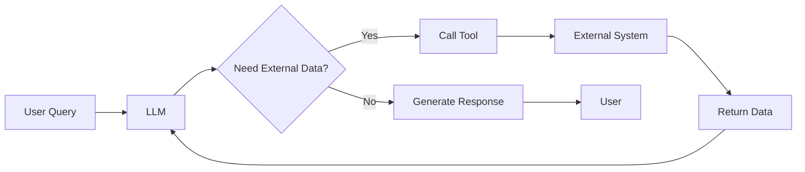

## 💡 Key Takeaway
Tools transform LLMs from isolated language processors into systems that can interact with the external world, access real-time information, and perform specialized tasks beyond their built-in capabilities.

# 🛠️ Understanding LLM Tools & Agent Architecture 📊

## 🌐 Tool Categories
As shown in Image 1, tools for LLMs fall into two main categories:

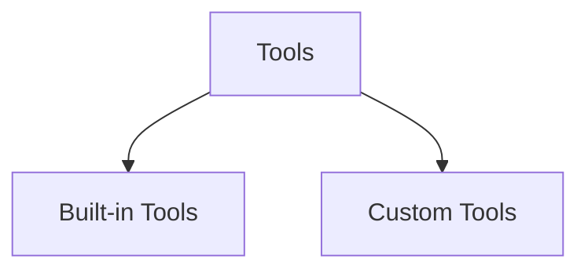

| 🧩 Built-in Tools | 🔧 Custom Tools |
|-------------------|----------------|
| Pre-packaged with the LLM system | Developed for specific use cases |
| Standard capabilities | Domain-specific functionality |
| Maintained by the platform | Created by developers/organizations |

## 🤖 Agent Ecosystem Integration

### 📌 Definition
> "An AI agent is an LLM-powered system that can autonomously think, decide, and take actions using external tools or APIs to achieve a goal."

### 🏗️ Agent Architecture

The agent architecture (Image 2) consists of two critical components:

1. **Reasoning & Decision Making (LLM)** 🧠
   - Processes user requests
   - Understands context
   - Determines what actions to take
   - Decides which tools to use

2. **Action (Tools)** ⚙️
   - Executes decisions made by the LLM
   - Interacts with external systems
   - Retrieves information
   - Performs operations LLMs can't do natively

## 🔄 The Complete Workflow

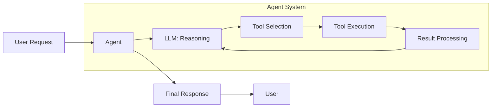

## 💡 Key Insights

- LLMs handle the **thinking** while tools handle the **doing**
- Tools extend LLM capabilities beyond their knowledge cutoff
- The combination creates a powerful system that can both reason and act
- Custom tools allow for specialized domain applications
- This architecture enables AI systems to interact with the real world in meaningful ways

# 🛠️ Built-in Tools in LangChain 🔗

## 📋 Definition & Purpose

> "A built-in tool is a tool that LangChain already provides for you —it's pre-built, production-ready, and requires minimal or no setup."

> "You don't have to write the function logic yourself — you just import and use it."

## 🧰 Available Built-in Tools

| 🔧 Tool Name | 🔍 Function |
|-------------|------------|
| DuckDuckGoSearchRun | Web search via DuckDuckGo |
| WikipediaQueryRun | Wikipedia summary |
| PythonREPLTool | Run raw Python code |
| ShellTool | Run shell commands |
| RequestsGetTool | Make HTTP GET requests |
| GmailSendMessageTool | Send emails via Gmail |
| SlackSendMessageTool | Post message to Slack |
| SQLDatabaseQueryTool | Run SQL queries |

## 🌟 Key Advantages

- ⚡ **Ready-to-Use**: Production-grade tools with no development required
- 🔌 **Plug-and-Play**: Simple import and implementation
- 🛡️ **Reliability**: Pre-tested for production environments
- ⏱️ **Time-Saving**: Eliminates custom development needs

## 💻 Implementation Flow

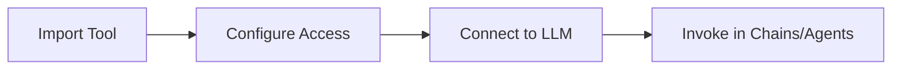

## 📌 Usage Examples

- 🌐 **Web Research**: DuckDuckGoSearchRun for retrieving current information
- 📊 **Data Analysis**: PythonREPLTool for processing data
- 🔄 **API Integration**: RequestsGetTool for external API calls
- 📨 **Communications**: GmailSendMessageTool for automated emails

## 💡 Bottom Line
Built-in tools dramatically reduce development time and complexity by providing ready-made functionality for common agent operations.

# 🦆 DuckDuckGo Search Tool in LangChain 🔍

## 📦 Installation

```python
!pip install langchain langchain-core langchain-community pydantic duckduckgo-search langchain_experimental
```

## 🛠️ Implementation Guide

### 📥 Import & Setup

```python
from langchain_community.tools import DuckDuckGoSearchRun

# Initialize the tool
search_tool = DuckDuckGoSearchRun()
```

### 🚀 Usage Example

```python
# Invoke the search tool with a query
results = search_tool.invoke('top news in india today')

# Display the search results
print(results)
```

## 📊 Tool Metadata

| 🔑 Property | 📄 Value |
|-------------|----------|
| 📛 **Name** | `duckduckgo_search` |
| 📝 **Description** | A wrapper around DuckDuckGo Search. Useful for when you need to answer questions about current events. Input should be a search query. |

## 🧩 Arguments Schema

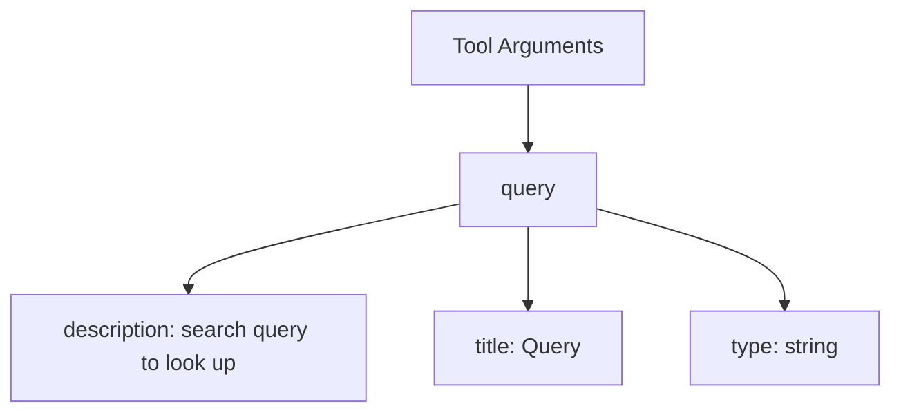

## 💡 Key Features

- 🔄 **Real-time Data**: Access to current information beyond LLM training cutoff
- 🌐 **Web Integration**: Seamless connection to online search capabilities
- 🧠 **Knowledge Extension**: Expands LLM knowledge with up-to-date information
- 🔌 **Zero Configuration**: Ready to use with minimal setup

## 📚 Implementation Flow

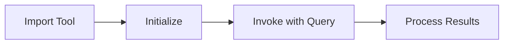

## 🚩 Use Cases

- 📰 News retrieval and summarization
- 🔍 Fact-checking against current information
- 📈 Market and trend analysis
- 📅 Event and conference details
- 🌦️ Weather and environmental updates

# 🔧 Custom Tools in LangChain: Method 2 📚

## 🛠️ Using StructuredTool Class

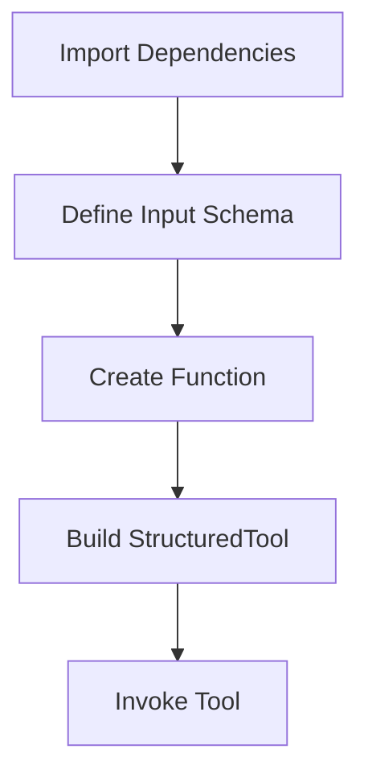

### 📥 Step 1: Import Required Components

```python
from langchain.tools import StructuredTool
from pydantic import BaseModel, Field
```

### 🧰 Step 2: Define Input Schema with Pydantic

```python
class MultiplyInput(BaseModel):
    a: int = Field(required=True, description="The first number to add")
    b: int = Field(required=True, description="The second number to add")
```

### ⚙️ Step 3: Create Function Logic

```python
def multiply_func(a: int, b: int) -> int:
    return a * b
```

### 🔨 Step 4: Build the Structured Tool

```python
multiply_tool = StructuredTool.from_function(
    func=multiply_func,
    name="multiply",
    description="Multiply two numbers",
    args_schema=MultiplyInput
)
```

### 🚀 Step 5: Invoke the Tool

```python
result = multiply_tool.invoke({'a':3, 'b':3})
print(result)  # Output: 9
```

## 📊 Tool Metadata Analysis

| 🔑 Property | 📄 Value |
|-------------|----------|
| 📛 **Name** | `multiply` |
| 📝 **Description** | Multiply two numbers |
| 🧩 **Arguments** | Structured schema with descriptions |

## 📋 Arguments Schema Detail

```json
{
  "a": {
    "description": "The first number to add",
    "required": true,
    "title": "A",
    "type": "integer"
  },
  "b": {
    "description": "The second number to add",
    "required": true,
    "title": "B",
    "type": "integer"
  }
}
```

## 🎯 When to Use Custom Tools

> "A custom tool is a tool that you define yourself."

| 📌 Use Case | 🔍 Example Scenario |
|-------------|---------------------|
| 🔌 **Call your own APIs** | Connect to your company's proprietary services |
| 💼 **Encapsulate business logic** | Implement complex domain-specific calculations |
| 🗄️ **Interact with your systems** | Query databases, products, or applications |

## 💡 Key Advantages of Structured Tools

- 📝 **Enhanced Documentation**: Detailed field descriptions
- 🛡️ **Validation**: Automatic type checking and error handling
- 🧩 **Complex Inputs**: Support for nested objects and advanced types
- 🔄 **Reusability**: Schema-based approach for consistent interfaces

## 📚 Implementation Workflow

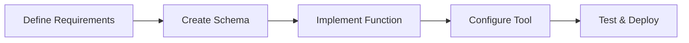


# 🛠️ Custom Tools in LangChain: Method 3 - Using BaseTool Class 📚

## 📥 Required Imports

```python
from langchain.tools import BaseTool
from typing import Type
from pydantic import BaseModel, Field
```

## 🧩 Implementation Structure

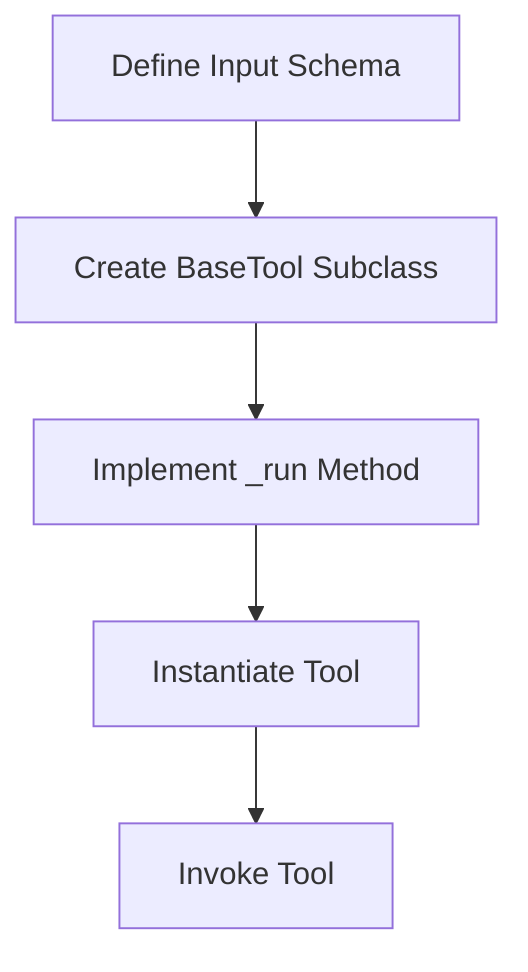

## 📋 Step 1: Define Input Schema with Pydantic

```python
class MultiplyInput(BaseModel):
    a: int = Field(required=True, description="The first number to add")
    b: int = Field(required=True, description="The second number to add")
```

## 🔍 Step 2: Create Custom Tool Class

```python
class MultiplyTool(BaseTool):
    name: str = "multiply"
    description: str = "Multiply two numbers"
    
    args_schema: Type[BaseModel] = MultiplyInput
    
    def _run(self, a: int, b: int) -> int:
        return a * b
```

## 🚀 Step 3: Instantiate and Use Tool

```python
multiply_tool = MultiplyTool()
result = multiply_tool.invoke({'a':3, 'b':3})
print(result)  # Output: 9
```

## ⚙️ Tool Configuration Breakdown

| 🔑 Property | 📄 Value | 📝 Purpose |
|-------------|----------|-----------|
| 📛 **name** | `multiply` | Tool identifier for LLM |
| 📝 **description** | Multiply two numbers | Usage guidance for LLM |
| 🧩 **args_schema** | MultiplyInput | Input validation schema |
| ⚙️ **_run** | Method implementation | Core functionality logic |

## 📊 Tool Output

```
9
multiply
Multiply two numbers
{'a': {'description': 'The first number to add', 'required': True, 'title': 'A', 'type': 'integer'}, 
 'b': {'description': 'The second number to add', 'required': True, 'title': 'B', 'type': 'integer'}}
```

## 💡 Key Benefits of BaseTool Approach

- 🧠 **Object-Oriented Design**: Clean encapsulation of tool logic
- 🔄 **Inheritance**: Leverage BaseTool functionality
- 🛡️ **Type Safety**: Strong typing with Pydantic
- 📐 **Extensibility**: Easy to add complex behaviors
- 🧪 **Testability**: Class-based design simplifies testing

## 🔄 Comparison with Other Methods

| 📌 Feature | 🏷️ @tool Decorator | 🔧 StructuredTool | 🧰 BaseTool |
|------------|---------------------|---------------------|------------|
| 💻 **Complexity** | Low | Medium | High |
| 🔄 **Reusability** | Basic | Good | Excellent |
| 🧩 **Extensibility** | Limited | Moderate | Advanced |
| 📝 **Boilerplate** | Minimal | Some | Most |
| 💪 **Power** | Simple | Moderate | Full control |

## 📌 When to Use BaseTool

> "BaseTool is ideal for complex tools that require additional functionality beyond a simple function, especially when you need full control over the tool's behavior and properties."

# 🧰 Toolkits in LangChain: Organizing Custom Tools 📚

## 📋 Overview

> A toolkit is a collection of related tools bundled together for organized access and management.

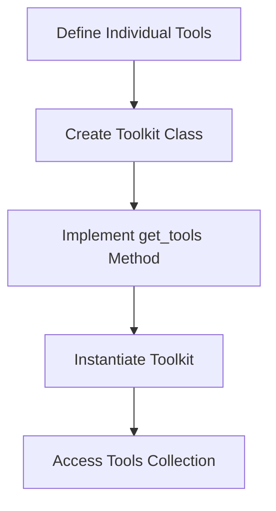

## 🛠️ Implementation Guide

### 📥 Step 1: Import Dependencies

```python
from langchain_core.tools import tool
```

### 🔨 Step 2: Define Individual Tools

```python
# Custom tools
@tool
def add(a: int, b: int) -> int:
    """Add two numbers"""
    return a + b

@tool
def multiply(a: int, b: int) -> int:
    """Multiply two numbers"""
    return a * b
```

### 📦 Step 3: Create Toolkit Class

```python
class MathToolkit:
    def get_tools(self):
        return [add, multiply]
```

### 🚀 Step 4: Instantiate and Use

```python
toolkit = MathToolkit()
tools = toolkit.get_tools()

for tool in tools:
    print(tool.name, "=>", tool.description)
```

## 📊 Tool Comparison

| 🔧 Tool | 📝 Description | ⚙️ Functionality |
|---------|---------------|-----------------|
| `add` | Add two numbers | Returns sum of two integers |
| `multiply` | Multiply two numbers | Returns product of two integers |

## 💡 Output

```
add => Add two numbers
multiply => Multiply two numbers
```

## 📌 Benefits of Toolkits

- 🗂️ **Organization**: Group related tools logically
- 🔄 **Reusability**: Import entire collections at once
- 🧩 **Modularity**: Swap toolkits based on requirements
- 📚 **Discoverability**: Make tools easier to find and use
- 🔌 **Extensibility**: Add new tools to existing categories

## 🔍 Use Cases

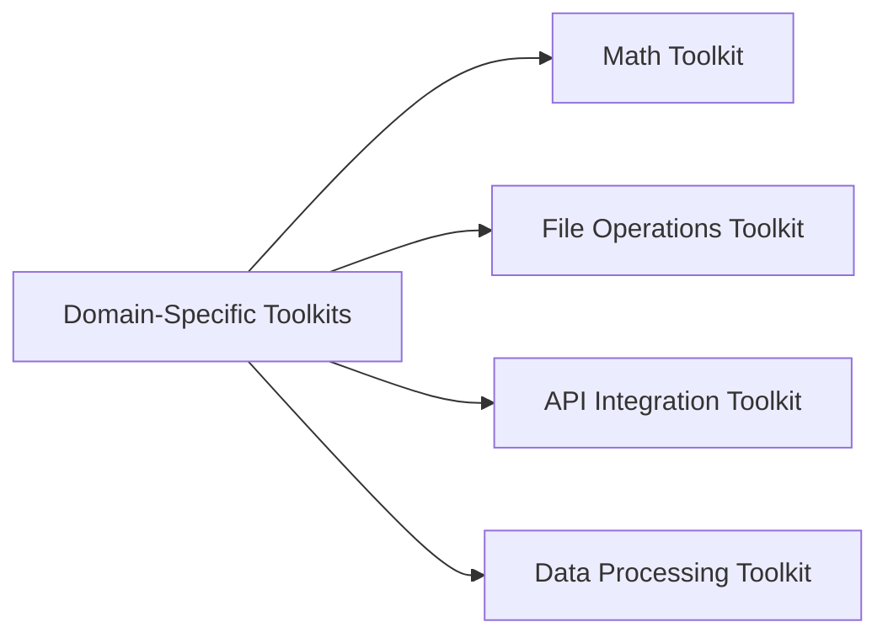

## 📚 Implementation Best Practices

- 📋 Create logical groupings of related tools
- 📝 Use consistent naming conventions
- 🧪 Test toolkits as complete units
- 📊 Document toolkit capabilities clearly
- 🔄 Consider making toolkits dynamically configurable

# 🛠️ Creating Custom Tools in LangChain: 3 Methods 📚

## 🔍 Overview

```mermaid
graph TD
    A[Ways to create Tools] --> B[Using @tool decorator]
    A --> C[Using StructuredTool & Pydantic]
    A --> D[Using BaseTool class]
    E[BaseTool] --> F[@tool decorator]
    E --> G[StructuredTool]
```

> **Key Insight:** BaseTool is the abstract base class for all tools in LangChain. It defines the core structure and interface that any tool must follow, whether it's a simple one-liner or a fully customized function. All other tool types like @tool, StructuredTool are built on top of BaseTool.

## 📋 Comparison of Methods

| 🔧 Method | 📝 Description | 🔑 Key Characteristics | 🚀 Complexity | ⚙️ Use Case |
|-----------|---------------|------------------------|--------------|------------|
| **@tool decorator** | Simple function decorator | Minimal code, function-based | 🟢 Low | Quick, simple tools |
| **StructuredTool** | Uses Pydantic models | Schema validation, structured inputs | 🟡 Medium | Complex inputs, validation needs |
| **BaseTool class** | Direct class inheritance | Full customization, OOP approach | 🔴 High | Advanced tools, custom behaviors |

## 📊 Method Details

### 1️⃣ Using @tool Decorator

```python
from langchain_core.tools import tool

@tool
def multiply(a: int, b: int) -> int:
    """Multiply two numbers"""
    return a * b
```

🌟 **Benefits:** 
- 🔹 Minimal boilerplate
- 🔹 Quick implementation 
- 🔹 Function-centric approach

### 2️⃣ Using StructuredTool & Pydantic

```python
from langchain.tools import StructuredTool
from pydantic import BaseModel, Field

class MultiplyInput(BaseModel):
    a: int = Field(description="First number")
    b: int = Field(description="Second number")

multiply_tool = StructuredTool.from_function(
    func=multiply_func,
    args_schema=MultiplyInput
)
```

🌟 **Benefits:**
- 🔹 Strong input validation
- 🔹 Detailed schema definition
- 🔹 Enhanced documentation

### 3️⃣ Using BaseTool Class

```python
from langchain.tools import BaseTool

class MultiplyTool(BaseTool):
    name = "multiply"
    description = "Multiply two numbers"
    
    def _run(self, a: int, b: int) -> int:
        return a * b
```

🌟 **Benefits:**
- 🔹 Complete customization
- 🔹 Object-oriented design
- 🔹 Maximum flexibility

## 💡 Key Concept: Structured Tools

> A Structured Tool in LangChain is a special type of tool where the input to the tool follows a structured schema, typically defined using a Pydantic model.

## 🏗️ Tool Inheritance Hierarchy

```mermaid
graph BT
    A[@tool] --> B[BaseTool]
    C[StructuredTool] --> B[BaseTool]
    D[Custom Tools] --> B[BaseTool]
```

## 📌 Implementation Strategy Guide

| 🎯 Goal | ✅ Recommended Method |
|---------|----------------------|
| Quick prototype | @tool decorator |
| Complex input validation | StructuredTool & Pydantic |
| Advanced customization | BaseTool class |
| Extending functionality | BaseTool class |
| Simple functions | @tool decorator |

## 📚 Best Practices

- 🔸 Start with the simplest approach (@tool) and scale up as needed
- 🔸 Use Pydantic for complex input validation
- 🔸 Inherit from BaseTool for maximum customization
- 🔸 Document your tools thoroughly
- 🔸 Test each tool independently before integration

# 🧰 LangChain Toolkits: Bundled Tools for Enhanced Functionality 📚

## 📋 Definition & Purpose
> A toolkit is just a collection (bundle) of related tools that serve a common purpose - packaged together for convenience and reusability.

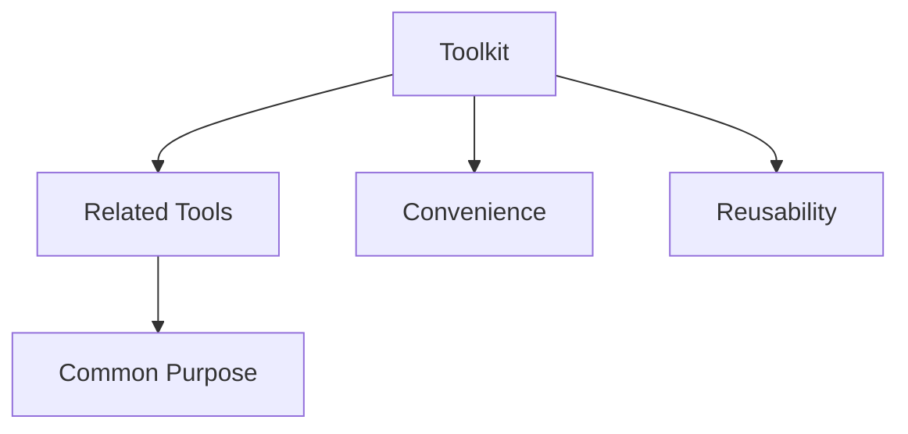

## 🔍 Key Characteristics

| 🔑 Feature | 📝 Description | 🌟 Benefit |
|------------|----------------|------------|
| 📦 Bundling | Collection of related tools | Organized access |
| 🎯 Purpose-driven | Tools with common objective | Focused functionality |
| ♻️ Reusability | Ready-made solution packages | Reduced development time |
| 🔌 Consistency | Standardized interfaces | Simplified integration |

## 🛠️ Example: Google Drive Toolkit

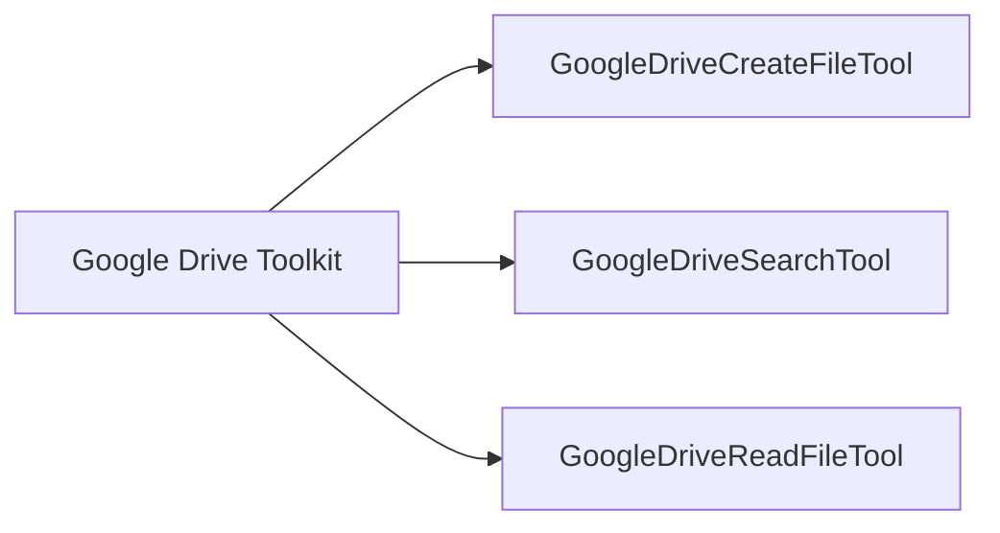

### 📁 Available Tools

| 🔧 Tool | 📄 Description | 🚀 Function |
|---------|---------------|-------------|
| 📤 **GoogleDriveCreateFileTool** | Upload a file | Adds new content to Drive |
| 🔍 **GoogleDriveSearchTool** | Search for a file | Finds by name/content |
| 📖 **GoogleDriveReadFileTool** | Read contents of a file | Retrieves file data |

## 💡 Implementation Benefits

- 🔹 **Domain Cohesion**: Tools organized by functional domain
- 🔹 **Simplified Access**: Single import for multiple tools
- 🔹 **Consistent Interfaces**: Standardized patterns across tools
- 🔹 **Improved Discoverability**: Logical grouping aids discovery
- 🔹 **Reduced Complexity**: Pre-configured for common use cases

## 🚀 Usage Pattern

```python
# Example pattern (conceptual)
from langchain.toolkits import GoogleDriveToolkit

# Initialize toolkit
drive_toolkit = GoogleDriveToolkit(credentials=credentials)

# Access individual tools
search_tool = drive_toolkit.get_tools()["search"]
create_tool = drive_toolkit.get_tools()["create"]
read_tool = drive_toolkit.get_tools()["read"]

## 📌 LangChain Toolkit Philosophy
> "Bundle related functionality together to create powerful, domain-specific capabilities while maintaining clean abstraction boundaries and simplified usage patterns."
