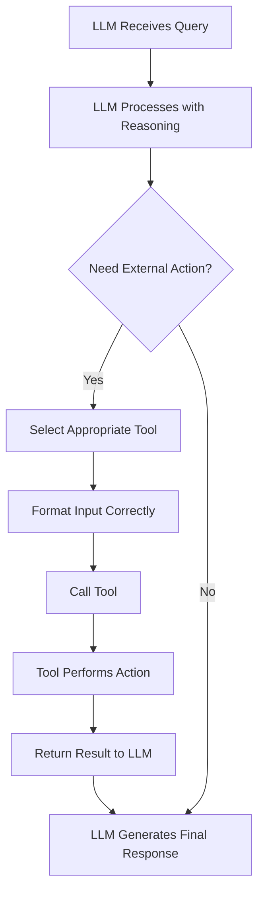

# 🤖 AI Agent Development: Tool Calling & Binding Notes 📝

## 📚 Video Context & Overview

This is a detailed summary of a YouTube tutorial by Nitesh about **Lang Chain** and **AI Agents**, specifically focusing on the concept of **Tool Calling**.

> 💡 **Key Information**: This video continues from a previous tutorial where "Tools" were introduced as a fundamental concept.

## 🔄 Recap of Previous Video

### LLM Capabilities & Limitations

| 💪 Powers of LLMs | ❌ Limitations |
|-------------------|----------------|
| **Reasoning** - Understanding and breaking down questions | Cannot perform actions on their own |
| **Output Generation** - Creating text based on parametric knowledge | Cannot interact with databases |
| | Cannot post on social media platforms |
| | Cannot fetch real-time data (e.g., weather) |

> 🧠 **Analogy**: LLMs are like humans who can think and speak well but have no hands or feet to perform tasks

## 🎯 Today's Focus Topics

1. **Tool Binding**: How to connect LLMs with tools
2. **Tool Calling**: How LLMs can use these tools when needed

## 🔗 Tool Binding Explained

### What is Tool Binding?
The process where you register tools with a Large Language Model so the LLM knows:
- What tools are available
- What each tool does
- What input format to use

### Components Required for Tool Binding:
- **Tool Name**: Identifier for the tool
- **Description**: Explains what the tool does (helps LLM understand when to use it)
- **Input Schema**: Defines what format of input the tool expects

## 💻 Practical Implementation

```python
# Creating a simple multiplication tool
@tool
def multiply(a: int, b: int) -> int:
    """Given two numbers A and B, this tool returns their product"""
    return a * b

# Testing the tool
result = multiply({"a": 3, "b": 4})  # Returns 12
```

## 🚀 Benefits of Tool Binding

- Enables LLMs to understand what tools they can access
- Helps LLMs comprehend each tool's purpose
- Ensures proper input formatting when tools are called
- Creates a bridge between thinking capabilities and action capabilities

## 📊 The Full Process Flow



## 🔜 Coming Up in the Video
- Demonstration of a more complex tool
- Building a real-time currency converter application using LLMs
- Practical implementation of tool calling in real scenarios

---

📌 **Note**: The tutorial emphasizes that these concepts are better understood through practical implementation rather than just theory.
