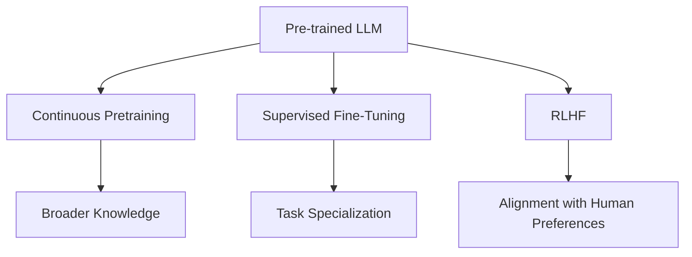
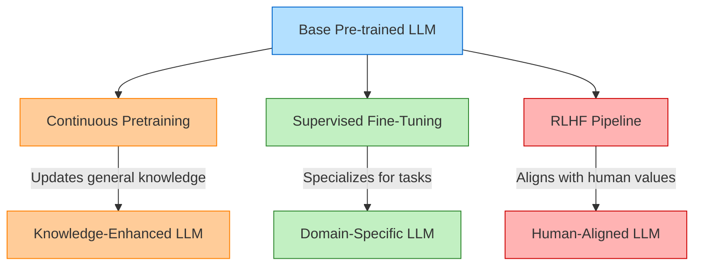
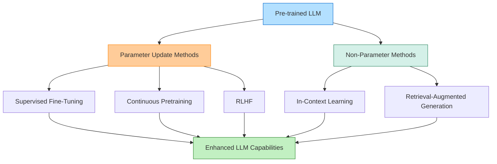
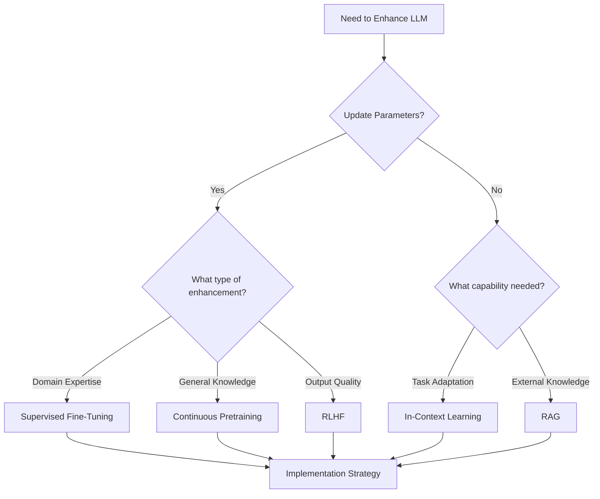
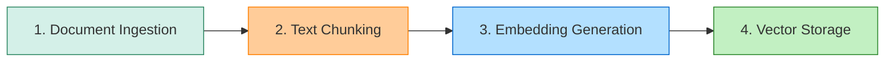
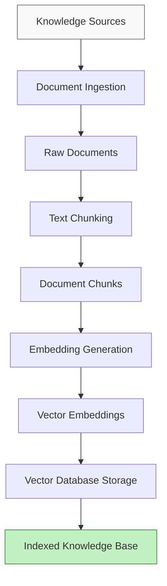
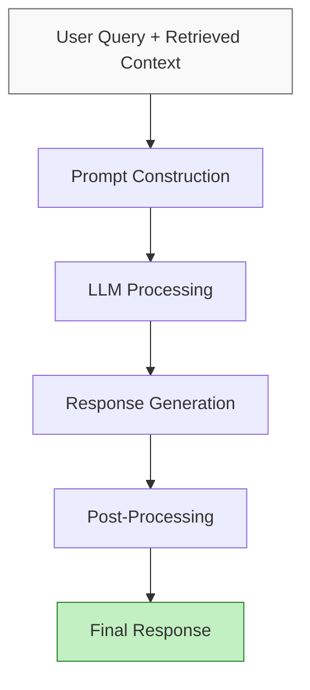
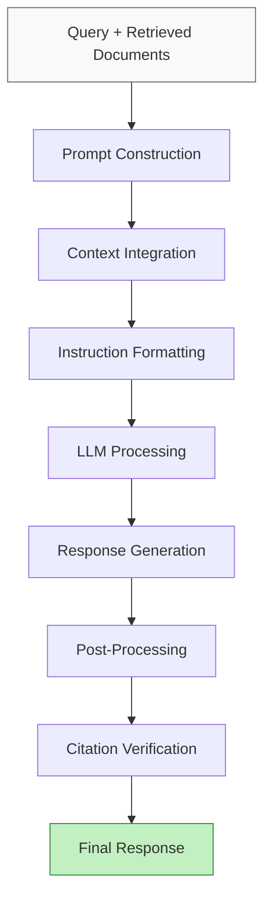

# Retrieval Augmented Generation | What is RAG | How does RAG Work | RAG Explained

# Retrieval Augmented Generation (RAG) Explained 🔍🤖

## What is RAG? 🎯

**Retrieval Augmented Generation (RAG)** is an AI framework that enhances Large Language Models (LLMs) by connecting them to external knowledge sources. This creates more accurate, up-to-date, and verifiable responses.

 *The diagram shows the basic RAG workflow.*

## How RAG Works 🛠️

| Component | Function | Benefit |
|-----------|----------|---------|
| Query Processing | Analyzes user questions | Improves understanding |
| Retrieval System | Fetches relevant documents | Adds factual context |
| LLM | Generates response using retrieved information | Creates coherent answers |
| Prompt Engineering | Structures information for the LLM | Enhances output quality |

## Key Advantages of RAG 🌟

### 1️⃣ Private Data Integration 🔒
- Connects LLMs to proprietary information
- Enables personalized responses based on private documents
- Maintains security while leveraging AI capabilities

### 2️⃣ Real-Time Data Access ⏱️
- Overcomes LLM knowledge cutoff limitations
- Provides up-to-date information from external sources
- Ensures responses reflect current facts and developments

### 3️⃣ Hallucination Reduction 🧠
- Grounds responses in retrieved facts
- Provides citations to support claims
- Significantly decreases fabricated information

## RAG Architecture Flow 📊


## Implementation Considerations 💡

- **Vector Databases**: Efficient storage and retrieval of embeddings
- **Chunking Strategies**: How to divide documents for optimal retrieval
- **Embedding Models**: Converting text to vector representations
- **Ranking Algorithms**: Determining relevance of retrieved information

RAG represents a significant advancement in making LLMs more reliable for practical applications by combining their parametric knowledge with explicit retrieval capabilities.

# Fine-Tuning Large Language Models: A Visual Guide 🧠🔍

## Understanding the Fine-Tuning Landscape 🌟

Fine-tuning transforms pre-trained LLMs into specialized tools for specific domains or tasks. The image shows the essential workflow:

1. 📊 **Start with a pre-trained model** - Leverage foundation models with broad knowledge
2. 🎯 **Apply domain-specific training** - Create a smaller, specialized model
3. 📈 **Measure performance** - Evaluate factuality and hallucination rates

## Supervised Fine-Tuning (SFT) Process 🚀

Supervised fine-tuning adapts pre-trained language models to specific tasks using labeled data. This process transforms general-purpose models into specialized tools by optimizing their performance for specific applications.

### Key Steps in SFT Implementation ⚙️

| Step | Description | Details |
|------|-------------|---------|
| 1️⃣ Collect Data | Prepare high-quality labeled examples of desired outputs | A few hundred to few hundred thousand carefully curated examples |
| 2️⃣ Choose Method | Select full-parameter or parameter-efficient approach | LoRA/QLoRA or full parameter fine-tuning (FT) |
| 3️⃣ Train Model | Adjust model parameters to improve task performance | Keep base weights frozen or partially frozen |
| 4️⃣ Evaluate | Test against metrics like factuality and hallucination rate | Measure against held-out data, red-team for safety |

### SFT Techniques 🛠️

Several approaches can be employed during supervised fine-tuning:

- **Feature Extraction**: Using a pre-trained model to extract relevant features for task-specific models
- **End-to-End Fine-Tuning**: Adjusting every layer for comprehensive adaptation
- **Layer Freezing**: Locking certain layers to prevent updates during fine-tuning
- **Parameter-Efficient Adapters**: Methods like LoRA that add low-rank matrices to model layers

## How SFT Differs from Other Approaches 🔄



### Comparison of Approaches 📊

| Technique | Purpose | Training Data | Outcome |
|-----------|---------|--------------|---------|
| Supervised Fine-Tuning | Task specialization | Labeled examples | Domain-specific expertise |
| Continuous Pretraining | Knowledge expansion | New general data | Updated general knowledge |
| RLHF | Human alignment | Human feedback | Improved helpfulness & safety |

## Benefits of Fine-Tuning 💎

- ✅ Enables models to learn task-specific patterns and nuances
- ✅ Improves performance on specialized tasks while retaining general knowledge
- ✅ Requires less data and computational resources compared to training from scratch
- ✅ Allows for customization of a model's behavior, writing style, or domain expertise

## Implementation Considerations 🤔

- 🔍 **Data Quality**: Carefully curated examples significantly impact performance
- ⚖️ **Resource Tradeoffs**: Balance between full-parameter vs. parameter-efficient methods
- 📏 **Evaluation Metrics**: Define clear success criteria (factuality, hallucination rate)
- 🔒 **Layer Management**: Decide which layers to freeze or update

## When to Use Each Approach? 🧭

- 🎯 **SFT**: When you need domain specialization with labeled examples
- 🌐 **Continuous Pretraining**: When filling knowledge gaps or updating general capabilities
- 👥 **RLHF**: When aligning outputs with human preferences and values

Fine-tuning is transforming how we adapt LLMs for specific use cases, enabling more precise, reliable, and specialized AI applications while reducing computational requirements compared to training from scratch.

# 🧠 Language Model Training Approaches: A Comparative Guide 📊

## Overview: The Three Pillars of LLM Training 🌟

This guide compares three fundamental approaches to training and improving large language models, each serving distinct purposes in the AI development lifecycle.

## Detailed Comparison Table 📋

| Aspect | Supervised Fine-Tuning (SFT) 🎯 | Continuous Pretraining 🔄 | RLHF 👥 |
|--------|----------------------------------|---------------------------|---------|
| **Goal** | Specialize a pre-trained model for a specific domain or task | Update/expand model's general knowledge or adapt to new data | Align model outputs with human preferences and values |
| **Data Used** | Curated, labeled examples (prompts and desired outputs), typically hundreds to thousands | Large, unlabeled or domain-specific corpora | Human feedback (rankings or preferences on outputs) |
| **Process** | Fine-tune a pre-trained LLM on small, domain-specific datasets | Further pre-train the model on new or updated datasets | Train a reward model from human feedback, then optimize model via RL |
| **Parameter Update** | Full model (all weights), partial (some layers), or adapters (e.g., LoRA/QLoRA) | All model parameters updated during further pretraining | Model updated based on reward signals from human feedback |
| **Typical Steps** | 1. Collect data<br>2. Choose method (full FT, LoRA, adapters)<br>3. Train<br>4. Evaluate | 1. Gather new data<br>2. Continue pretraining<br>3. Evaluate | 1. Collect human feedback<br>2. Train reward model<br>3. RL optimization |
| **Evaluation** | Exact match, factuality, hallucination rate, safety testing | Perplexity, accuracy, generalization, knowledge retention | Alignment with human preferences, helpfulness, safety |
| **Strengths** | ✅ Efficient for domain/task specialization<br>✅ Requires less data | ✅ Keeps model up-to-date<br>✅ Broadens knowledge<br>✅ Adapts to new domains | ✅ Produces more helpful and aligned outputs<br>✅ Captures nuanced human judgment |
| **Limitations** | ❗ May not update general knowledge<br>❗ Risk of overfitting to small data | ❗ Risk of catastrophic forgetting<br>❗ Computationally intensive | ❗ Requires extensive human feedback<br>❗ Complex pipeline |

## Training Approach Workflow Visualization 🔄



## Key Differences at a Glance 📌

| 🎯 **Supervised Fine-Tuning** | 🔄 **Continuous Pretraining** | 👥 **RLHF** |
|--------------------------|----------------------------|---------|
| **Focus**: Task specialization | **Focus**: Knowledge expansion | **Focus**: Human alignment |
| **Data Scale**: Hundreds to thousands of examples | **Data Scale**: Millions+ of documents | **Data Scale**: Thousands of human judgments |
| **Resource Impact**: Moderate | **Resource Impact**: High | **Resource Impact**: High |
| **Primary Value**: Domain expertise | **Primary Value**: Updated knowledge | **Primary Value**: Better outputs |

## When to Use Each Approach 🧭

- 🎯 **Use SFT when**: You need to adapt a model for specific tasks or domains with limited data
- 🔄 **Use Continuous Pretraining when**: Your model needs updated knowledge or broader domain coverage
- 👥 **Use RLHF when**: You need to align outputs with human preferences or reduce harmful responses

## Practical Implementation Considerations 💡

- **Combined Approaches**: Many production systems use all three techniques in sequence
- **Resource Constraints**: SFT offers the best performance-to-resource ratio for most applications
- **Evaluation Strategy**: Each approach requires different evaluation metrics and validation strategies
- **Data Quality**: The quality of training data dramatically affects outcomes across all approaches
# LLM Enhancement Techniques: The Complete Picture 🧠✨

## Overview of the Image 🖼️

The image appears to show a gradient background (white to light gray) with a small red element in the bottom right corner. This minimalist design may be intended as a presentation slide background or placeholder for content related to our discussion on LLM techniques.

## Comprehensive LLM Enhancement Framework 🚀

Based on our previous discussions, here's a complete visualization of how various LLM enhancement techniques work together:



## Integrated Comparison of All Techniques 📊

| Technique | Updates Parameters? | Knowledge Source | Implementation Complexity | Resource Requirements | Knowledge Persistence |
|-----------|---------------------|------------------|--------------------------|----------------------|----------------------|
| 🎯 **Supervised Fine-Tuning** | ✅ Yes | Labeled datasets | 🟡 Moderate | 🟡 Moderate | ✅ Permanent |
| 🔄 **Continuous Pretraining** | ✅ Yes | Large general corpora | 🔴 High | 🔴 High | ✅ Permanent |
| 👥 **RLHF** | ✅ Yes | Human feedback | 🔴 High | 🔴 High | ✅ Permanent |
| 💡 **In-Context Learning** | ❌ No | Prompt examples | 🟢 Low | 🟢 Low | ❌ Temporary |
| 🔍 **RAG** | ❌ No | External knowledge bases | 🟡 Moderate | 🟡 Moderate | ⚠️ Query-dependent |

## The Complete Enhancement Ecosystem 🌐

### Parameter-Updating Methods 🛠️

1. **Supervised Fine-Tuning (SFT)** 🎯
   - Specializes models for specific tasks using labeled data
   - Creates domain expertise with modest computational resources
   - Uses techniques like LoRA for parameter-efficient adaptation

2. **Continuous Pretraining** 🔄
   - Updates general knowledge with new datasets
   - Addresses knowledge gaps and evolving information
   - Requires significant computational resources

3. **Reinforcement Learning from Human Feedback (RLHF)** 👥
   - Aligns model outputs with human preferences
   - Improves safety, helpfulness, and output quality
   - Involves complex multi-stage training pipeline

### Non-Parameter Methods 💫

4. **In-Context Learning (ICL)** 💡
   - Emergent capability appearing at scale
   - Enables on-the-fly adaptation without training
   - Works through pattern recognition within prompts

5. **Retrieval-Augmented Generation (RAG)** 🔍
   - Enhances responses with external knowledge
   - Reduces hallucinations and provides citations
   - Enables access to private, specialized, or current information

## Strategic Implementation Decision Tree 🌳



## Best Practices for Implementation 💎

### Parameter-Updating Methods 🔧

- 📊 **Data Quality**: Carefully curate high-quality datasets
- 🔄 **Evaluation Metrics**: Define clear success criteria
- 📝 **Version Control**: Track model versions and performance
- 🧪 **A/B Testing**: Compare enhanced models against baselines

### Non-Parameter Methods 📚

- 🔍 **RAG Optimization**: Focus on chunking, embedding, and retrieval precision
- 📋 **ICL Prompting**: Design clear, consistent example formats
- 🌐 **Knowledge Base Maintenance**: Regularly update external sources
- 🔄 **Hybrid Approaches**: Combine techniques for optimal results

## Future Trends to Watch 🔮

- 🔄 **Multimodal Enhancement**: Extending techniques to image, audio, and video
- 🌐 **Cross-Model Knowledge Transfer**: Sharing enhancements across model architectures
- 🧠 **Emerging Capabilities**: New emergent properties at larger scales
- 🔍 **RAG Evolution**: More sophisticated retrieval and integration methods

---

Would you like me to explore any specific aspect of these LLM enhancement techniques in more detail? Or would you prefer a deep dive into implementation strategies for any particular approach? 📝✨

# 📚 RAG Indexing Process: A Visual Guide 🚀

## What is Indexing? 🤔

**Indexing** is the critical process of preparing your knowledge base for efficient retrieval during RAG queries. This foundation ensures your LLM can quickly access and leverage the most relevant information.

## The 4-Step Indexing Pipeline 🛠️



### 1️⃣ Document Ingestion 📄

The process of loading your source knowledge into memory.

#### Source Examples 📚

| Document Type | Examples |
|---------------|----------|
| 📑 **Documents** | PDF reports, Word documents |
| 🎥 **Media** | YouTube transcripts, blog pages |
| 💻 **Code** | GitHub repos, internal wikis |
| 🗃️ **Data** | SQL records, scraped webpages |

#### Tools Available 🧰
- **LangChain loaders**: 
  - 📄 PyPDFLoader
  - 🎬 YouTubeLoader
  - 🌐 WebBaseLoader
  - 📂 GitLoader

> 💡 **Process Flow**: Document → Loader → Memory

### 2️⃣ Text Chunking ✂️

Breaking large documents into small, semantically meaningful chunks.

#### Chunking Tools 🛠️
- 📏 RecursiveCharacterTextSplitter
- 📑 MarkdownHeaderTextSplitter
- 🧩 SemanticChunker

#### Why Chunking Matters 🔍

| Reason | Explanation |
|--------|-------------|
| 📏 **Context Limits** | LLMs have token limitations (4K-32K tokens) |
| 🎯 **Focus** | Smaller chunks provide more targeted context |
| 🔍 **Retrieval Quality** | Improves semantic search accuracy |

### 3️⃣ Embedding Generation 🧠

Converting each chunk into a dense vector (embedding) that captures its semantic meaning.

#### Embedding Tools 🔢
- 🤖 OpenAIEmbeddings
- 🔤 SentenceTransformerEmbeddings
- 🧑‍🏫 InstructorEmbeddings

#### Why Embeddings Work 💫

- ✅ **Semantic Proximity**: Similar ideas cluster together in vector space
- 🔍 **Fuzzy Search**: Enables finding conceptually related content
- 🚀 **Speed**: Allows for rapid similarity comparisons

### 4️⃣ Storage in a Vector Store 💾

Storing vectors alongside original chunk text and metadata in a specialized database.

#### Vector Database Options 🗄️

| Deployment | Vector Database Options |
|------------|-------------------------|
| 💻 **Local** | FAISS, Chroma |
| ☁️ **Cloud** | Pinecone, Weaviate, Milvus, Qdrant |

## The Complete Indexing Workflow 📊



## Implementation Best Practices 💡

- 📏 **Chunk Size Optimization**: Balance between context completeness and retrieval precision
- 🧪 **Embedding Quality**: Choose models appropriate for your domain
- 🔄 **Metadata Enrichment**: Add source information, timestamps, and categories
- 🔍 **Indexing Configuration**: Tune vector dimensions and similarity metrics
- 🧮 **Vector Space Management**: Consider database partitioning for large collections

---

This indexing pipeline forms the foundation of effective RAG systems, enabling your LLM to retrieve and leverage the most relevant information from your knowledge base during query time.

# 🔍 RAG Generation: The Final Step in the RAG Pipeline 🚀

## What is Generation? 🤔

**Generation** is the culminating phase in the Retrieval-Augmented Generation (RAG) process where a Large Language Model (LLM) synthesizes the user's query and retrieved context into a coherent, informative response.


## The Generation Process 🎯

### Key Components in the Generation Phase 📋

| Component | Description | Importance |
|-----------|-------------|------------|
| 🔍 **Query Understanding** | Interpreting user intent and information needs | High |
| 📚 **Context Integration** | Incorporating retrieved knowledge into reasoning | Critical |
| 🧠 **Response Formulation** | Creating coherent, relevant output | High |
| 📝 **Citation Management** | Referencing source documents | Medium |
| 🔄 **Consistency Checking** | Ensuring logical coherence | Medium |

### Generation Pipeline Architecture 🏗️



## Prompt Engineering for Generation 📝

### Prompt Strategies for Effective Generation 💡

| Strategy | Description | Benefits |
|----------|-------------|----------|
| 🧩 **Few-Shot Prompting** | Provide examples of desired output format | Improves output structure consistency |
| 📋 **Context Windowing** | Manage context for long documents | Handles extended information effectively |
| 🔍 **Query Enrichment** | Expand query with relevant terms | Enhances relevance of generated content |
| 🧠 **Chain-of-Thought** | Guide LLM through reasoning steps | Improves logical reasoning in responses |
| 📊 **Structured Output** | Request specific format (JSON, etc.) | Creates machine-readable responses |

> 💡 **Best Practice**: Structure prompts with clear separation between instructions, context, and query to help the LLM organize information effectively.

## Generation Methods & Techniques 🛠️

### Advanced Generation Approaches 🚀

- 🔄 **Recursive Generation**: Multi-step generation with intermediate refinement
- 🧩 **Ensemble Methods**: Combining multiple generation approaches
- 🔍 **Re-ranking**: Generate multiple responses and select the best
- 📝 **Template-Based**: Using structured templates for consistent outputs
- 🧠 **Reasoning-Enhanced**: Explicit reasoning steps before final answer

### Example Prompt Template Structure 📋

```
# SYSTEM INSTRUCTIONS
You are a helpful assistant that answers questions based on the provided context.

# CONTEXT
{retrieved_documents}

# QUERY
{user_question}

# TASK
Answer the query using ONLY the information in the context.
If you cannot answer from the context, state "I don't have enough information."
Include citations to relevant sections of the context.
```

## Quality Control in Generation ✅

### Generation Evaluation Metrics 📊

| Metric | Description | Measurement |
|--------|-------------|-------------|
| 📊 **Relevance** | Response addresses the query | High/Medium/Low |
| 📚 **Factual Accuracy** | Information correctness | Precision/Recall |
| 🧠 **Coherence** | Logical flow and readability | Subjective rating |
| 🔄 **Completeness** | Covers all aspects of query | Coverage percentage |
| 🚫 **Hallucination Rate** | Incorrect information generated | Error frequency |

## Common Generation Challenges & Solutions 🔄

### Addressing Generation Issues 🛠️

| Challenge | Description | Solution |
|-----------|-------------|----------|
| 🚫 **Hallucinations** | Generating facts not in context | Stronger grounding in retrieved text |
| 📚 **Information Overload** | Too much context to process | Better chunking and prioritization |
| 🧠 **Conflicting Information** | Contradictions in retrieved documents | Reasoning, source weighting |
| 📝 **Format Inconsistency** | Unstructured outputs | Template-based generation |
| 🔄 **Query Drift** | Straying from original question | Query-focused prompting |

## Implementation Best Practices 💎

- 🔍 **Context Prioritization**: Present most relevant information first
- 📝 **Clear Instructions**: Explicitly guide the model's response format
- 🧠 **Reasoning Steps**: Request intermediate reasoning before conclusions
- 📊 **Source Attribution**: Require citations to retrieved documents
- 🔄 **Iterative Refinement**: Consider multi-step generation for complex queries

---

## The Complete Generation Workflow 🌟



> 💡 **Key Insight**: The quality of generation depends heavily on both the relevance of retrieved information and the effectiveness of prompt engineering. A well-structured prompt can dramatically improve the accuracy and usefulness of generated responses.
