# Contents

1. Statistics Intro
2. Data Pillars
3. Data Types
4. Level/Scales of Measurement
5. Data Collection and Sampling
6. Data Visualization
7. Exploratory Data Analysis (EDA)
8. Descriptive Statistics
   - Central tendency
      - Mean, media, mode
   - Variability
     - Range
     - Variance
     - Standard Deviation
   - Data Distributio
     - Skewness / Kurtosis
     - Normal Distribution
9. Probability Theory
10. Inferential Statistics
    - Population vs Sampling
    - Sampling Distribution
    - Confidence Intervals
    - Hypothesis Testing
    - Types of Errors (Type-I and Type-II)
    - Common Statistical Tests
      - Univariate Analysis
      - Bivariate Analysis
      - Multivariate Analysis
      - P-Values and Significane

## Statitics

Statitics is a branch of mathematics that deals with the collection, analysis, interpretation, presentation, and organization of data. In applying statistics to a scientific, industrial, or social problem, it is conventional to begin with a statistical population or a statistical model to be studied.

1. Collection
   - Sampling of data
   - For Data Science Data is raw material
2. Analysis
   - Data Analysis techniques
3. Interpretation
   - Graphs or Plotting
4. Presentation
5. Organization

### Stats Helps in

- Decision Making
  - Data Driven Decision Making
- Clarity and Precision

Stats used in many fields such as business, economics, engineering, and social sciences to make informed decisions and predictions.

## Types of Statistics

### 1. Descriptive Statistics

It involves summarizing and describing data using measures such as mean, median, mode, range, standard deviation, and graphical representations like histograms and box plots. Descriptive statistics helps in identifying patterns, relationships, and trends in data, making it an essential tool in various fields, including business, medicine, and social science.

_Exploring the Data (EDA)._

For descriptive statistics you should know about

1. Population vs Sample
2. Central Tendency
3. Measure of variability/spread
4. Outliers
5. Data visualization tools and plots
   - Frequency table/plot
   - Bar chart
     - Histogram
     - Boxplot
   - Bivariate plots
     - Scatter plot
     - Line chart
6. When comparing two means, 2 tests helps the difference between the 2 means.
   - t-test
     - t-test is used when we have less than 30 sample size.
     - One sample t-test
     - Independent t-test
     - Repeated measure t-test
     - Unequal variance
   - z-test
     - z-test is used when we have greater than 30 sample size.

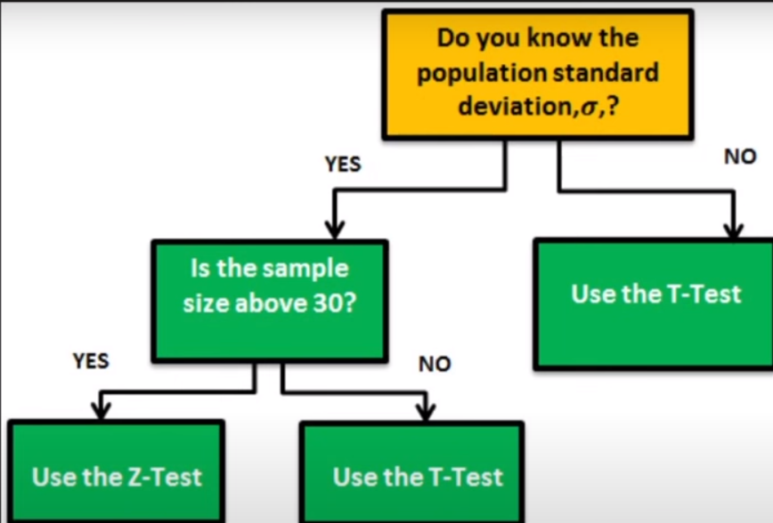

### 2. Inferential Statistics

Inferential statistics is a branch of statistical science that involves drawing conclusions, making predictions about a larger population from a sample of data. This is done by using probability and hypothesis testing to determine the likelihood that observed results are due to chance or if there is a significant relationship between variables.

Genrating inference from population on the basis of sample.

1. Dependent vs Independent Variables
2. Hypothesis Testing
3. Confidence Interval
4. Multiple Comparison of Means

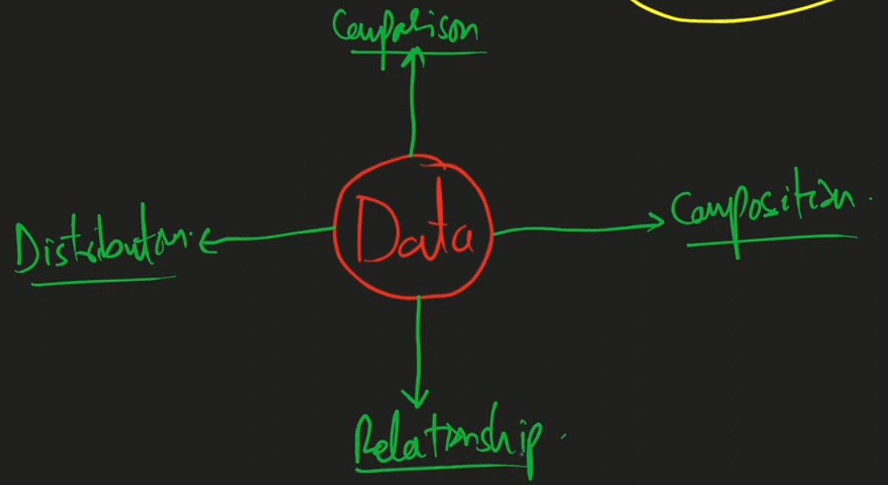

## Why Stats is Important for Data Science

Statistics is important because it helps to describe, understand, and interpret data. It is used to identify patterns and make predictions based on the information available. Statistics provides a framework for decision-making and problem-solving, and helps to make sense of complex data sets.

### Question / Problem

How many Pakistani female and male are in IT industry? If there are 10 vacancies, then how we will know that how many seats we have to give to Male or Female?

### Solution

Conduct a surveys of different cities, districts and gather the data. Let's suppose we took survey of 500 people.

- 250 Male IT
- 100 Female IT
- 150 Non IT

Maybe we didn't use a good technique to gather sample. **Stats also helps in how to collect the data.**

## Scales or Levels of Measurement

1. Nominal Scale
   - Names, Labels and Qualities. No Number and also No Order/Ranking.
   - **Example**: Male, Female, Dot, Cat, Bird, Ahsan, Shakoor, Jawad, Ahmad.
   - **Stats**: Can apply Mode, Frequency and Chi-Square.
2. Ordinal Scale
   - Nominal Scale + Rank or Order.
   - **Example**: Is it hot in Pakistan?
   - **Options**: I agree, I Strongly agree, I don't agree
   - Class Position of students first, second, third etc.
   - **Stats**: Can check Median, Mode.
3. Interval Scale
   - Numbers, Equal difference between numbers, Not True Zero, Absolute Zero.
   - **Example**: Temperature in Celsius, Dates in Calender year.
   - **Stats**: Can check Mean, Median, Mode, Variance, Standard Deviation, ANOVA Test, Regression Analysis.
4. Ratio Scale
   - Numbers, True Zero, Meaningful Arithmetic Operations.
   - **Example**: Height, Weight, Income, distance, decimal.
   - **Stats**: Can apply Mean, Median, Mode, SD, Geomteric Mean, Harmonic Mean.


## Qualitative vs Quantitive Data

Qualitative Data | Quantitive Data |
-----------------|-----------------|
 Quality Measure | Quantity Measure |
 Categorical Data | Numerical Data |
 No Number Involved | Only Numbers |
 Nominal Scale | Interval Scale |
 Ordinal Scale | Ratio Scale |
 ............. | Can Apply Arithmetic Operations |

### Example

Male, Female is a qualitative data, but what if we represent it using 0 and 1 then it will be also a **Qualitative Data**. Because 0 and 1 is the method to collect the data and at the end of day it represents Female or Male data.

It is called **Data Encoding**. We do it to increase the performance of computer and less time required to process.

## Discrete Data

Discrete data is a type of data that can only take on a specific set of distinct values, such as integers, and is used to represent counts, frequencies, or categories. Such as 1, 2, 3, Car parking in parking lot, Number of children in family.

## Coninuous Data

Continuous data is a type of data that can take on any value within a continuous range, such as decimal numbers, and is used to represent measurements or quantities. Such as all the decimal numbers between 1-2, Measurable data - height, weight, temperature, time series.

## Binary Data

Binary data is a type of data that can only take on two values, typically represented as 0 and 1, and is used to represent categorical data or to encode other types of data. Such as True or False, Yes or No.

## Time Series Data

Time series data is a type of data that is collected at regular intervals over time, and is used to analyze trends, cycles, and patterns in the data. Such as, calculating weight after every 10 days, stock market, weather, temperature.

## Spatial Data

Spatial data is a type of data that is used to represent geographic features, locations, and phenomena, and is used in many fields such as geography, urban planning, and environmental science. Such as, location of a city, location of a building, location of a person.

## Categorical Data

Categorical data is a type of data that is used to represent categories or groups, and is typically represented using text or labels. For example, the gender of a person can be represented as "male" or "female", which are categories. Blood Groups (A,AB,O,AB+).

No order included.

## Ordinal Categorical Data

Same like categorical data but data is ordered. For example, Ratings, Educational level etc.

## Multivariate Data

Multivariate data is a type of data that consists of multiple variables/columns/attributes that are measured on the same set of observations, and is used to analyze the relationships and patterns between the variables.

**Univariate** - one variable.
**Bivariate** - two variables.

## Structured vs Unstructured Data

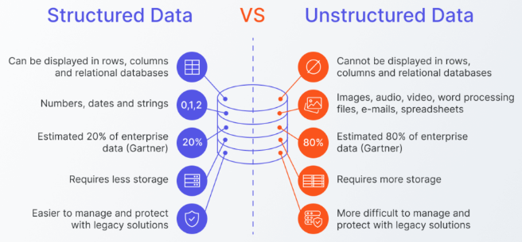
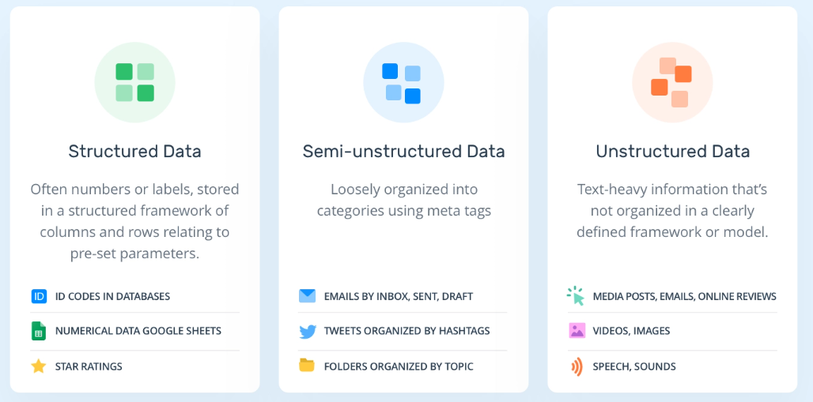

## Boolean Data

Boolean data is a type of data that can only take on two values, typically represented as 0 and 1, and is used to represent categorical data or to encode other types of data. It is also known as binary data.

## Operationalization and Proxy Measurements

We measures something in order to give labels. Sometimes, we get the data which have no standard measurements and we make strategy to measure that concept which is called **Operationalization Measurement**.

**For Example**, measuring stress, we will measure the factors which give stress that is hearbeat, colestrol level, self reported feelings.

Using a related but indirect measure to estimate a variable of interest is called **Proxy Measurement**.

**For Example**, finding tree age, we can't ask the tree to tell us its age, so we can count the rings of stem to estimate the age.

## Surrogate Endpoints

A surrogate endpoint is a measure that is used as a substitute for a more meaningful or direct measure of a phenomenon, and is used when the direct measure is difficult or impossible to obtain. Final aim can't be easily measured.

**For Example**, Heart Attack, we make different end-points to save a person rather than to give him a heart attack controller tablet. We measure the blood pressure and other factor and try to save the person.

### Benefits

1. Short Research
2. Ethics
3. Help to save money

## True and Error Score

True and error score is a measure of the accuracy of a measurement or prediction, where the true score is the actual value and the error score is the difference between the predicted and actual values.

True and error score is used in many fields, including engineering, physics, and statistics, to evaluate the accuracy of measurements and predictions. **Errors wh? questions** helps you to understand the error. Adjustments in algorithms are actually minimizing the errors.

**For example**, if a person's true weight is 70 kilograms and a scale measures it as 72 kilograms, then the error score is 2 kilograms. Maybe you make mistake (Human) or Weighing Balance error. Mostly this error occurs in **continuous data**.

```Equation

X = T + E

where X = Observed Value, T = True Value and E = Error Value

```

## Types of Errors

Systematic errors are errors that occur consistently and can be corrected for, while random errors are errors that occur randomly and cannot be completely eliminated.

### 1. Random Errors

Random errors are unpredictable and occur randomly in the measurement or evaluation process. These errors are typically due to factors outside the control of the person measuring or evaluating, such as outside influences or human error.

**For example**, random error is an error that if we do it twice then the values will change. Such as Dice, each time you will get random number.

### 2. Systematic Errors

Systematic errors, also known as measurement errors or assessment errors, are consistent and predictable mistakes made in the measurement or evaluation process. These errors can arise from flaws in the measurement instrument or from the way the measurement is conducted.

**For example**, an electronic scale that, if loaded with a standard weight, provides readings that are systematically lower than the true weight by 0.5 grams – that is, the arithmetic mean of the errors is -0.5 gram.

## Type-I Error

**False Positive Error**. For example, let's suppose you don't have COVID but test kit is showing that you have COVID.

Work on 0 and 1 or ON and OFF.

## Type-II Error

**False Negative Error**. For example, let's suppose you have COVID but test kit is showing that you don't have COVID.


## Errors & Data Scientist

Data Scientists should care alot about errors due to following factors:

1. Better Decision Making.
2. ML and AI Models will work better.
3. Better understanding of risk management.
4. Ethical implementation.

## Reliability and Validity

Reliability and validity are both about how well a method measures something.

### Reliability

Reliability refers to the consistency of a measure (whether the results can be reproduced under the same conditions). Claim is True. If we collect the data and that is reliable. A reliable is tool or method, when it yield the same results under consistent condition.

**For example**, we collected height and weight of different students in class and then ask them to verify the data. If they say yes then it is reliable.

**For example**, if you scored 95% on a test the first time and the next you score, 96%, your results are reliable.  So, even if there is a minor difference in the outcomes, as long as it is within the error margin, your results are reliable.

### Validity

Validity refers to the accuracy of a measure (whether the results really do represent what they are supposed to measure). Valid something which means accurate.

**For example**, all 12-inch rulers are one foot, I must repeat the experiment several times and obtain very similar results, indicating that 12-inch rulers are indeed one foot.

### Why Important

Data is measure which are level of Measurements.

**NOTE**, _DATA IS NEW OIL_

If your data is Reliable and Valid then:

1. Your data is trust worthy.
2. You can take sound decision based on data.
3. Ethical Research.
4. Effective Solution

## Triangulation

Triangulation in statistics refers to the use of multiple methods or sources of data to verify or corroborate a particular measurement or estimation. This technique is often used to reduce measurement error and increase the accuracy of results.

**For example**, Health records, air quality metrices, sattelite images all three leads to that Lahore is polluted city to live then it is triangulization.

### Why Important Triangulation

1. Credibility
2. Reduces Bias
3. Increase Confidence on findings
4. Comprehensice View

### Demerits

1. Resouce Intensive
2. Complex Integration
3. Skill Requirements

## Measurement and Data Bias

Bias in research or data collection refers to systematic errors that skew results or inferences away from reality. Bias can occur in various aspects of research, including data collection, analysis, interpretation, and publication.

These biases can arise from various sources:

1. **Sampling Bias**: When the sample used in a study does not accurately represent the population.
   - For example, if a study is conducted only on men, the results may not be representative of the general population.
2. **Selection Bias**: When the participants included in the study do not accurately represent the general population. Its like listening to opinions of those people who agree with you.
   - For example, if a health survey is conducted only in urban hospitals, trends in rural areas may be missed.
3. **Confirmation Bias**: When researchers or data collectors consciously or unconsciously favor data or interpret results that confirm their pre-existing beliefs or hypotheses.
   - Pre Assumptions, Pre Existing beliefs.
   - For example, a detective only see to those clues which support his theory.
4. **Publication/Survivorship Bias**: Selectively publishing only positive or significant results while neglecting negative or non-significant findings.
5. **Reporting Bias**: When only certain outcomes or aspects of a study are reported, leaving out others that may be equally important.
   - Media Channels.

These all lead you to **Information Bias**.

### Measurement Bias

Measurement bias is a particular type of bias that is associated with systematic errors in collecting, recording, or interpreting measurements. It can significantly impact the reliability and validity of study outcomes. It mislead to draw conclusion.

Types of measurement bias include:

1. **Instrument Bias**: When there are flaws in the measurement instruments themselves. For example, a scale consistently showing lower weight than actual.
2. **Observer Bias**: When the person measuring (observer) unintentionally influences the results, perhaps due to their expectations or preconceived notions.
3. **Response Bias**: When study participants provide answers they believe are expected or socially acceptable, rather than their true thoughts or feelings.
4. **Sampling Bias**: A type of measurement bias related to how the sample is selected. If the sample does not accurately represent the population, measurement bias can occur.

### Reducing Bias and Measurement Bias

1. Improve Sampling Methods (Randomized Sampling)
2. Use Refined Research Designs
3. Data Collection Vigillances (Use standardized protocol or use multiple resources)
4. Analytical Awareness (Statistical test & Peer Review)
5. Ongoing Education and Awareness

## Data Analysis

A process of transforming raw data (collected data) into meaningful insights.

### Types of Data Analysis

1. Descriptive Data Analysis
   - Focuses on summarizing the main features of a dataset.
2. Diagnostic Data Analysis
   - Digs deeper to find the cause behind the observed patterns.
3. Predictive Data Analysis
   - Uses historical data to predict future outcomes.
4. Prescriptive Data Analysis
   - Recommends actions and predicts their outcomes.
5. EDA
   - Explores data for patterns, anomalies, and hypotheses.
6. Inferential Analysis
   - Makes inferences about populations using sample data.
7. Causal Analysis
   - Determines causality between variables.
8. Mechanistic Analysis
   1. Examines the exact mechanisms of changes in variables.

[More Details](https://codanics.com/data-analysis-and-types-of-data-analysis/)

## Population vs Sample

### What is a Population?

In statistics, a population refers to the entire group that you want to draw conclusions about. For example, the population could be “all the people living in Lahore City” or “every oak tree in a forest.”

### What is a Sample?

A sample is a subset of the population, selected for study. For instance, surveying 1,000 residents of Lahore City as a sample of the entire city’s population.

#### Ensuring Accurate Sampling

1. Random Sampling: Ensures every member of the population has an equal chance of being selected.
2. Stratified Sampling: Divides the population into strata and samples from each stratum.
3. Sample Size: Larger samples generally provide more accurate reflections of the population.

## Central Tendency

Central Tendency is a way to describe the center of a data set. In data terms, it’s the point around which the data clusters. Think of it as a way to summarize a whole lot of numbers with just one value that represents them best.

### The Big Three of Central Tendency

1. **Mean (The Average)**
   - Arithmetic Mean
   - Geomteric Mean - is calculated by multiplying all the valus together and then taking the nth root.
   - Harmonic Mean - is the reciprocal of the arithmetic mean of the reciprocals of the values. Suitable for rates and ratios.
   - Weighted Mean - is the weight or importance of each value in dataset.
2. **Median (The Middle Value)**
   - Always sort the data then find the middle value.
   - Outliers can be handle.
   - Use on Real estates data, Income data.
3. **Mode (The Most Common)**
   - Frequency of the most common value.
   - Use on categorical data.

### NOTE

**Mean:** Can be skewed by outliers (like a billionaire moving into a neighborhood).
**Median:** Great for skewed distributions (think wealth distribution).
**Mode:** Perfect for categorical data (like survey responses).

**Sample Mean:** The mean of a sample of data.
**Population Mean:** The mean of the entire population.

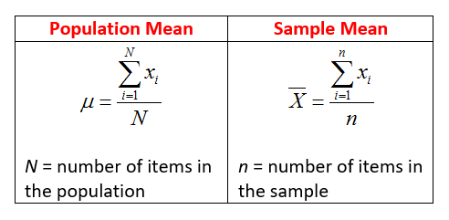

## Limitations of Mean

1. Sensitive to Outliers.
2. Sensitive to extreme values.
3. Sensitive to the number of values.
4. Doesn't tell the full story.

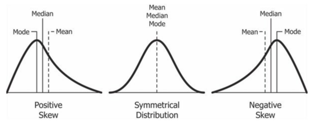

## Variability | Dispersion | Spread of Data

Variability often referred to as dispersion, is the hearbeat of a dataset. It measures how much individual data points differ from each other and from the central tendency (like mean or median).

1. Range of Spread
   - Max - Min
2. IQR
   - Shows middle 50% of data.
   - Q1, Q2, Q3, Q4
   - Helps to remove outliers
3. Variance
   - Checks spread around the mean
4. Standard Deviation
5. Standard Error

### 1. Range of Data

Sensitive to outliers.

- Minimum Value
- Maximum Value

Range = Maximum - Minimum

### 2. IQR (Interquartile Range)

Any data divided into 4 parts.

- Q1 (25th Percentile)
- Q2 (50th Percentile)
- Q3 (75th Percentile)
- Q4 (100th Percentile)

The middle 50% of data is IQR. Helps to identify outliers.

IQR = Q3 - Q1

#### Steps

1. Sort the data in ascending the order.
2. Find the quartiles.
3. Subtract Q1 from Q3.

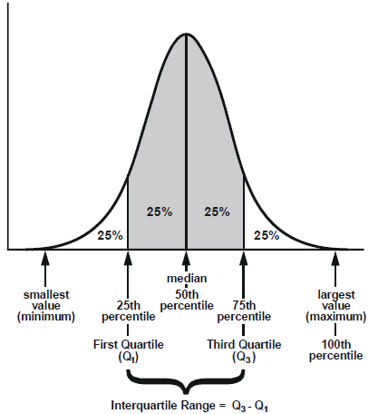
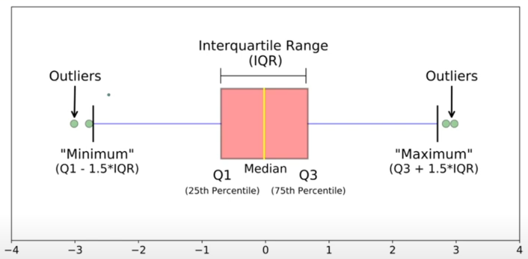

### 3. Variance

Variance is a statistical measure that quantifies the extent to which data points in a set deviate from the mean.

Variance is a statistical measure of the spread of a dataset, calculated as the average of the squared differences between each data point and the mean, and is used to quantify the dispersion of data around an average value. _For example_, if the mean of a dataset is 10 and the variance is 4, it means that the data points in the dataset are on average 4 units away from the mean.

Variance is a measure of how spread out a set of data points is from the mean.

[More About Variance](https://codanics.com/variance-in-statistics/)

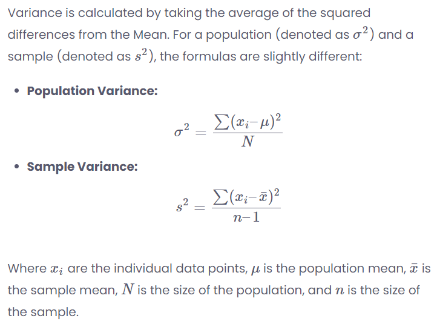

### 4. Standard Deviation

Standard deviation is a measure of the dispersion of data around the mean.

A low standard deviation means that the data points are close to the mean, indicating smooth and consistent terrain. In contrast, a high standard deviation indicates that the data points are spread out over a wider range of values, akin to a rough, uneven landscape.

Mean +- SD/std/st.dev = 3 +- 0.05

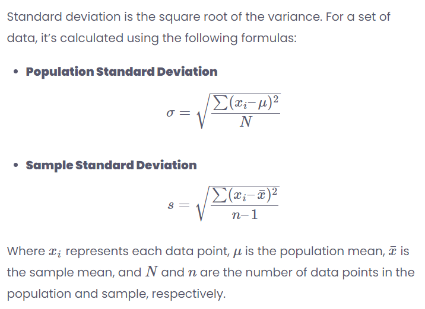
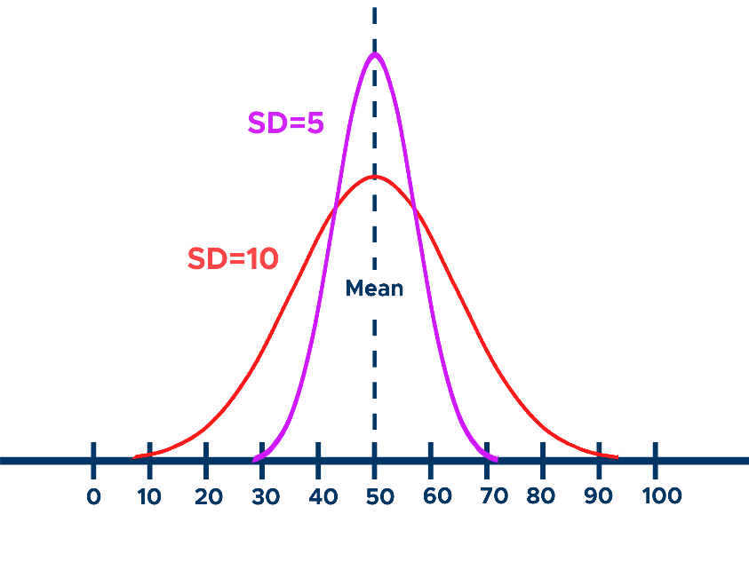
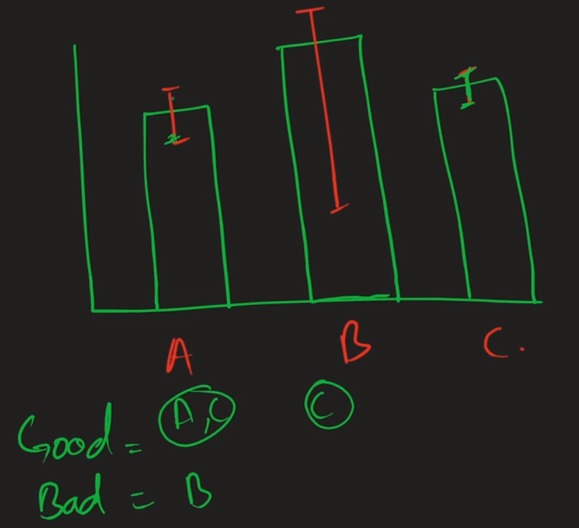

#### Standard Error

 The standard error is used when we want to estimate the precision of the sample mean as an estimate of the population mean. It is calculated as the standard deviation divided by the square root of the sample size. The larger the sample size, the smaller the standard error, which means that the sample mean is more likely to be close to the true population mean. On the other hand, the standard deviation is used to describe the variability of the data set itself. It is calculated as the square root of the variance, which is the average of the squared differences from the mean. The standard deviation is useful for understanding how much the values in a data set vary from the mean.

 se = SD / square_root(n)

## Normal Distribution / Gaussian Distribution

If we calculate STD;

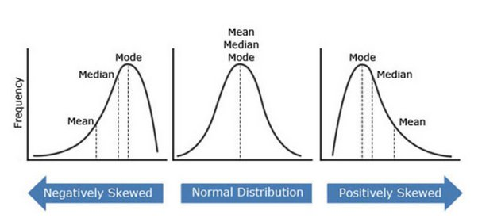

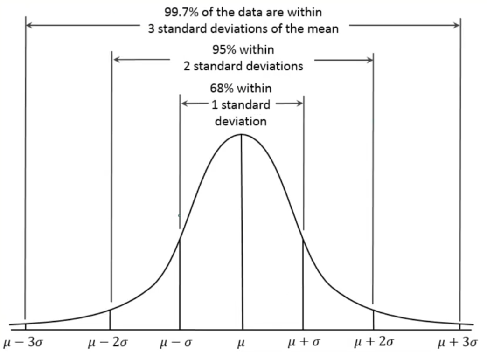
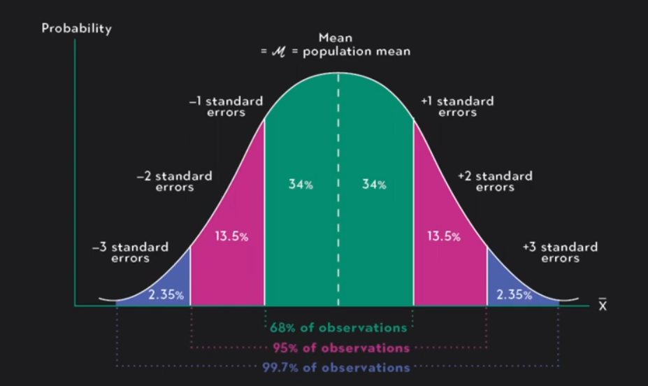

## Data Distributions

Data distribution refers to how data points in a dataset are spread out or clustered across a range of values. It is the blueprint that describes the shape or spread of data in a graphical format. Understanding the distribution of data is fundamental in choosing the correct statistical methods and models for analysis.

Graphical representations such as histograms, box plots, and probability density plots are invaluable in visualizing data distributions. We apply distributions on **numerical data** only.

Understanding the distribution of data is pivotal in data science for several reasons:

1. Model Selection
2. Predictive Analysis
3. Outlier Detection

### Why is normal distribution important in data science and data analysis?

The normal distribution is important in data science and data analysis because it provides a framework for statistical inference, simplifies analysis, and allows for the application of a wide range of statistical techniques.

### How to Normalize the Data?

1. Min-Max Normalization
2. Z-Score Normalization

### 1. Normal/Gaussian Distribution: The Bell Curve

Symmetrical, bell-shaped curve centered around the mean. Example: Human heights within a specific gender and age group.

### 2. Uniform Distribution: Even Spread

All values have the same frequency, creating a flat distribution. Example: A fair roll of a dice, where each outcome from 1 to 6 is equally likely.

### 3. Binomial Distribution: Success or Failure

Represents the probability of a fixed number of successes in a series of independent experiments. Example: The number of heads observed when flipping a coin multiple times.

### 4. Poisson Distribution: Counting Events

Models the number of times an event occurs within a fixed interval. Example: The number of emails a person receives per day.

### 5. Exponential and Gamma Distributions: Modeling Time

Often used to model waiting times or lifetimes. Example: The amount of time until the next bus arrives.

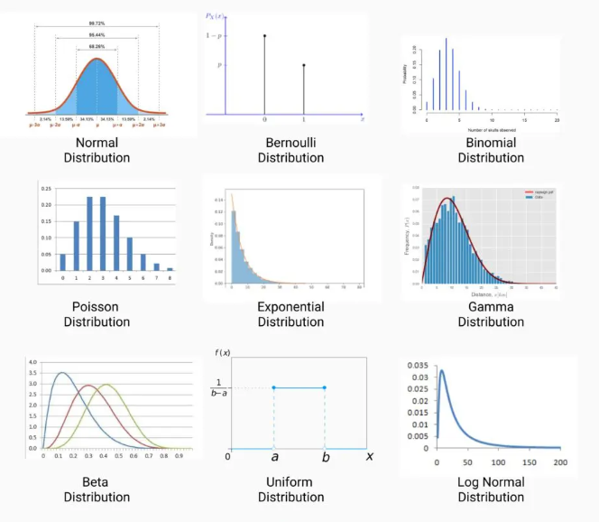
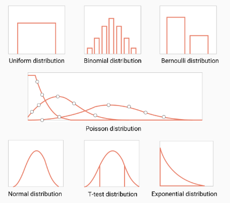
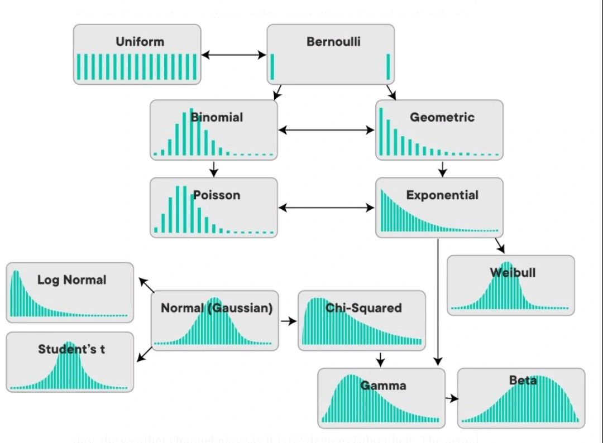

## Skewness vs Kurtosis

Skewness and kurtosis are measures that describe the shape of a data distribution. While they may sound complex, they are essentially tools to understand how data behaves around the mean.

### Symmetrical Data Distribution

A distribution in which Mean, Media, and Mode are same on center data i.e Normally distributed.

### Skewness: The Asymmetry Measure

Skewness measures the degree of asymmetry of a distribution around its mean. It indicates whether the data points are skewed to the left (negative skew) or to the right (positive skew) of the mean.

- Positive Skew: A distribution with a longer tail on the right side.
- Negative Skew: A distribution with a longer tail on the left side.

Example: Income distribution is often positively skewed, as a majority of people earn below the average, with a few high earners creating a long right tail.

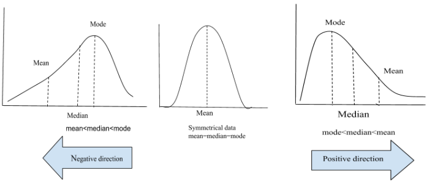

### Kurtosis: The Tailedness Measure

Kurtosis measures the ‘tailedness’ of a distribution. It describes the height and sharpness of the central peak and the heaviness of the distribution’s tails.

- High Kurtosis (Leptokurtic): A distribution with heavy tails and a sharper peak than a normal distribution.
- Low Kurtosis (Platykurtic): A distribution with lighter tails and a flatter peak.

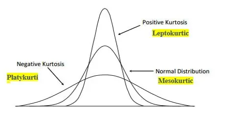

### Skewness vs Kurtosis: The Key Differences

- Focus on Symmetry: Skewness primarily focuses on the symmetry, or lack thereof, of a distribution, whereas kurtosis is more about the extremity of data points.
- Implication on Data Analysis: Skewness affects the direction of data deviation, while kurtosis influences the probability of extreme values.

## Data Collection

Data collection is the process of gathering and measuring information on variables of interest in a systematic manner, enabling one to answer stated research questions, test hypotheses, and evaluate outcomes. The quality of your data collection determines the quality of your data analysis.

### Primary Data

Primary data is data that is collected directly from the source, such as through surveys, interviews, or observations, and is used to gather original information about a particular topic. For example, a researcher conducting a survey to gather data about people's opinions on a political issue is collecting primary data.

1. Research/Experiment Data Collection
2. Interview Data Collection
3. Primary Reagent Data Collection
   - Lab/University/Institute Data
4. Questionaire Data Collection
5. Survey Data Collection
6. Audio Data Podcast

### Secondary Data

Secondary data is data that has been previously collected by someone else and is used to analyze or interpret information about a particular topic. For example, a researcher using census data to analyze population trends is using secondary data.

## Why Do We Need Sampling?

1. For Data Science, raw material is DATA.
2. The one who is collecting the data they need resources.
3. Data collected in two ways that is either collect in population or in sample.
   - In sampling we collect the data randomly to reduce the biasness.
4. If we have already seconday data (in big data world) then why do we need to collect more data?
   - Because we need to collect more data to get more accurate data.
   - Also new theory and new phenomenon arise because of different researches and experiements.
   - If we stop to collect data (primary data) then innovation will stop.

## Best Practices in Data Collection

1. Clearly Define Your Objectives
2. Choose the Right Data Collection Method
3. Ensure Data Accuracy and Reliability
   - Implement checks and balances to validate the accuracy of your data.
   - This might include cross-checking with multiple sources or using validated instruments.
4. Ensure Data Privacy and Ethics
5. Plan for Data Storage and Management
   - Have a system for organizing, storing, and managing your data.
   - This could involve databases, cloud storage, and data management software.
6. Train Your Data Collection Team
7. Pilot Test Your Data Collection Tools
8. Document the Process

## Representative and Non-representative Sampling

Representative Sampling | Non-representative Sampling |
------------------------|-----------------------------|
 A sampling method that aims to select a subset of data that accurately reflects the characteristics of the entire population       | A sampling selects a subset of data that may not accurately reflect the population. |
 ____                   | ____ |
 Simple Random Sampling | Convenience Sampling |
 Systematic Sampling    | Haphazard Sampling |
 Stratifies Sampling    | Purposive/Judgmental Sampling |
 Cluster Sampling       | Snowball Sampling |
 ____                   | Quota Sampling |

- Also called Probability Sampling and Non-Probability Sampling

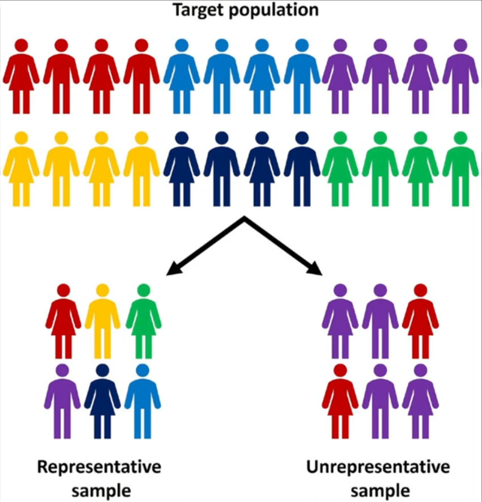

## Chossing a Right Statistical Method

Parametric Tests | Non-Parametric Tests |
-----------------|----------------------|
 More Reliable results | Less Reliable results |
 First we have meet the assumptions | Calulates the rand of data |
 A3 | No need to meet the assumptions |

### Step-1 Normality Test

1. Shapiro-Wilk Test
   - Specific (Reliable)
2. Kolmogorov-Smirnov Test
   - General (Less Reliable)

### Step-2 Homogeneity Test

The variance of the variable in data are equal

1. Levene's Test

### Step-3 Purpose

Know the purpose of your research question

1. Comparison
2. Relationship
   - Connection, Correlation, Causation, Prediction

### Step-4 Data Type

Know the type of data you are working with.

1. Categorical
2. Numerical

### Step-5 Statistical Tests

Choosing a statistical test from three main families.

1. Chi-Squared
   - Comparison, use for categorical only.
   - Can be used with any number of levels or groups.
2. t-test/ANOVA
   - Comparison, use for cateogrical and numerical both.
3. Correlation
   - Relationship, use for numerical only.
   - Pearson's Correlation.
   - Regression.

### Assumptions are not Met

1. Normalize your data
   - Standardization
   - Min-max Scaling
   - Log Transformation
2. Use Alternative Non-Paramteric Tests

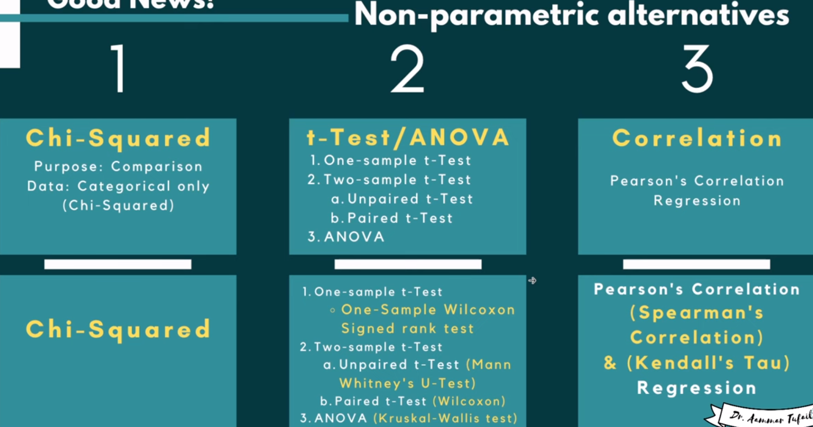
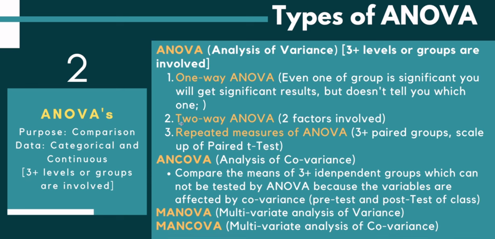
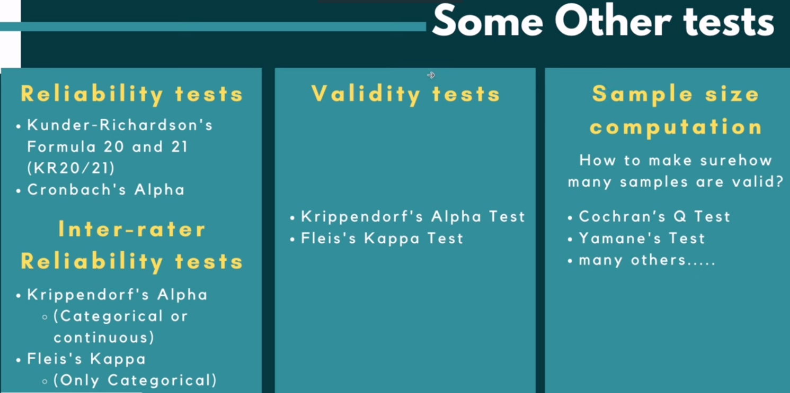

- Full Guide to Choose Test

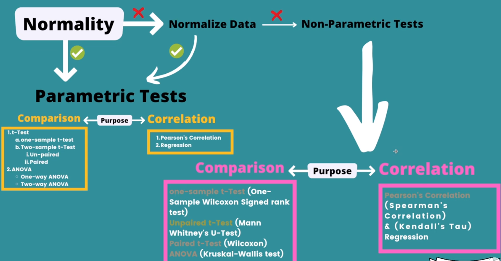

## Four Pillars of EDA

CDCR

1. Composition
2. Distribution
3. Comparison
4. Relationship

## Dependent vs Independent Variables

In statistics, dependent variables are variables that are influenced by or depend on other variables, while independent variables are variables that influence or determine the dependent variables.

Columns are variables.

## Hypothesis Testing

Hypothesis testing is a statistical technique used to determine whether a hypothesis about a population parameter is likely to be true or false, based on sample data. It is used to make inferences about a population based on a sample.

Example of hypothesis testing include determining whether a new drug is effective in treating a certain medical condition, based on the results of a clinical trial.

1. **Null Hypothesis**
   - Denoted by H0:
   - Independent Variable doesn't effect dependent variable is called Null Hypothesis.
   - When we want to reject our hypothesis.
   - The null hypothesis is a hypothesis that there is no significant difference or relationship between variables, and is used as a baseline for comparison in statistical testing.
   - _Examples_ of the null hypothesis include a study of the effect of a new drug on blood pressure, where the null hypothesis might be that the drug has no effect on blood pressure.
2. **Alternate** Hypothesis
   - Denoted by H1:
   - Independent variable effect dependent variable is called Alternate Hypothesis.
   - A hypothesis that states that there is a significant difference or relationship between variables, and is used as a comparison to the null hypothesis in statistical testing.

### Hypothesis Testing Steps

1. H0: Null Hypothesis
2. H1: Alternate Hypothesis
3. Data Collection to test the hypothesis
4. Statistical Analysis
5. Results of H0 and H1, which one is true or false.
   - Answer
   - Reporting

**Example**; Let's say you want to test if there's a significant difference in math skills between students in Karachi and Lahore. Your null hypothesis (HO) would be that there's no difference in skills between students in both cities, and the alternative hypothesis (H1) would be that there is a significant difference. Then you collect data from schools in both cities and perform a statistical test like a t-test or ANOVA to see if your data rejects the null hypothesis or not.

If we get P<0.05 after getting 95% confidence interval then we reject the H0.

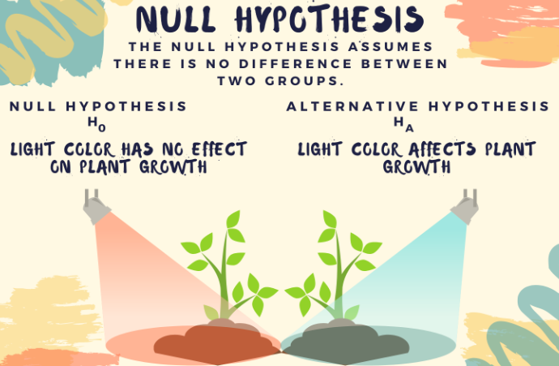

## Confidence Intervals

A confidence interval is a range of values within which we can be confident that the true population parameter lies, based on a sample; for example, a 95% confidence interval for the mean height of a population is 160-170 cm, indicating that we are 95% confident that the true mean height falls within this range.

Upper bound and lower bound are 160-170 cm.

**Example**; Let's say you calculated the average test score of students in a college in Peshawar. Your sample mean is 70, and you calculated a 95% confidence interval which falls between 68 and 72. This means that you are 95% confident that the average score of all students in the college will be within this range.

## Resources

[ABC of Statistics](https://codanics.com/books/abc-of-statistics-for-data-science/)
