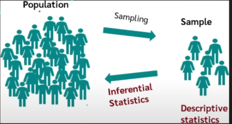
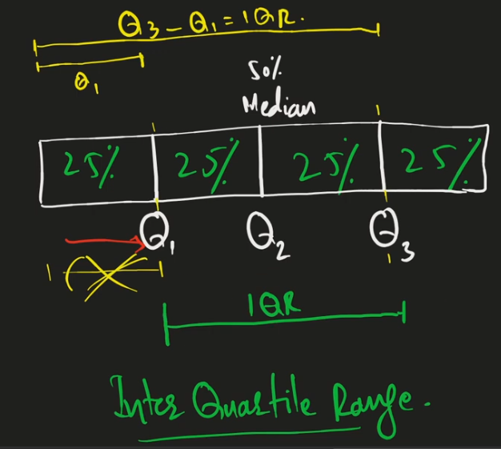
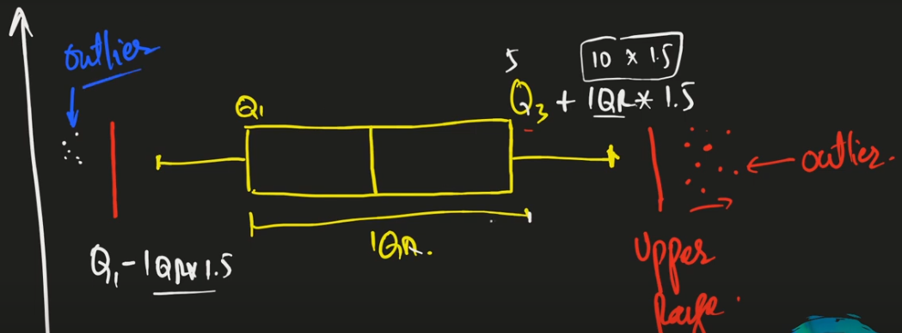
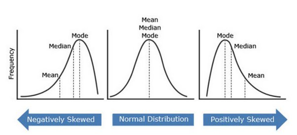

# Pandas & Exploratory Data Analysis or Data Wrangling

All the pandas tips and tricks for doing exploratory data analysis are collected in this section.

## Intro to Pandas

1. A high-level data manipulation tool built on the Numpy package.
2. Designed to make data cleaning and analysis quick and easy in Python.

## Rows and Columns

Rows - rows set the data from left to right in horizontal form, and the other names for rows are records, instances, datapoints, observations, entries.

Columns - Columns align the data from top to bottom, and the other names for columns are attributes, properties, features, fields , dimensions.

Rows and Columns are called Dataframe in Pandas.

## Data Life Cycle

1. Acquire the data. **(Ask)**
   1. Create data
   2. Capture data
   3. Gather data
2. Clean the data. **(Process)**
   1. Organize data
   2. Filter data
   3. Anotate data
   4. Clean data
3. Use the data. **(Analyze)**
   1. Analyze
   2. Mine
   3. Model
   4. Decision
   5. Visualize
4. Publish the data. **(Report)**
5. Preserve/Destroy the data. **(Save)**

## Structured & Unstructed Data

1. Structured data is in tabular form. Rows and Columns.
2. Unstructured data are images, audios or text data.

## Data Collection

We need to collect the data. So we ask **_wh?_** questions

**why? -> How? -> Where? -> Who? -> When?**

1. Primary data is our own. Expensive method. Research included.
2. Secondary data is already produced. Cheaper Method.

## Data Scientist vs Data Analyst

## Data Scientist

1. Understand Business.
2. Data Acquistion / Understanding.
3. Data Preparation.
4. Data Modeling (ML/DL).
5. Data/Model Evaluation.
6. Model Deployment.
7. Monitor and Optimize the Models.

### Data Analyst: (Tableu / PowerBI)

1. Required Information about data (Meta Data).
2. Data Collection.
3. Assigned Goals about data.
4. Data Cleaning / Preprocessing.
5. EDA (Exploratory Data Analysis).
6. Generate Inference from data.
7. Make Model.
8. Deploy the Model.
9. Interept and Visualize the data.
10. Report Writing.

## Types of Data Analytics

1. Descriptive -> What happend? -> **EDA**
2. Diagnostic -> Why did it happen? -> **Patterns / EDA**
3. Predictive -> What will happen? -> **ML/DL**
4. Prescriptive -> How can we make it happen? -> **Data Driven Decision Making**

## Levels of Measurement

1. Nominal -> Name, colour, city_name
2. Ordinal -> Named + Ordered Variable. E.g Elder, Younger, Middle
3. Interval -> Named + Ordered + Proportion / Interval Between Variables. E.g Peshawar to Islamabad distance
4. Ratio -> Absolute Zero

## Data Major Types

## Qualitative & Quantitave

### Qualitative Data

Categorical / Non-Numeric -> Nominal and Ordinal are sub-types.

### Quantitave Data

Numerical -> Discrete Data (Non-Decimal) and Continuous (Decimal) -> Interval and Ratio are sub types of Continuous.

## Population & Sampling



## Exploratory Data Analysis **(EDA)**

Important point for EDA is the **Purpose**. Why do want to conduct this analysis? Is it for prediction or understanding?

EDA [Importance](https://codanics.com/why-eda-is-important/)

## Data Exploration or Data Wrangling or Data Munging or Data Preprocessing or Data Cleaning

1. Feel the data again and again.
2. Explore **Who** collected / gathered this data.
3. Explore **What** is this data about?
4. Find **Meta Data** of the data.
5. Explore the data **Dimension** _(rows x columns)_.
6. Explore the **Composition _(rows and columns or structure)_, Comparison, Correlation _(corr matrix)_, Distribution** of the data.
   1. Person'r R & Spearson's R -> Correlation Coefficient.
   > A positive value indicates a linear relationship.
7. The above 4 components are **Descriptive Data Analytics**.

## Data Cleaning 🧹

1. Handling Missing Data: Utilize methods like `dropna()`, `fillna()`, and understand the importance of `inplace` parameter.
2. Data Type Conversion: Grasp `astype()` to convert data types and understand pandas’ native data types.
3. Removing Duplicates: Employ `drop_duplicates()` to maintain data integrity.

## Data Manipulation & Analysis 📈

1. Aggregation: Use powerful grouping and aggregation tools like `groupby()`, `pivot_table()`, and `crosstab()`.
2. String Operations: Dive into the .str accessor for essential string operations within Series.
3. Merging, Joining, and Concatenating: Understand the differences and applications of `merge()`, `join()`, and `concat()`.
4. Reshaping Data: Grasp `melt()` and `pivot()` for transforming datasets.

## Outliers

Blog [Link](https://codanics.com/handling-outliers-in-data-science-and-machine-learning/)

1. An outlier is an observation that lies an abnormal distance from other values in a random sample from a population.
2. Outliers can sometimes indicate errors or anomalies in the data.
3. Outliers can also impact the structure of the data that is normal distribution.
4. Mean and Variance. Variance is the spread of data distribution which is also called Standard Distribution.

### Types of Outliers

- Univariate outliers -> 1 variable.
- Multivariate outliers -> More than 2 variables.
  
1. Global outlier
   > Point Anomally affects all observations. E.g. Temperature ranges from 2°C to 40°C in particular set and we get one temperature of 100°C.
2. Contextual outlier
   > Data points whose value significantly deviates from other data within the same context.
3. Collective outlier
   > Groups of data points that collectively deviate significantly from the overall distribution of a dataset.

### How to Identify Outliers

- Visually Identification
  > Boxplot and Histogram
- IQR (Inter Quartile Range) Method.
  > IQR = Q3 - Q1
- Z-Score Method








### Handling Outliers

1. Remove them.
2. Transform them. `Exponential transformation`, `logarithmic transformation` etc.
3. Impute them. Deal the outliers like missing values.
4. Use ML Models which are robust to outliers. Ex: Isolation Forest, One Class SVM.

### Python Code to Remove Outliers

```Python
import seaborn as sns
import pandas as pd

# Load the Titanic dataset
titanic = sns.load_dataset('titanic')

# Display the first few rows of the dataset
print(titanic.head())

# Calculate the IQR for the 'age' column
Q1 = titanic['age'].quantile(0.25)
Q3 = titanic['age'].quantile(0.75)
IQR = Q3 - Q1

# Define bounds for the outliers
lower_bound = Q1 - 1.5 * IQR
upper_bound = Q3 + 1.5 * IQR

# Remove outliers
titanic_no_outliers = titanic[(titanic['age'] >= lower_bound) & (titanic['age'] <= upper_bound)]

# Display the first few rows of the dataset without outliers
print(titanic_no_outliers.head())
```

## Links to useful resources

- [Book] <https://wesmckinney.com/book/python-builtin#set>
- [Pandas Cheat Sheet] <https://pandas.pydata.org/Pandas_Cheat_Sheet.pdf>
- Google Data Search.
- Machine Learning Data Repository.
- [EDA Blog] <https://codanics.com/pandas-python-library-for-eda-a-comprehensive-guide/>
- [Complete Guide Step by Step] <https://www.analyticsvidhya.com/blog/2022/07/step-by-step-exploratory-data-analysis-eda-using-python/>

## Other Libraries

Explore libraries like Dask for parallel computing and Vaex for handling large datasets.
