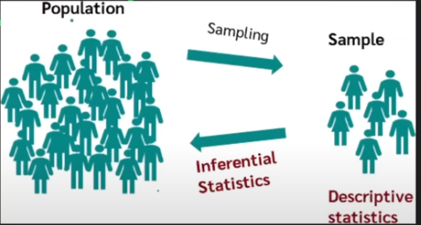

# Pandas & Exploratory Data Analysis or Data Wrangling

All the pandas tips and tricks for doing exploratory data analysis are collected in this section. 

## Intro to Pandas
1. A high-level data manipulation tool built on the Numpy package.
2. Designed to make data cleaning and analysis quick and easy in Python.

## Rows and Columns
Rows - rows set the data from left to right in horizontal form, and the other names for rows are records, instances, datapoints, observations, entries.

Columns - Columns align the data from top to bottom, and the other names for columns are attributes, properties, features, fields , dimensions.

Rows and Columns are called Dataframe in Pandas.

## Data Life Cycle
1. Acquire the data. **(Ask)**
   1. Create data
   2. Capture data
   3. Gather data
2. Clean the data. **(Process)**
   1. Organize data
   2. Filter data
   3. Anotate data
   4. Clean data
3. Use the data. **(Analyze)**
   1. Analyze
   2. Mine
   3. Model
   4. Decision
   5. Visualize
4. Publish the data. **(Report)**
5. Preserve/Destroy the data. **(Save)**

## Structured & Unstructed Data
1. Structured data is in tabular form. Rows and Columns.
2. Unstructured data are images, audios or text data.

## Data Collection
We need to collect the data. So we ask wh? questions

why? -> How? -> Where? -> Who? -> When?

1. Primary data is our own. Expensive method. Research included.
2. Secondary data is already produced. Cheaper Method.

## Data Scientist vs Data Analyst
### Data Scientist:
1. Understand Business.
2. Data Acquistion / Understanding.
3. Data Preparation.
4. Data Modeling (ML/DL).
5. Data/Model Evaluation.
6. Model Deployment.
7. Monitor and Optimize the Models.

### Data Analyst: (Tableu / PowerBI)
1. Required Information about data (Meta Data).
2. Data Collection.
3. Assigned Goals about data.
4. Data Cleaning / Preprocessing.
5. EDA (Exploratory Data Analysis).
6. Generate Inference from data.
7. Make Model.
8. Deploy the Model.
9. Interept and Visualize the data.
10. Report Writing.

### Types of Data Analytics
1. Descriptive -> What happend? -> **EDA**
2. Diagnostic -> Why did it happen? -> **Patterns / EDA**
3. Predictive -> What will happen? -> **ML/DL**
4. Prescriptive -> How can we make it happen? -> **Data Driven Decision Making** 

## Levels of Measurement
1. Nominal -> Name, colour, city_name
2. Ordinal -> Named + Ordered Variable. E.g Elder, Younger, Middle
3. Interval -> Named + Ordered + Proportion / Interval Between Variables. E.g Peshawar to Islamabad distance
4. Ratio -> Absolute Zero

## Data Major Types
Qualitative & Quantitave
### Qualitative Data
Categorical / Non-Numeric -> Nominal and Ordinal are sub-types.
### Quantitave Data
Numerical -> Discrete Data (Non-Decimal) and Continuous (Decimal) -> Interval and Ratio are sub types of Continuous.

## Population & Sampling

## Data Cleaning 🧹
1. Handling Missing Data: Utilize methods like `dropna()`, `fillna()`, and understand the importance of `inplace` parameter.
2. Data Type Conversion: Grasp `astype()` to convert data types and understand pandas’ native data types.
3. Removing Duplicates: Employ `drop_duplicates()` to maintain data integrity.

## Data Manipulation & Analysis 📈
1. Aggregation: Use powerful grouping and aggregation tools like `groupby()`, `pivot_table()`, and `crosstab()`.
2. String Operations: Dive into the .str accessor for essential string operations within Series.
3. Merging, Joining, and Concatenating: Understand the differences and applications of `merge()`, `join()`, and `concat()`.
4. Reshaping Data: Grasp `melt()` and `pivot()` for transforming datasets.

## Links to useful resources: 
- [Book] https://wesmckinney.com/book/python-builtin#set
- [Pandas Cheat Sheet] https://pandas.pydata.org/Pandas_Cheat_Sheet.pdf 

### Other Libraries 
Explore libraries like Dask for parallel computing and Vaex for handling large datasets.