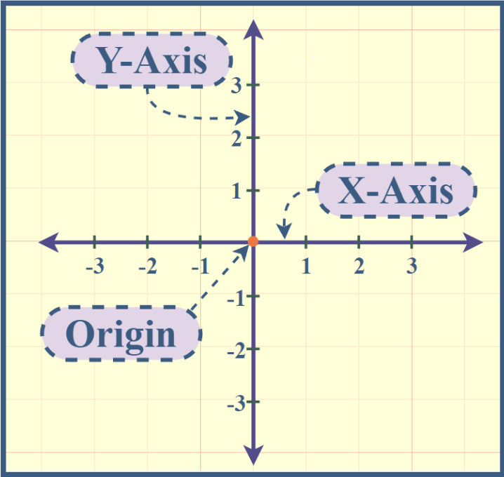
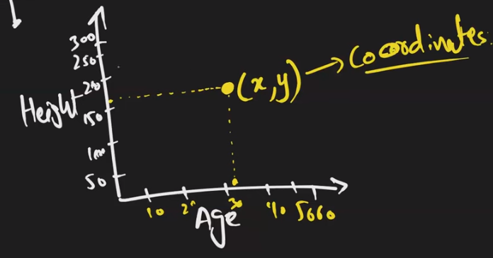

# Data Visualization

Data visualization is the representation of data through use of common graphics, such as charts, plots, infographics and even animations. It allows users to see and understand patterns, trends, and insights in data.

In EDA we prefer to use graphs to get better insights. E.g. Weather Forecast Graphs, Stock Market Graphs.

## 4 Important Points

- Quick insights from data.
- Informed decision making.
- Engagement. Engage the audience and stalkholders.
- Data Exploration (EDA).

## key principals

1. Simplicity: less is more.
2. Consistency: making sure to have same color pallet, fonts.
3. Accuracy: plot what data says.
4. Interactivity: make plots interactive, user interactive.

## Top Learning Tools for Data Visualization

1. Python Libraries
   - Pandas
   - Seaborn
   - Matplotlib
   - Plotly -> Interactive Plots
2. R  
3. MS Excel
4. Tableau
5. PowerBI

## Types of Plots

### Line Plot

Shows the relationship between two variables by connecting data points with straight lines.

### Bar Plot

Displays categorical data with rectangular bars, where the height or length of each bar represents the data value.

### Histogram

Represents the distribution of a continuous variable by dividing it into bins and displaying the frequency or count of observations within each bin.

### Scatter Plot

Displays the relationship between two continuous variables by placing individual data points on a two-dimensional plane.

### Pie Chart

Represents categorical data as a circular chart divided into sectors, where each sector represents a specific category and the area or angle of each sector represents the proportion of data.

### Box Plot

Visualizes the distribution of a continuous variable through quartiles, showing the median, interquartile range, and outliers.

### Heatmap

Displays data in a tabular form using colors to represent the values, with each cell color indicating the magnitude of the data.

### Area Plot

Shows the magnitude and proportion of different variables over time, with areas stacked on top of one another.

### Violin Plot

Combines a box plot and a kernel density plot to represent the distribution of a continuous variable.

### Network Graph

Represents relationships between entities as nodes and connections (edges) between them.

### Treemap

Displays hierarchical data using nested rectangles, where the area of each rectangle represents a specific value.

### Radar Chart

Displays multivariate data on a two-dimensional plane with multiple axes originating from a common center point.

### Bubble Chart

Represents three variables by using bubbles, where the x and y coordinates represent two variables, and the size of the bubble represents the third variable.

### Choropleth Map

Visualizes data by shading or coloring regions or areas based on the measured values, typically used for geographic or spatial data. Sankey Diagram: Illustrates the flow or movement of data or quantities between different entities using interconnected flows.
