# Linear Algebra

Linear algebra is a branch of mathematics that studies vectors, vector spaces, linear mappings, and linear transformations, and systems of linear equations.

Linear = Pattern
Algebra = Join broken pieces

## Vector

A Vector is an object that has both a magnitude (size) and direction. In linear algebra, vectors are often representated as a list of numbers (coordinates), which define its position in space.

**Example**: 3cm line but if we add direction to this line then it is called vector.

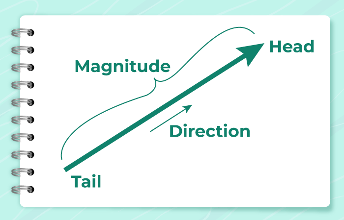


## Vector Space

This is a collection of vectors that can be added together and multiplied by scalars (number).

**Example**: 2D vector = (2,3) or (x,y) - 3D vector = (2,3,4) or (x,y,z). If we multiply a number with vector i.e.       2(x,y) = (2x,2y) then we get a new vector.

## Vector vs Vector Space

A vector is a part of a vector space whereas vector space is a group of objects which is multiplied by scalars and combined by the vector space axioms.

1. **Vector:** Think of a vector as an arrow pointing from one point to another in space. For instance, in a 2-dimensional plane, the vector (3, 4) can be visualized as an arrow pointing from the origin (0, 0) to the point (3, 4).
2. **Vector Space:** Imagine all the arrows (vectors) that can start from a single point in a plane. No matter how long these arrows are or in what direction they point, they all belong to the same 2-dimensional vector space.

## Cartesian Coordinates Geometry & Algebra

Cartesian Coordinates Geometry & Algebra is a branch of mathematics that deals with the study of points, lines, shapes, and spaces using a coordinate system. It is used to describe geometric figures and is fundamental to many areas of science and engineering.

(x,y) are coordinates which make vector. List of number in specific direction

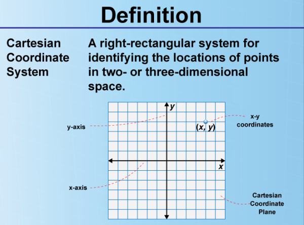
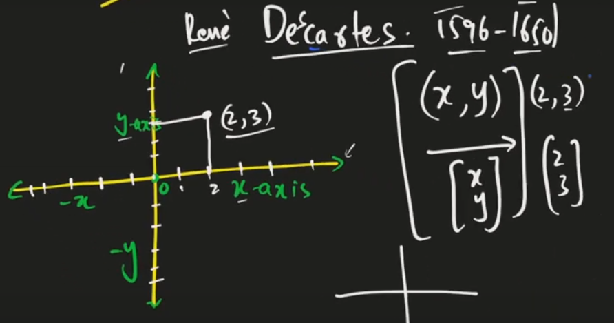

## Unit Vectors

A vector with lenght of 1.


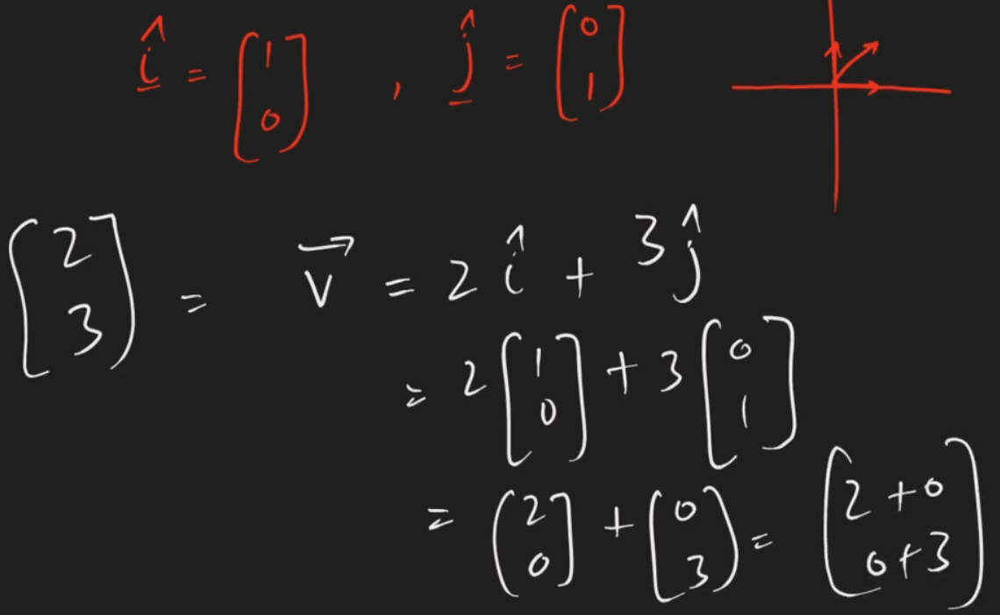

## Scalars & Scaling a Matrix

A scalar is a single number that can be used to multiply a matrix or a vector.

Scaling a matrix means multiplying each element of the matrix by a scalar.

**For example**, if we have a matrix A = [[1, 2], [3, 4]] and a scalar k = 2, then scaling the matrix A by k results in a new matrix B = [[2, 4], [6, 8]].

This is because each element of the matrix A is multiplied by the scalar k. Scaling a matrix can be useful in various applications, such as image processing, where scaling can be used to adjust the brightness or contrast of an image.

## Vector Addition

Vector addition is the process of adding two vectors together.

**Example**: a = [[1, 1]] + [[2, 1]] = [[3, 2]]

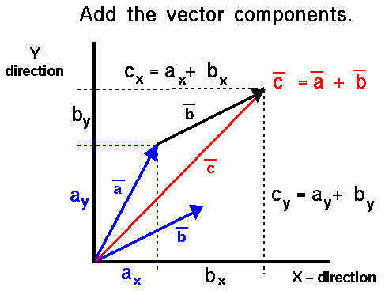

## Vector Span & Linear Dependence of Vectors

Vector Span: The span of a set of vectors is the set of all possible linear combinations of those vectors. In other words, it is the set of all vectors that can be obtained by adding and scaling the given vectors.

IR^2 = 2D-Span Vector Space

## Intercepts

Intercepts are the points where two lines intersect.

**Example** 3x + 3 = y, when finding x-intercept we make y=0 and for finding y-intercept we make x=0.

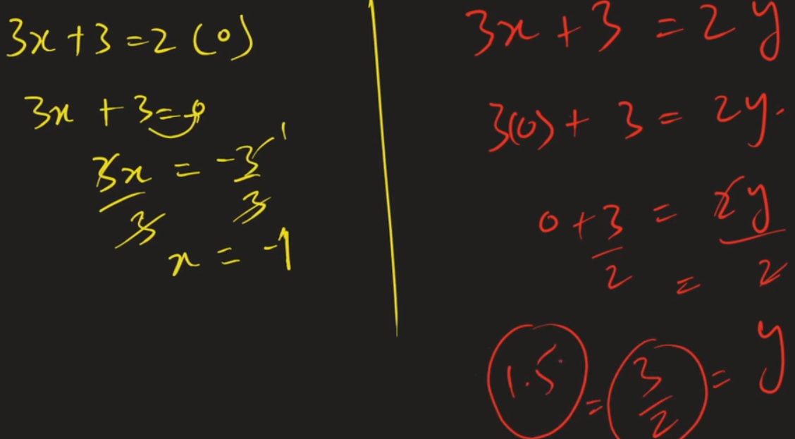
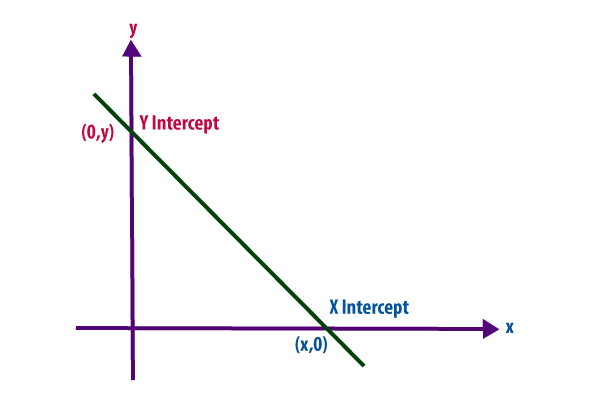

## Dot Products in Vectors

Dot product is a mathematical operation that takes two equal-length vectors and returns a single number. The dot product is defined as the sum of the products of the corresponding elements of the two vectors.

```Equation

             a.b = [2]  . [3]
                   [4]    [7]
                 = (2 x 3) + (4 x 7) = 6 + 28 = 34 **(Scalar Quantity)**

```

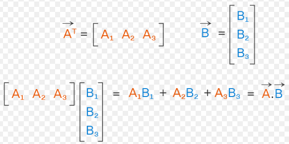

## Cross Product in Vectors

The cross product is a mathematical operation that takes two vectors of the same dimension and returns a vector of dimension 3. Cross product gives you another vector.

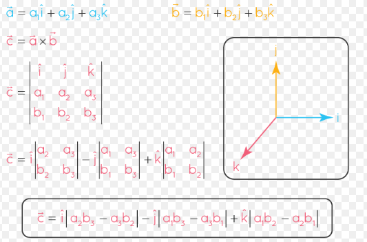

## Basis Vectors

A basis vector is a vector that is used as a basis for a vector space.

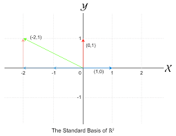

## Transformation

Transformation of space is the process of changing the position of points in space.

## Linear Transformation & Matrices

A linear transformation is a function from one vector space to another that respects the underlying (linear) structure of each vector space. A linear transformation is also known as a linear operator or map.

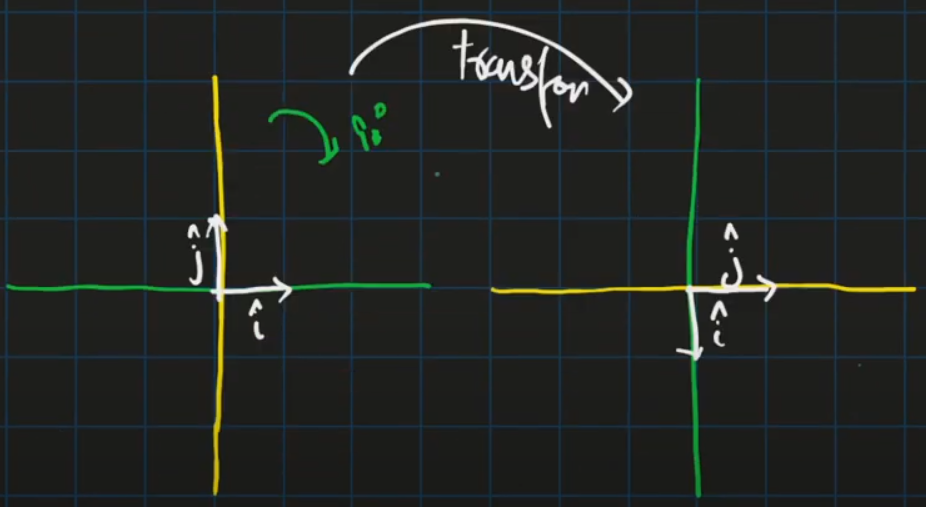

## Matrics are Linear Transformations

A matrix is a rectangular array of numbers, and it can be used to represent a linear transformation.

**For example**, consider the following matrix:

A = [[2, 1], [1, 2]]

This matrix represents a linear transformation that stretches the x-coordinate by a factor of 2 and the y-coordinate by a factor of 2

## Shear Transformations

A shear transformation is a linear transformation that displaces each point in a given direction by an amount proportional to its signed distance from a fixed line.

In shear transformation, one vector remains in the same position (I vector) and only the j vector will move towards i vector.

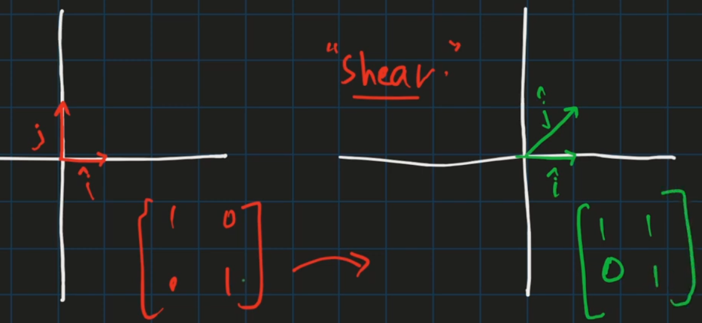

Final Vector is in transformed version.

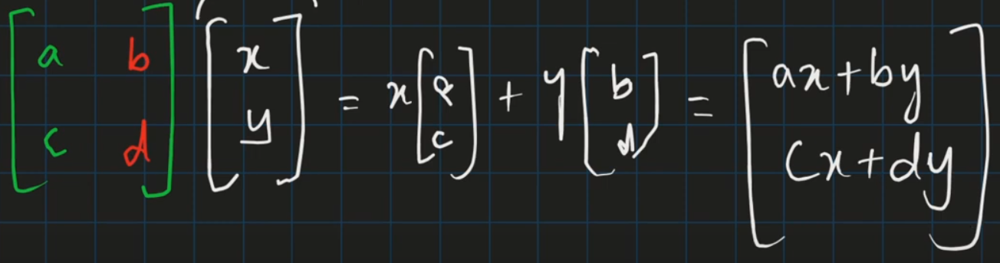

## Why Do We Need to Transform Vectors

Transformation is the movement of real world, any movement to any direction in 3 d directions use algebra & mathematics.

Transforming vectors allows us to change their position, orientation, or shape in a systematic and predictable way, which is useful in many applications such as computer graphics, physics, and engineering.

**For example**, rotating a vector by a certain angle or scaling it by a certain factor are common transformations.

## Matrix or Matrices

A matrix is a rectangular array of numbers, symbols, or expressions, arranged in rows and columns.

**For Example**: a 2x3 matrix has 2 rows and 3 columns.

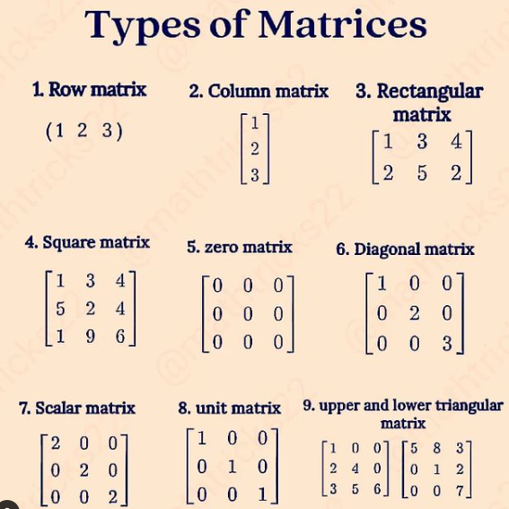

- **Matrices used in images.**

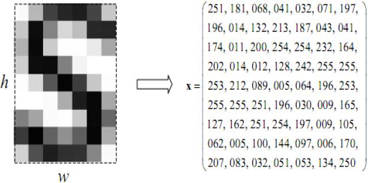

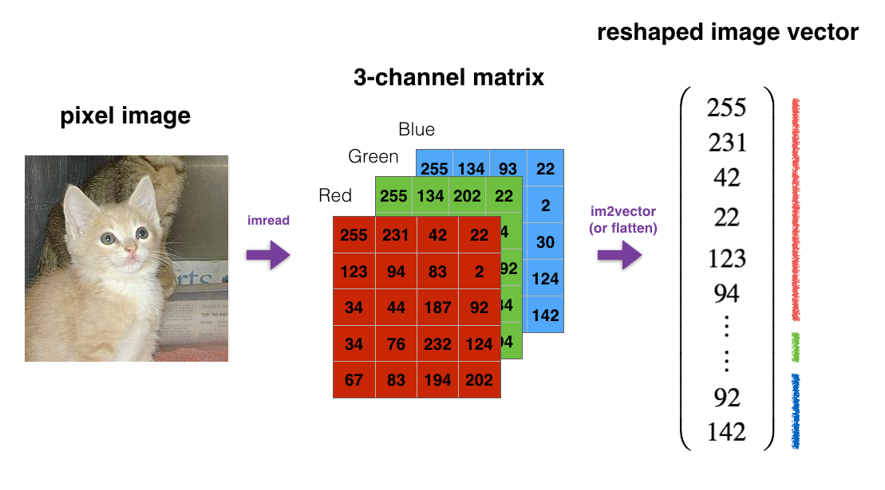

The numbers in matrix is called element of matrix. i = row and j = column. So elements can be identified using ij locations which is like cells in Excel.

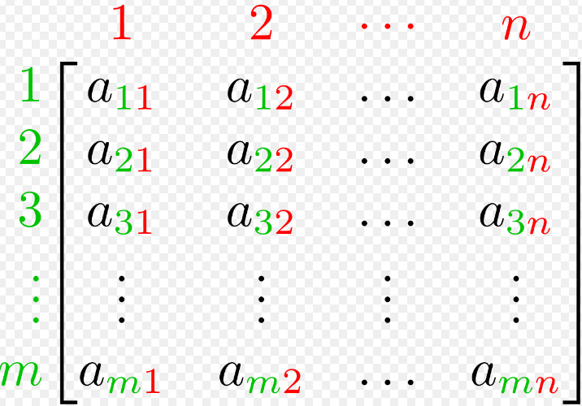

### Transpose of a Matrix

The transpose of a matrix is formed by turning all the rows of a given matrix into columns and vice-versa.

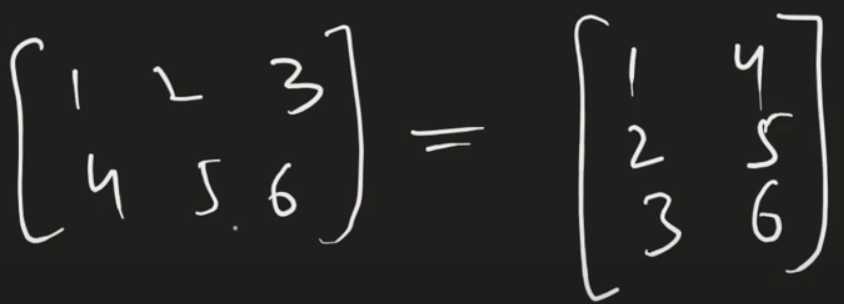

### Symmetric Matrix

A symmetric matrix is a square matrix that is equal to its transpose.

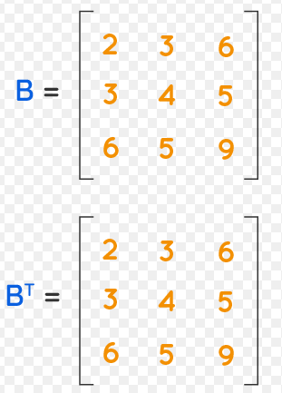

### Skew Symmetric Matrix

A skew symmetric matrix is a square matrix that is equal to the negative of its transpose.

B transpose = -B

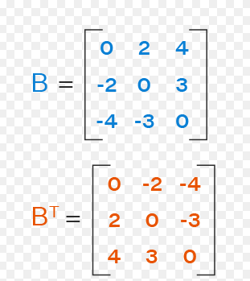

### Matrix & Transformation

Matrix is a **transformation**, which is a way to move in space (vector space). If we have linear independence then linear transformation does not affect it.

1. 90 Degree Rotation Transormation
2. Shear Transformation

### Matrix Addition & Subtraction

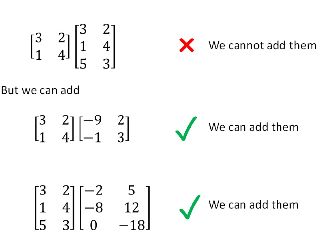

### Matrix Multiplication

Matrix multiplication is used in machine learning to perform various operations such as linear transformations, dot products, and matrix factorization. It allows for efficient computation and representation of data, and is used in many machine learning algorithms such as linear regression, logistic regression, and neural networks.

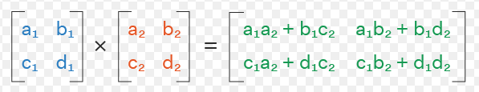

### Determinant of Matrix

The determinant of a matrix is a scalar value that can be used to determine the solvability of a system of linear equations, invertibility of a matrix, and orientation of a matrix in space, and is calculated as the sum of the products of the elements of each row or column, with each product multiplied by its corresponding sign.

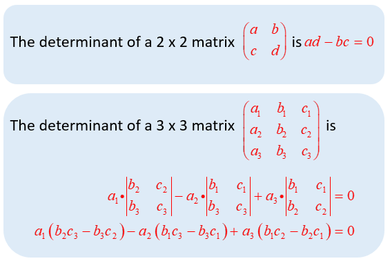

## Inverse of Matrix

The inverse of a matrix is a matrix that, when multiplied by the original matrix, results in the identity matrix. It is used to solve systems of linear equations and invert matrices.

The inverse of a matrix is used in machine learning to solve systems of linear equations, invert matrices, and calculate the covariance matrix, which is used in various machine learning algorithms such as linear regression, logistic regression, and principal component analysis.

A A^-1 = Identity Matrix

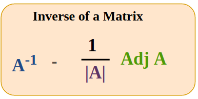
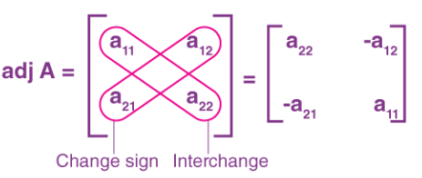
