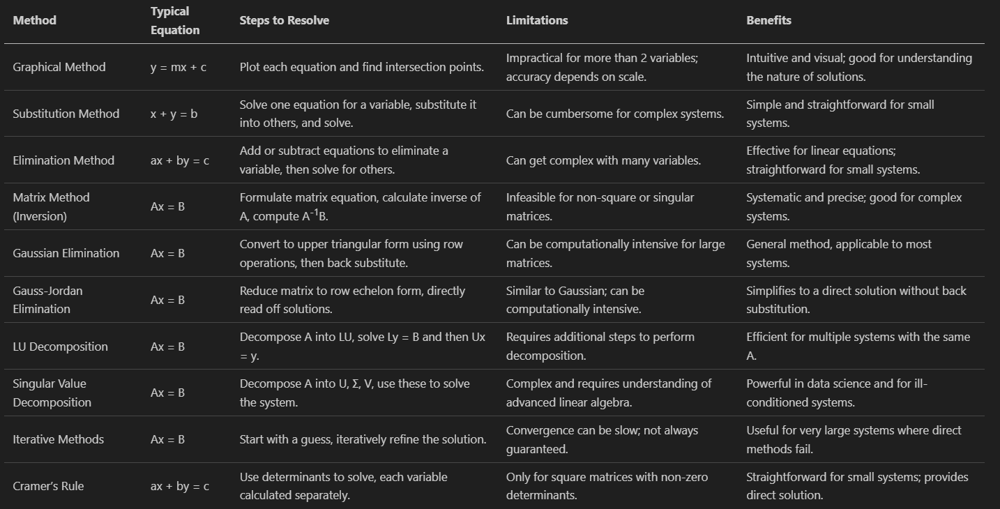
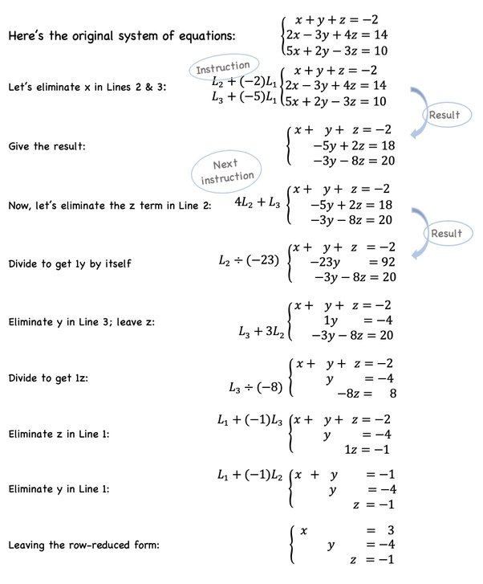
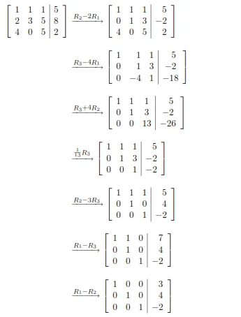
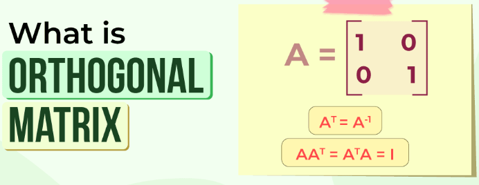
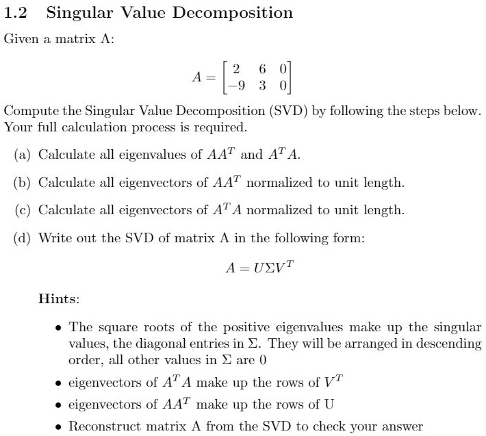
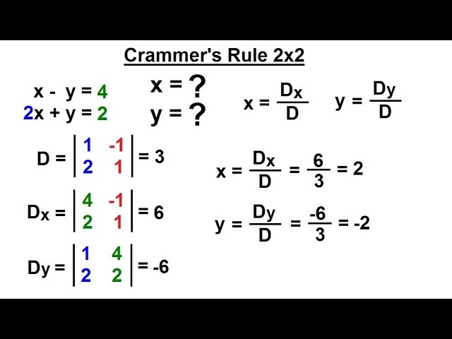

# System of Equation

A system of equations is a collection of two or more equations involving the same set of variables. In linear algebra, these are typically linear equations, mean each equation represents a straight line in 2-Dimensional Space, a plane in 3-Dimesional Space or hyperplanes in higher dimension.

Use in Engineering: Forces, Resistances, physical.
Economics: Demand and Supply Link using graph.
Computer Scientist: Software, Tools, API's.

1. Variable => x,y,z
2. Expression => 2x + 3
3. Coefficient => 2x = 2 is the Coefficient
4. Constant => ax + by = c is the Constant

```Equation
3x + 2 = 4 is the equation
```

## Type of Linear Equations

When we draw this equation on graph it gives us straight line.

- **Two Variable Linear Equation**
  - 3x + 2y = 4
- **Three Variable Linear Equation**
  - x - 2y + z = 4
- **Higher Diemsional Linear Equation**
  - More than 3 Dimensions

## Representing System of Equations

In linear Algebra, the way we represent systems of equations is crucial for understanding and solving them efficiently

### Standard Algebric Notations

```Equation

2x + 3y = 6
x -   y = 4

```

### Matrix Notation

```Equation

2x + 3y = 6
x -   y = 4

Matrix:

|2   3| |x|  = |6|
|1  -1| |y|  = |4|

Ax = B where A is the co-efficient matrix, x is variable matrix and B is constant matrix

```

### Advantages of Writing in Matrix Form

1. Simplicity
2. Matrix Operations
   1. Addition, Subtraction, Multiplication
   2. Determinent
   3. Inverse
   4. Eigen Values etc
3. Computational Efficiency
   1. Data store in structure form in binary codes 0 and 1.
   2. Matrices are easy to understood to processor.
   3. Even python libraries prefer to work on matrices.

## Methods for Solving System of Equation

The main goal when dealing with systems of equations is to find the value of **unknown variables** that satisfy all the equations.

Future, Unseen, Unknown - Predict the future on previous data using Machine Learning.

There are different methods to solving system of equation in linear algebra:

- Graphing Method
- Substitution Method
- Elimination Method
- Matrix Method

## Graphical Method

The graphical method to solve a system of linear equations involves plotting the lines corresponding to each equation on a graph and finding the point(s) of intersection, which represent the solution(s) to the system.

- No Intersection - No Solution
- 1 Intersection - 1 Solution
- 2 Intersection - Infinite Solutions


```Equation

Problem:
        y = 2x+1
        y = -x+3
        
Convert to Slope Intercept Form

y-intercept: x = 0 , y = 1
x-intercept: y = 0 , x = -0.5

    y = 2x+1   finding y-intercept
    so x = 0
    y = 2(0) + 1
    y = 0 + 1 = 1

    y = 2x+1   finding x-intercept
    so y = 0
    2x = -1
    x = -1/2 = -0.5


    y = 2x+1   x-intercept = -0.5 and y-intercept = 1
    y = -x+3   x-intercept = 3 and y-intercept = 3

Now Finding Intersection point with the help of graph

    x = 0.6667
    y = 2.333 

```

### Intercept Form

y = mx + b where b is y intercept and m is slope.

## Subsitituion Method

The substitution method in a system of equations involves solving for one variable in one equation and then substituting that expression into the other equation(s) to solve for the remaining variable(s).

```Equation

Suppose we have 

    x + y = 10
    2x - y = 3
so
    x + y = 10
    y = 10 - x
Now adding y value to 2nd equation

    2x - (10 - x) = 3
    2x - 10 + x = 3
    2x + x = 3 + 10
    3x = 13
    x = 13/3 = 4.33
    
Now add x value to (y = 10 - x)

    y = 10 - x
    y = 10 - 4.3
    y = 5.67

```

## Elimination Method

The elimination method in a system of equations involves adding or subtracting equations to eliminate one variable and then solving for the remaining variable(s).

```Equation

x + 2y = 8 ---- i
3x - y = 5 ---- ii

Step 1
Multiply equation i by 1

    1 (x + 2y) = 1 (8)
    x + 2y = 8

We need to multiply equation with a number so that x get completely eliminated

Multiply equation ii by 2

    2(3x - y) = 2 (5)
    6x - 2y = 10 ---- iii

Step 2
Add equation i and iii

    (x + 2y) + (6x - 2y) = (8) + (10)
    x + 2y + 6x - 2y = 8 + 10
    7x = 18
    x = 18/7 = 2.57

Step 3
Add x value to equation i

    x + 2y = 8
    2.57 + 2y = 8
    2y = 8 - 2.57
    y = 5.43 / 2
    y = 2.715

So we got the values of x and y

    x = 2.57 --- i
    y = 2.715 ---- j

```

## Matrix Method (Inversion)

The matrix method in a system of equations involves representing the system as a matrix equation and solving for the unknown variables using matrix operations such as matrix multiplication, matrix inversion, and matrix determinant.

```Equation

2x + 3y = 8
x - 2y = -3

Matrix Form

|2  3| |x| = |8|
|1 -2| |y|   |-3|

A      x   =  B

Solve for X

    x = A^-1 B

Finding Determinant

    |A| = -7 (Non Zero)

A^-1 = Adj(A) / |A|

    |-2  -3|
    |-1   2|  / -7 

    Divide this and then multiply it with B

    The value you will get the intersections points of graph    

```

Sure, here's the provided information converted into GitHub README markdown tables:

## Methods for Solving System of Equations Comparison



## Gaussian Elimination Method

In mathematics, the Gaussian elimination method is known as the row reduction algorithm for solving linear equations systems. It consists of a sequence of operations performed on the corresponding matrix of coefficients.

In the Gaussian elimination method for solving systems of linear equations, specific row operations are used to transform the matrix into an upper triangular form or row echelon form. These operations are fundamental to the process and are designed to preserve the system’s solutions.

### Permissible Row Operations

1. **Swapping Rows**: You can interchange two rows. This operation does not change the solution set of the system.
2. **Multiplying a Row by a Non-zero Scalar**: Any row can be multiplied by a non-zero constant. This operation changes the scale of the equation but not its solutions.
3. **Adding a Multiple of One Row to Another**: You can add or subtract a multiple of one row to another row. This operation is used to create zeros in specific positions under the pivot elements.

### Operations Not Permissible

1. **Multiplying or Adding Rows with Columns**: Operations involving both rows and columns simultaneously are not allowed, as they would change the nature of the system.
2. **Multiplying a Row by Zero**: This operation is not allowed as it leads to loss of information from the equation, potentially changing the solution set.
3. **Changing the Number of Rows or Columns**: Any operation that alters the dimensions of the matrix (like adding or removing a row or column) is not permissible, as it would change the underlying system of equations.

### Importance of Following Permissible Operations

The key purpose of these operations in Gaussian elimination is to systematically simplify the matrix while ensuring that the transformed matrix represents a system of equations equivalent to the original. This means that the operations should neither alter the solution set nor introduce any new solutions. Adhering to the permissible operations guarantees that the integrity of the system is maintained throughout the process.

```Equation

x + 2y + z = 9
2x + 3y + z = 16
-x + y - 2z = -1

```

$$
\left(\begin{array}{cc}
1 & 2 & 1 \\
2 & 3 & 1 \\
-1 & 1 & -2
\end{array}\right)
\left(\begin{array}{cc}
9 \\
16 \\
-1
\end{array}\right)
$$

- Apply -> Row2 - 2 x Row1

$$
\left(\begin{array}{cc}
1 & 2 & 1 \\
0 & 2 & -1 \\
-1 & 1 & -2
\end{array}\right)
\left(\begin{array}{cc}
9 \\
126 \\
-1
\end{array}\right)
$$

- The end goal is to make lower traingle matrix zero in this matrix.



## Gauss Jordan Elimination Method

The Gauss-Jordan method is similar to the Gaussian elimination process, except that the entries both above and below each pivot are zeroed out. After performing Gaussian elimination on a matrix, the result is in row echelon form, while the result after the Gauss-Jordan method is in reduced row echelon form.

- Make an augmented matrix.
- Row Reduction to Reduced Row Echelon Form.
- Row Operations.
- Resovle Equation.



## LU Decomposition Method

Lower–Upper (LU) Decomposition or factorization factors a matrix as the product of a lower triangular matrix and an upper triangular matrix

A x = B

A = Decompose the lower traingular Matrix = L
A = Decompose the upper traingular Matrix = U

A = LU

L U x = B

## Singular Value Decomposition (SVD)

In linear algebra, the singular value decomposition (SVD) is a factorization of a real or complex matrix into a rotation, followed by a rescaling followed by another rotation.

Useful in Computational Analysis, Dimensionality Reduction, and Unsupervised Learning.

- A x = B

It captures the essential Algebric and Geomteric properties of original matrix, and convert/decompose it into 3 matrix.

- A = U Σ V^T
  - U is any matrix of mxn (orthognal matrix).
  - Σ is any matrix of mxn (diagonal matrix with non-negative real numbers on the diagonal).
  - V^T transpose of mxn V orthognal matrix.
- Singular Values
  - The diagonal entries of a Sigma (Σ) matrix are of singular values of A.
  - They are square root of the eigen values of A^T A or A A^T.
  - SV are always non-negative numbers.
  - Usually in descending order.
- Eigenvectors
  - The columns of U are the eigenvectors of AA^T.
  - The columns of V (or rows of V^T) are the eigenvectors of A^T A.





### Example

- Let A

$$
\left(\begin{array}{cc}
3 & 4 \\
0 & 5
\end{array}\right)
$$

- **Computing SVD**
  1. Compute A^T A
  2. Compute AA^T
  3. Find their eigenvalue and eigenvectors.
  4. Construct Sigma (Σ) using the square roots of the non-zero eigenvalues.
  5. Form U and V using the eigenvectors of A^T A and AA^T
     1. Eigenvectors of AA^T = U columns
     2. Eigenvectors of A^TA = V columns

## Iterative Methods

## Cramer's Rule



## Eigenvalues & Eigenvectors

The eigenvectors are also termed as characteristic roots. It is a non-zero vector that can be changed at most by its scalar factor after the application of linear transformations. And the corresponding factor which scales the eigenvectors is called an eigenvalue.

Eigenvector and eigenvalues are the extended form of basis vector. Eigenvectors are always non-zero vectors. The scalar multiple of an eigenvector is called its eigenvalue. The eigenvectors of a matrix are not unique; any scalar multiple of an eigenvector is also an eigenvector. The eigenvectors of a matrix are orthogonal if and only if the matrix is symmetric.

```Equation

Sometimes the diagonal values are eigenvalues.

|2 0|
|0 3|

```
