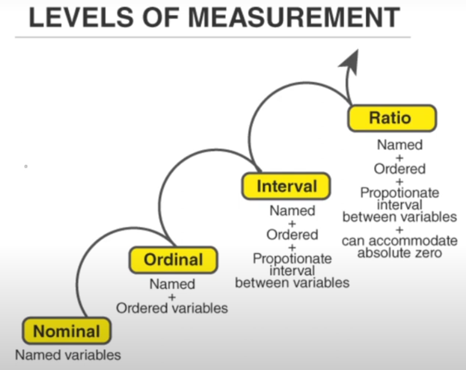

# Contents

1. Statistics Intro
2. Data Pillars
3. Data Types
4. Level/Scales of Measurement
5. Data Collection and Sampling
6. Data Visualization
7. Exploratory Data Analysis (EDA)
8. Descriptive Statistics
   - Central tendency
      - Mean, media, mode
   - Variability
     - Range
     - Variance
     - Standard Deviation
   - Data Distributio
     - Skewness / Kurtosis
     - Normal Distribution
9. Probability Theory
10. Inferential Statistics
    - Population vs Sampling
    - Sampling Distribution
    - Confidence Intervals
    - Hypothesis Testing
    - Types of Errors (Type-I and Type-II)
    - Common Statistical Tests
      - Univariate Analysis
      - Bivariate Analysis
      - Multivariate Analysis
      - P-Values and Significane

## Statitics

Statitics is a branch of mathematics that deals with the collection, analysis, interpretation, presentation, and organization of data. In applying statistics to a scientific, industrial, or social problem, it is conventional to begin with a statistical population or a statistical model to be studied.

1. Collection
   - Sampling of data
2. Analysis
   - Data Analysis techniques
3. Interpretation
   - Graphs or Plotting
4. Presentation
5. Organization

### Stats Helps in

- Decision Making
  - Data Driven Decision Making
- Clarity and Precision

Stats used in many fields such as business, economics, engineering, and social sciences to make informed decisions and predictions.

## Types of Statistics

### 1. Descriptive Statistics

### 2. Inferential Statistics

## Why Stats is Important for Data Science

### Question / Problem

How many Pakistani female and male are in IT industry? If there are 10 vacancies, then how we will know that how many seats we have to give to Male or Female?

### Solution

Conduct a surveys of different cities, districts and gather the data. Let's suppose we took survey of 500 people.

- 250 Male IT
- 100 Female IT
- 150 Non IT

Maybe we didn't use a good technique to gather sample. **Stats also helps in how to collect the data.**

## Scales or Levels of Measurement

1. Nominal Scale
   - Names, Labels and Qualities. No Number and also No Order/Ranking.
   - **Example**: Male, Female, Dot, Cat, Bird, Ahsan, Shakoor, Jawad, Ahmad.
   - **Stats**: Can apply Mode, Frequency and Chi-Square.
2. Ordinal Scale
   - Nominal Scale + Rank or Order.
   - **Example**: Is it hot in Pakistan?
   - **Options**: I agree, I Strongly agree, I don't agree
   - Class Position of students first, second, third etc.
   - **Stats**: Can check Median, Mode.
3. Interval Scale
   - Numbers, Equal difference between numbers, Not True Zero, Absolute Zero.
   - **Example**: Temperature in Celsius, Dates in Calender year.
   - **Stats**: Can check Mean, Median, Mode, Variance, Standard Deviation, ANOVA Test, Regression Analysis.
4. Ratio Scale
   - Numbers, True Zero, Meaningful Arithmetic Operations.
   - **Example**: Height, Weight, Income, distance, decimal.
   - **Stats**: Can apply Mean, Median, Mode, SD, Geomteric Mean, Harmonic Mean.



## Qualitative vs Quantitive Data

Qualitative Data | Quantitive Data |
-----------------|-----------------|
 Quality Measure | Quantity Measure |
 Categorical Data | Numerical Data |
 No Number Involved | Only Numbers |
 Nominal Scale | Interval Scale |
 Ordinal Scale | Ratio Scale |
 ............. | Can Apply Arithmetic Operations |

### Example

Male, Female is a qualitative data, but what if we represent it using 0 and 1 then it will be also a **Qualitative Data**. Because 0 and 1 is the method to collect the data and at the end of day it represents Female or Male data.

It is called **Data Encoding**. We do it to increase the performance of computer and less time required to process.

## Discrete Data

Discrete data is a type of data that can only take on a specific set of distinct values, such as integers, and is used to represent counts, frequencies, or categories. Such as 1, 2, 3, Car parking in parking lot, Number of children in family.

## Coninuous Data

Continuous data is a type of data that can take on any value within a continuous range, such as decimal numbers, and is used to represent measurements or quantities. Such as all the decimal numbers between 1-2, Measurable data - height, weight, temperature, time series.

## Binary Data

Binary data is a type of data that can only take on two values, typically represented as 0 and 1, and is used to represent categorical data or to encode other types of data. Such as True or False, Yes or No.

## Time Series Data

Time series data is a type of data that is collected at regular intervals over time, and is used to analyze trends, cycles, and patterns in the data. Such as, calculating weight after every 10 days, stock market, weather, temperature.

## Spatial Data

Spatial data is a type of data that is used to represent geographic features, locations, and phenomena, and is used in many fields such as geography, urban planning, and environmental science. Such as, location of a city, location of a building, location of a person.

## Categorical Data

Categorical data is a type of data that is used to represent categories or groups, and is typically represented using text or labels. For example, the gender of a person can be represented as "male" or "female", which are categories. Blood Groups (A,AB,O,AB+).

No order included.

## Ordinal Categorical Data

Same like categorical data but data is ordered. For example, Ratings, Educational level etc.

## Multivariate Data

Multivariate data is a type of data that consists of multiple variables/columns/attributes that are measured on the same set of observations, and is used to analyze the relationships and patterns between the variables.

**Univariate** - one variable.
**Bivariate** - two variables.

## Structured vs Unstructured Data


## Boolean Data

Boolean data is a type of data that can only take on two values, typically represented as 0 and 1, and is used to represent categorical data or to encode other types of data. It is also known as binary data.

## Operationalization and Proxy Measurements

We measures something in order to give labels. Sometimes, we get the data which have no standard measurements and we make strategy to measure that concept which is called **Operationalization Measurement**.

**For Example**, measuring stress, we will measure the factors which give stress that is hearbeat, colestrol level, self reported feelings.

Using a related but indirect measure to estimate a variable of interest is called **Proxy Measurement**.

**For Example**, finding tree age, we can't ask the tree to tell us its age, so we can count the rings of stem to estimate the age.

## Surrogate Endpoints

A surrogate endpoint is a measure that is used as a substitute for a more meaningful or direct measure of a phenomenon, and is used when the direct measure is difficult or impossible to obtain. Final aim can't be easily measured.

**For Example**, Heart Attack, we make different end-points to save a person rather than to give him a heart attack controller tablet. We measure the blood pressure and other factor and try to save the person.

### Benefits

1. Short Research
2. Ethics
3. Help to save money

## True and Error Score

True and error score is a measure of the accuracy of a measurement or prediction, where the true score is the actual value and the error score is the difference between the predicted and actual values.

True and error score is used in many fields, including engineering, physics, and statistics, to evaluate the accuracy of measurements and predictions. **Errors wh? questions** helps you to understand the error. Adjustments in algorithms are actually minimizing the errors.

**For example**, if a person's true weight is 70 kilograms and a scale measures it as 72 kilograms, then the error score is 2 kilograms. Maybe you make mistake (Human) or Weighing Balance error. Mostly this error occurs in **continuous data**.

```Equation

X = T + E

where X = Observed Value, T = True Value and E = Error Value

```

## Types of Errors

Systematic errors are errors that occur consistently and can be corrected for, while random errors are errors that occur randomly and cannot be completely eliminated.

### 1. Random Errors

Random errors are unpredictable and occur randomly in the measurement or evaluation process. These errors are typically due to factors outside the control of the person measuring or evaluating, such as outside influences or human error.

**For example**, random error is an error that if we do it twice then the values will change. Such as Dice, each time you will get random number.

### 2. Systematic Errors

Systematic errors, also known as measurement errors or assessment errors, are consistent and predictable mistakes made in the measurement or evaluation process. These errors can arise from flaws in the measurement instrument or from the way the measurement is conducted.

**For example**, an electronic scale that, if loaded with a standard weight, provides readings that are systematically lower than the true weight by 0.5 grams – that is, the arithmetic mean of the errors is -0.5 gram.

## Type-I Error

**False Positive Error**. For example, let's suppose you don't have COVID but test kit is showing that you have COVID.

Work on 0 and 1 or ON and OFF.

## Type-II Error

**False Negative Error**. For example, let's suppose you have COVID but test kit is showing that you don't have COVID.


## Errors & Data Scientist

Data Scientists should care alot about errors due to following factors:

1. Better Decision Making.
2. ML and AI Models will work better.
3. Better understanding of risk management.
4. Ethical implementation.

## Reliability and Validity

Reliability and validity are both about how well a method measures something.

### Reliability

Reliability refers to the consistency of a measure (whether the results can be reproduced under the same conditions). Claim is True. If we collect the data and that is reliable. A reliable is tool or method, when it yield the same results under consistent condition.

**For example**, we collected height and weight of different students in class and then ask them to verify the data. If they say yes then it is reliable.

**For example**, if you scored 95% on a test the first time and the next you score, 96%, your results are reliable.  So, even if there is a minor difference in the outcomes, as long as it is within the error margin, your results are reliable.

### Validity

Validity refers to the accuracy of a measure (whether the results really do represent what they are supposed to measure). Valid something which means accurate.

**For example**, all 12-inch rulers are one foot, I must repeat the experiment several times and obtain very similar results, indicating that 12-inch rulers are indeed one foot.

### Why Important

Data is measure which are level of Measurements.

**NOTE**, _DATA IS NEW OIL_

If your data is Reliable and Valid then:

1. Your data is trust worthy.
2. You can take sound decision based on data.
3. Ethical Research.
4. Effective Solution

## Triangulation

Triangulation in statistics refers to the use of multiple methods or sources of data to verify or corroborate a particular measurement or estimation. This technique is often used to reduce measurement error and increase the accuracy of results.

**For example**, Health records, air quality metrices, sattelite images all three leads to that Lahore is polluted city to live then it is triangulization.

### Why Important Triangulation

1. Credibility
2. Reduces Bias
3. Increase Confidence on findings
4. Comprehensice View

### Demerits

1. Resouce Intensive
2. Complex Integration
3. Skill Requirements

## Measurement and Data Bias

Bias in research or data collection refers to systematic errors that skew results or inferences away from reality. Bias can occur in various aspects of research, including data collection, analysis, interpretation, and publication.

These biases can arise from various sources:

1. **Sampling Bias**: When the sample used in a study does not accurately represent the population.
   - For example, if a study is conducted only on men, the results may not be representative of the general population.
2. **Selection Bias**: When the participants included in the study do not accurately represent the general population. Its like listening to opinions of those people who agree with you.
   - For example, if a health survey is conducted only in urban hospitals, trends in rural areas may be missed.
3. **Confirmation Bias**: When researchers or data collectors consciously or unconsciously favor data or interpret results that confirm their pre-existing beliefs or hypotheses.
   - Pre Assumptions, Pre Existing beliefs.
   - For example, a detective only see to those clues which support his theory.
4. **Publication/Survivorship Bias**: Selectively publishing only positive or significant results while neglecting negative or non-significant findings.
5. **Reporting Bias**: When only certain outcomes or aspects of a study are reported, leaving out others that may be equally important.
   - Media Channels.

These all lead you to **Information Bias**.

### Measurement Bias

Measurement bias is a particular type of bias that is associated with systematic errors in collecting, recording, or interpreting measurements. It can significantly impact the reliability and validity of study outcomes. It mislead to draw conclusion.

Types of measurement bias include:

1. **Instrument Bias**: When there are flaws in the measurement instruments themselves. For example, a scale consistently showing lower weight than actual.
2. **Observer Bias**: When the person measuring (observer) unintentionally influences the results, perhaps due to their expectations or preconceived notions.
3. **Response Bias**: When study participants provide answers they believe are expected or socially acceptable, rather than their true thoughts or feelings.
4. **Sampling Bias**: A type of measurement bias related to how the sample is selected. If the sample does not accurately represent the population, measurement bias can occur.

### Reducing Bias and Measurement Bias

1. Improve Sampling Methods (Randomized Sampling)
2. Use Refined Research Designs
3. Data Collection Vigillances (Use standardized protocol or use multiple resources)
4. Analytical Awareness (Statistical test & Peer Review)
5. Ongoing Education and Awareness

## Resources

[ABC of Statistics](https://codanics.com/books/abc-of-statistics-for-data-science/)
