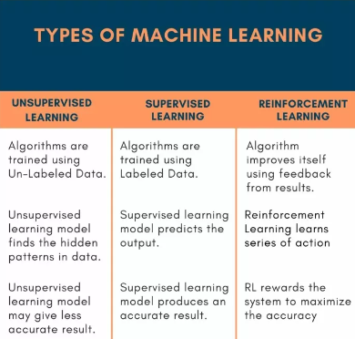
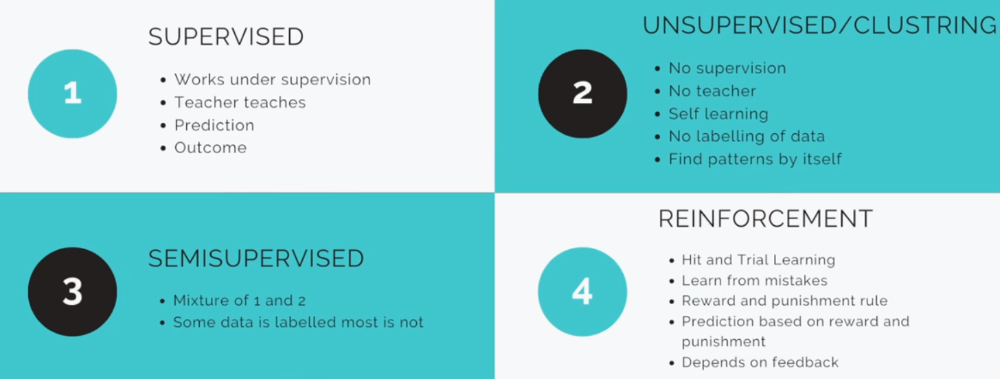
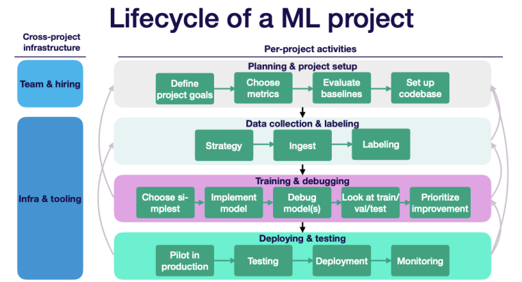
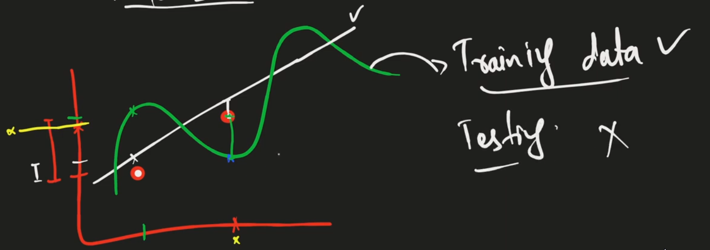

# ML 101

Machine learning allows machines to `learn` and make decisions `smartly`.

**Steps:**

- Data
- Learning
- Prediction
- Decisions

```Example

In mathematics we look to patterns. So when machine recognize the patterns from data and predicting the unknown value 'x' is called machine learning.

2 x 1 = 2
2 x 2 = 4
2 x 3 = 6
2 x 4 = ?

```

## Types of Machine Learning

### 1. Supervised Learning

- Works under supervision
- Teacher teaches
- Include label data
- Prediction
- Outcome

1. Classification
   - For Categories
2. Regression
   - For Numerical Data

#### Supervised Learning Algorithms

- Logistic Regression
- KNN
- SVM
- Kernel SVM
- Naive Bayes
- Decision Tree Classification
- Random Forest Classification

### 2. Unsupervised Learning

- No Supervision
- No teacher
- Self learning
- No labeling of data
- Find patterns by itself

It make clusters (groups) to predict.

#### Unsupervised Learning Algorithms

- K-Means Clustering
- Hierarchical Clustering
- Probabilistic Clustering

### 3. Semisupervised Learning

- Mixture of both
- Some data is labelled, most is not

### 4. Reinforcement Learning

- Hit and Trial Learning
- Learn from mistakes
- Reward and punishment rule
- Prediction based on reward and punishment
- Depends on feedback

Mostly used in gaming industries, autonomous driving and web crawling.





## ML Model Building to Deployment

1. Define the problem
   - Define aim/vision/goal
2. Data Collection
   - Define Objectives and Research Questions
   - Design the Data Collection Method/Tool (surveys/interviews/experiments)
   - Determine the Sample
   - Collect Data
   - Ensure Data Quality
   - Data Processing
   - Data Analysis
   - Interpreting Results
   - Report Writing and Presentation
   - Data Storage and Management
3. Data Pre-processing
   - 80% of time ML engineer works on data pre-processing.
   - Rest 20% of time they spend on building the model.
   - Raw Data contains anomalies, outliers, missing values and feature the variable.
   - Data Wrangling/EDA
4. Choose a model based on data
   - You should know what is the data type of your target/output variable.
5. Split the data
   - x = independent variables (predictor/input/features).
   - y = dependent variables (target/output/labels).
   - We split the data in two parts of training and testing data (80:20).
6. Evaluating the model.
   - When we create 3 different models then we evaluate them that which model is best.
   - Using different metrics R^2, RMSE, MSE etc.
7. Hyperparamter tuning
   - When your model doesn't perform well then we tune the hyperparameter.
8. Training and Testing data (cross validation)
   - We do cross validation of data.
   - First we take the last 20% of data as testing data and then take middle 20% for testing and in the end start 20% of data as testing to check whether there is biasness or not.
9. Model Finalization
   - Multi data validation.  
10. Deploy the Model
    - App, web, or in software.
    - MLOps  
11. Retest, Update, Control Versioning and Deploy new Model.



## Algorithm

A set of rules or instructions given to AI system to help it learn from data. `Example`, decision tree is an algorithm used for classification and regression tasks.

## Training Data

The dataset used to train the machine learning model. It's labeled data fro supervised learning. `Example`, a set of images of cats and dogs, each labeled with "cat" or "dog".

## Testing Data

Data used to evaluate the performance of a model after training. It's unseen by the model during training. `Example`, a set of new image not included in the training data, used to check the accuracy of a trained model.

## Features

Individual measurable properties or characteristics of a phenomenon being observed, used as input variable in a model. `Example`, in a dataset for house prediction, features might include square footage, number of bedrooms, and age of the house.

## Model

In machine learning, a model refers to the specific representation learned from data, based on which predictions or decisions are made. `Example`, a neural network trained to indentify objects in images.

## Overfitting vs Underfitting

Overfitting and underfitting are common problems in machine learning, both leading to poor generalization performance on unseen data.

A model is either too complex and captures noise in the data `(overfitting)` and it negatively impacts the performance of the model on new data. `Example`, a model that performs exceptionally well on the training data but poorly on the testing data.

A model is simple and fails to capture important patterns `(underfitting)` and therefore performs poorly on both training and new data. `Example`, a linear regression model trying to fit non-linear data.

## Python Libraries for ML

1. Scikit-Learn
2. Tesnor Flow
3. Keras
4. PyTorch
5. NLTK
6. OpenCV

## Data Pre-processing Before ML Model

We collect data on basis of our aim/questions. We also collect Meta-data of our data. We can't say that collected data is 100% correct data.

Data pre-processing is always needed for Machine Learning models. Following are the techniques of data pre-processing.

1. `Data Cleaning`
   - Know your purpose when cleaning the data.
   - Missing Values.
   - Smoothing noisy data.
   - Outliers removal.
   - Inconsistency, check for duplicates.
2. `Data Integration/Pooling`
   - Triangulation (Multi) method to collect data.
   - Duplicates or Data Redundancy will arise here and we have to remove them.
   - After data integration, we do data cleaning again.
3. `Data Transformation`
   - Scale the data to same unit.
   - Normalize the data.
   - Data Aggregation = combining two or more variables/features/columns to make a new variable/feature/column.
   - Data Generalization = specific to general, make bins from age column.
   - Higher level concepts.
4. `Data Reduction`
   - We have 50 features and predicting 1 feature. More features = More dimensions = More Computation.
   - Take out those features which are not important for output feature.
   - Dimensionality Reduction, PCA analysis, Multivariate analysis.
   - Numerousity Reduction, changing categorical variable to numeric variable (binary). This technique is also called data encoding technique.
   - Data Compression.
5. `Data Discretization`
   - Numeric data convert to Nominal data (categorical).
   - Binning method is used here.
   - Clusters.

## Data Pre-processing

1. Data Cleaning
   - Missing Values
   - Smoothing Noisy Data
   - Outliers
   - Inconsistency
2. Data Integration
   - Data Integrate
   - Data Duplicates
   - Data Merging
   - Data Consolidate
3. Data Transformation
   - Scaling
   - Normalization
   - Aggregate
   - Generalization
   - Higher Level Concepts
4. Data Reduction
   - Dimensionality Reduction
   - Numerousity Reduction
   - Data Compression
5. Data Discretization
   - Numerical to Categorical Conversion
   - Binning
   - Clustering

## Paramteric & Non-Paramteric

Parametric and non-parametric tests are statistical methods used to compare means or medians of two or more groups. Parametric tests assume that the data is normally distributed and have equal variances, while non-parametric tests do not make these assumptions and are used when the data is not normally distributed or the variances are not equal. Examples of parametric tests include t-test and ANOVA, while examples of non-parametric tests include Mann-Whitney U test and Kruskal-Wallis test.

Parametric distributions are distributions that are fully specified by a finite set of parameters, such as mean and variance. Examples of parametric distributions include:

- Normal distribution
- Binomial distribution
- Poisson distribution
- Exponential distribution

Non-parametric distributions, on the other hand, are distributions that are not fully specified by a finite set of parameters. Instead, they are often estimated using empirical data. Examples of non-parametric distributions include:

- Empirical distribution function
- Kernel density estimate
- Histogram

## Difference between Standardization, Transformation and Normalization

Standardization/Scaling refers to the process of transforming data to have a mean of 0 and a standard deviation of 1.

Transformation, on the other hand, refers to the process of applying a mathematical function to data to change its distribution or shape.

Normalization refers to the process of scaling data to a specific range, such as 0 to 1. This is often done to make data more comparable or to meet the assumptions of certain statistical models.

`NOTE`, we normalize the data so that our model easily understand the patterns.

## Feature Scaling vs Normalization

Scaling                | Normalization         |
-----------------------|-----------------------|
Use in Pre-Processing | Use in Pre-Processing |
Interchangeable       | Interchangeable       |
Change the range of data without altering shape of distribution | Adjust the scale of data but also change the shape of its distribution |
Important for algorithms that are sensitive to scale of data | Used to transform features to be on same scale |
SVM and KNN | This includes transforming skewed data to approximate a normal distribution |
Min-Max and Z-Score Scaling | log, square root, Box-Cox and Yeo-Johnson transformation |
Used when you want to compare data that is measured on different scales | Used when dataset has skewed distribution and algorithms used assume normality of features |

### Tip About Scaling and Normalization

When we are using scaling and normalization then we should not tell the user that we are using any transformation so we do this in backend. User gives input -> transform the input -> apply model -> then reverse the output -> show the result.

## Evaluation Metrics for Regression and Classification Models

- Regression
  - For Numeric
  - MSE, R^2, RMSE, MAE
- Classification
  - For Categorical
  - Accuracy Score, Recall Score, Precision Score, F1 Score, Confusion Matrix
  - Classification Report

## Train Test Split Matters

We only train the model on train data and further evaluate the model on testing data. Then we fit the model to transform the values into predictions. We split the data in 80/20. `80%` for training data and `20%` for testing data.

General Model is better otherwise we will face overfitting or underfitting in the model.

Here `White Line` is general model.



## Random State 42

Using 42 has become a bit of a tradition in programming (inspired by `"The Hitchhiker's Guide to the Galaxy"` by Douglas Adams) and it's often used as a placeholder value when a specific number isn't critical to the application. By setting random_state to a fixed value we ensure that every time the code run will `split` the data in the same way to achieve reproducibility in your results. If we don't set a random seed (random_state) different runs of the code result in different training and testing sets which can make it challenging to compare and reproduce results.
