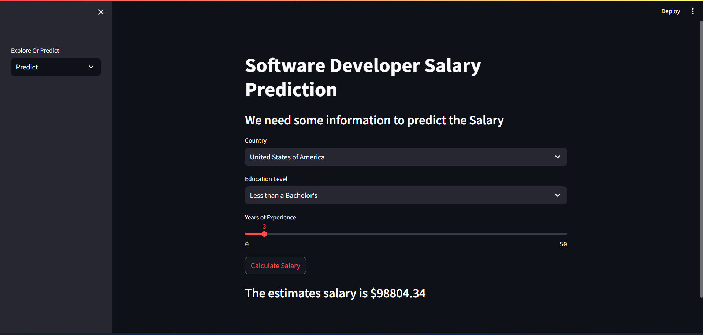

# Build A Salary Prediction Web App With Streamlit

### Data Used
https://insights.stackoverflow.com/survey

### Functionalities
The ML model predict the developer Salary based on Stack-Overflow survey.

### Running the App
1. Download the survey data from the above link.
2. Download the Source Code.
3. Run the app with `streamlit run app.py`

### App Visual

